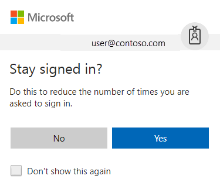

# Troubleshoot mapped network drives that connect to SharePoint Online

## Recommended: Sync instead of mapping a drive

Mapping a library as a network drive is temporary and supported only through Internet Explorer. Instead, [sync SharePoint files with the new OneDrive sync client](https://support.office.com/article/6de9ede8-5b6e-4503-80b2-6190f3354a88) which provides [Files On-Demand](https://support.office.com/article/0e6860d3-d9f3-4971-b321-7092438fb38e). Access all your files in OneDrive without using local storage space.

## Not recommended: Map a network drive

If you choose to map a drive instead of [using the new OneDrive sync client](https://support.office.com/en-us/article/6de9ede8-5b6e-4503-80b2-6190f3354a88), follow the steps below in **Internet Explorer**:

1. Sign in to the SharePoint Online site by using your Office 365 work or school account credentials. Make sure that you select the **Stay signed in** option.

1. Browse to the library that you want to map the drive for.

1. Select the view menu > **View in File Explorer**. The **View in File Explorer** option is not available in Microsoft Edge, Google Chrome or Firefox.

1. Select an empty area of the Explorer window address bar, and then copy the URL of the library.

1. Right-click **Computer** or **This PC** from the Desktop, or within Windows Explorer, and then click **Map Network Drive**.

1. Click the **Connect to a Web site that you can store your documents and pictures** link, and then click **Next** two times.

1. Paste the URL that you copied in step 4, click **Next**, and then follow the instructions in the wizard.

## Troubleshoot mapped network drive error messages

When you browse to a mapped network drive, you may receive an error message that resembles the following:

```adoc
\\Path is not accessible. You might not have permission to use this network resource. Contact the administrator of this server to find out if you have access permissions.

Access Denied. Before opening files in this location, you must first add the web site to your trusted site list, browse to the web site, and select the option to login automatically'
```

> [!NOTE]
> For Internet Explorer 10 with Windows 8 or Windows 7, install the hotfix to resolve this problem. Go to [Error when you open a SharePoint Document Library in Windows Explorer or map a network drive to the library after you install Internet Explorer 10](https://support.microsoft.com/help/2846960).

### Authenticate to Office 365

Make sure that you're authenticated to Office 365. To do this, follow these steps in Internet Explorer:

Sign in to the SharePoint Online site by using your Office 365 work or school account credentials, and make sure that you select the Stay signed in option as seen in the following screen shot:



> [!NOTE]
> After you map a network drive to SharePoint Online, you must occasionally connect to the SharePoint Online site by using Internet Explorer and select the **Stay signed in** option. This prevents the session that's used by the mapped network drive from expiring. A mapped network drive that’s connected to SharePoint Online is only supported when these steps are performed within Internet Explorer.

If you previously didn’t check the **Stay signed in** option and then browse to a SharePoint Online site or the Office 365 portal and you're already signed in, you must first sign out, and then sign in again by using the Stay signed in option. To do this, follow these steps:

1. In the Office 365 ribbon, click the drop-down arrow next to your user name.

1. Click **Sign out**.

1. Close all browser windows.

1. Browse to the Office 365 portal.

1. Select the **Stay signed in** option, enter your Office 365 work or school account credentials, and then click **Sign in** (if it’s necessary).

1. Open a document library in Explorer View.

1. Try to access the mapped network drive.

### Add your SharePoint Online sites to trusted sites

Make sure that the SharePoint Online URLs have been added to your Trusted sites zone in Internet Explorer. To do this, follow these steps:

1. Start Internet Explorer.

1. Depending on your version of Internet Explorer, take one of the following actions:

1. Click the **Tools** menu, and then click **Internet options**.

1. Click the gear icon, and then click **Internet options**.

   

1. Click the **Security** tab, click **Trusted sites**, and then click **Sites**.

   

1. In the **Add this website to the zone** box, type the URL for the SharePoint Online site that you want to add to the Trusted sites zone, and then click Add. For example, type https://**contoso**.sharepoint.com. (Here, the placeholder **contoso** represents the domain that you use for your organization.) Repeat this step for any additional sites that you want to add to this zone.

   

1. After you have added each site to the **Websites** list, click **Close**, and then click **OK**.

### Check the status of the WebClient service

To keep the connection after you restart the computer, make sure that the WebClient service is running. (Be aware that the cookie will eventually time out.) To do this, follow these steps:

1. Follow the appropriate step for your operating system:

    - For Windows XP, Windows Vista, and Windows 7, click **Start**, click **Run**, type **services.msc**, and then press **Enter**.
    
    - For Windows 8, click **Start**, type **services.msc**, and then press **Enter**.

1. In the list of services, locate the WebClient service, and then make sure that its status in the **Status** column is set to **Started**. If it isn't set to **Started**, double-click the **WebClientservice**, click **Start**, and then click **OK**.

Make sure that the latest Windows updates are applied. If all the latest updates are applied, and the issue persists, make sure that the WebClient service is running.

> [!NOTE]
> If the **Startup Type** for the **WebClient** service is set to **Disabled**, the map network drive functionality won't work correctly and you'll be unable to start the service. To enable the service, within the **WebClient Properties** dialog box, click the drop-down dialog for the **Startup type**: setting and then select either **Manual** or **Automatic**. The choice of **Automatic** is necessary for persistent drive mappings. After you complete this step, click **Apply**, click **Start** to start the service, and then click **OK**.

### Troubleshoot slower-than-expected mapped network drive performance on Windows 8-based or Windows Server 2012-based computers

When you browse to a SharePoint Online document library through a mapped network drive, you may experience an issue in which the enumeration of the files and directories is slower than expected. A hotfix was released to resolve this issue. For more info, go to [Slow performance when you connect to a WebDAV shared folder in Windows 8 or Window Server 2012](https://support.microsoft.com/help/2782826).

## More information

For more info about how to work with the WebClient service, go to the following Microsoft Knowledge Base articles:

- [A WebClient service crashes on a computer that is running Windows 7 or Windows Server 2008 R2 when you connect a WebDav resource](https://support.microsoft.com/help/2548470)

- [Prompt for Credentials When Accessing FQDN Sites From a Windows Vista or Windows 7 Computer](https://support.microsoft.com/help/943280)

For more info about ways to work with site library files in File Explorer, go to [Ways to work with site library files in File Explorer](https://support.office.live.com/article/751148de-f579-42f9-bc8c-fcd80ccf0f53).

Still need help? Go to the [Microsoft Community](https://answers.microsoft.com/).
