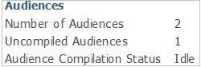

# Uncompiled audiences are present in SharePoint Online

## Problem

When you view the Manage User Profiles section of the SharePoint Online admin center in Office 365 for enterprises, you find that uncompiled audiences are present.

## Solution

To resolve this issue, wait for audience compilation to be completed. If more than seven full days have passed since the last audience compilation, contact Office 365 technical support.

Note Audience targeting won't function correctly on SharePoint Online sites until audience compilation is completed. Additionally, if a user was added or removed for an audience, compilation must be completed before the changes are made to the audience.

## More information

This behavior occurs because audiences are compiled weekly in SharePoint Online.

Still need help? Go to [Microsoft Community](https://answers.microsoft.com/).
