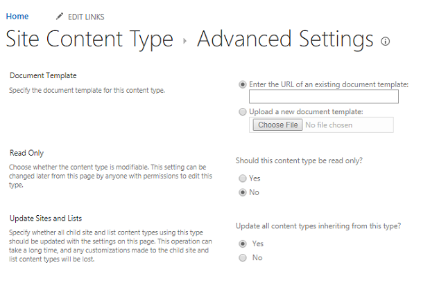

# Using relative URLs for content types across site collections is not supported in SharePoint Online

## Summary

n Microsoft SharePoint Online, when you specify a template for a site content type by using a URL of an existing template, make sure that you use the URL of the existing template in the same site collection in which the content type is used.

Using a relative URL to a template in a site collection that’s different from the one in which the content type is used is not supported. For example, using a relative URL to a content type in the content type syndication scenario is not supported.

This setting is made under **Site Content Type** > **Advanced Settings** > **Document Template**. The template URL that you enter must be of a content type that is in the same site collection.

