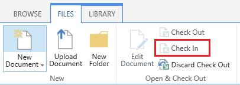

# You can't check in multiple SharePoint Online items in a document library

## Problem

You select multiple items in a SharePoint Online document library that are checked out, and then you try to click the **Check In** button. However, you discover that the control is disabled.

## Solution/Workaround

To work around this behavior, use **Check In** for individual items.

## More information

This is the expected behavior in SharePoint Online when a workflow is associated with the document library. 

Still need help? Go to [Microsoft Community](https://answers.microsoft.com/).
