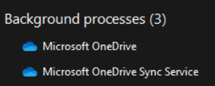

# Common issues syncing Microsoft SharePoint lists offline

This document contains troubleshooting steps for common issues with syncing lists offline.

## Troubleshooting
 

<b>Sync icon doesn't appear</b>

1. Open the Windows task manager and look for “__Microsoft OneDrive Sync Service__ (__OneDrive.Sync.Service.exe__)” under **Processes** > **Background Processes**.  

   - If __Microsoft OneDrive Sync Service__  is running, continue to step 2.
   - If __Microsoft OneDrive Sync Service__ isn't running, List sync isn't running. Your orgnization might have prevented it from synching, see [Lists sync policies](/sharepoint/lists-sync-policies). 
      
1. <a href=#logging>Enable Web App Logging</a>.  
1. Check the console log for a line that includes "Found list". It will look similar to this example:

    :::image type="content" source="./media/common-sync-issues/console.png" alt-text="Console log line that starts with Found List":::

    - If there is no log line starting with “Found list”, it might mean the List sync process hasn't synced the list yet. Wait for silent configuration or syncing to occur.
    - If the line with "Found list" shows “unsynced:true", the list is currently unsynced because List sync doesn’t support it. This is by design, and List sync will be extending our support for lists in future versions. See the "Current Limitations of List sync" section in [Edit lists offline](https://support.microsoft.com/office/41403c3e-1795-4e07-b56b-ae591cbde2f9).

1. If __OneDrive.Sync.Service.exe__ is running, and there is a “Found list” log line that does not show "unsynced",  it could be a client issue. See <a href=#support>Contacting Support</a>.  

 

<b>Sync icon stays on for more than 10 minutes</b>

The sync icon will often be on for a few minutes, appearing next to the list name:

:::image type="content" source="./media/common-sync-issues/sync-icon.png" alt-text="The sync icon appears next to the list name.":::

If the icon stays on for more than 10 minutes, first make sure that the client device is online. If it is offline, the sync icon will stay on.
If the client device is online, and the sync icon shows for more than 10 minutes, see <a href=#support>Contacting Support</a>.

 

<b>Local changes not synced</b>

1. See if there are any conflicts or failed uploads. Navigate to **View** > **All items** > **Items that need attention**.

    :::image type="content" source="./media/common-sync-issues/conflicts.png" alt-text="Conflicts are shown in the menu.":::

1. If there are conflicts, refresh the page and try the update again.
1. If there are no conflicts, or the conflicts continue to appear after step 2, see <a href=#support>Contacting Support</a>.

## Contacting support
 

<b>Information needed to open a Microsoft support request</b>

- **Required** The email address used to log into the List web app.
- **Required** A general time stamp of when the issue occurred (within a few hours is usually enough).
- **Required** A description of the issue.
- **Required** Browser type (Edge, Chrome, etc).
- **Optional** Screenshots of the issue. The more detail in the request, the more likely Microsoft team will be able to quickly assist and won’t need to ask for more information.
- **Optional** If you enabled web app logging during debugging, send a copy of the console logs. You can right-click the console in the browser tools and select “Save as” to generate a file.  
- **Optional** The ticket might require client logs to be collected separately. See “Collect Microsoft SharePoint client logs” below.

 

<b>Enable web app logging</b>

1. Open the browser and navigate to the list in question.  
1. Make sure you are using Microsoft Edge, Google Chrome, or Mozilla FireFox. These are the only currently supported browsers. Also make sure you are on a device running Windows 10 or later.  
1. Press F12 to open the browser tools.
1. Switch to the **Application** tab.
1. On the left side of the pane should be a list of Local Storage domains. Expand the **Local Storage** category and select the one that corresponds to the list URL. For example, if you were viewing `https://contoso.sharepoint.com/teams/teamSite/Lists/Number%20List/AllItems.aspx` you would pick `https://contoso.sharepoint.com`.  

1. Add `sharepoint.datasync.nucleus.logToConsole` in the right pane by selecting an empty line. Set the value to **true**.

    :::image type="content" source="./media/common-sync-issues/logto.png" alt-text="sharepoint.datasync.List sync.logToConsole is added with the value set to True.":::

1. With the browser tools still open, switch to the **Console** tab and press F5 to refresh the page.
1. The console will contain useful logging for web app issues.

 

<b>Collect Microsoft SharePoint client logs</b>

1. Open File Explorer.  
1. Navigate to `%localappdata%\Microsoft\OneDrive\logs\ListSync`.
1. Right-click the “Business1” folder and then select **Send To** > **Compressed (zipped) folder**.
1. Send that zip file to Microsoft support.  

 

<b>Create a support request</b>

Microsoft 365 admin users have access to create support requests.

Select the link below, which will populate the pane in the Microsoft 365 Admin Center.

[Run query: Issues with editing Microsoft Lists offline](https://aka.ms/editlistofflineIssue)

Fill in the Description field with the **Information needed to open a Microsoft support request**, above.

Select **Contact Support**.

## References

- [Edit lists offline](https://support.microsoft.com/office/41403c3e-1795-4e07-b56b-ae591cbde2f9)

- [Lists sync policies](/sharepoint/lists-sync-policies)
