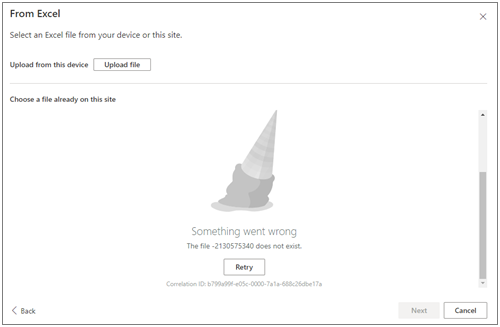

# Error when creating a list from Excel: Something went wrong. The file does not exist

## Symptoms

When you try to create a list from Excel in a SharePoint site, you receive the following error when you try to choose a file already on the site.

> Something went wrong.
>
> The file [xxxx] does not exist.

## Cause

The default **Document Library** is deleted, or its name is renamed from **Documents** to something else.  

## Resolution

- If the default **Document Library** is deleted and present in the recycle bin, restore it.

- If the default **Document Library** is deleted and not present in the recycle bin, create a **new library** with the name **Documents**.

- If the default Document Library name is renamed from **Documents** to something else, rename it back to **Documents** from **Library Settings -> List name, Description and Navigation -> Name**.
