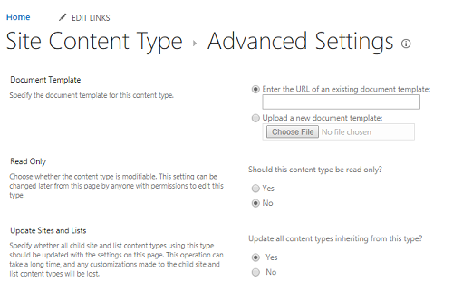

# Using relative URLs for content types across site collections is not supported

In Microsoft SharePoint Online, when you specify the **Document Template** for a site content type by using a URL of an existing document template, make sure that you use the URL of an existing site in the same site collection. A relative URL to a content type is not supported in the content type syndication scenario.

Specifically, under **Site Content Type** > **Advanced Settings** > **Document Template**, the URL (if any) has to be a URL of an existing content type on the same site collection.

## More information

Still need help? Go to [SharePoint Community](https://techcommunity.microsoft.com/t5/sharepoint/ct-p/SharePoint).
