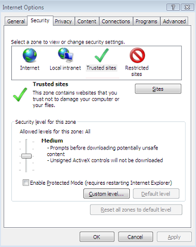
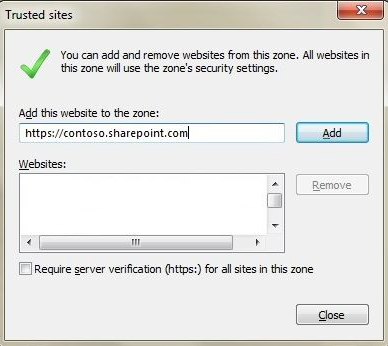

# How to use the "Open with Explorer" command to troubleshoot issues in SharePoint Online

## Introduction

This article discusses how to use the **Open with Explorer** command in SharePoint Online to view, copy, and move files in a library. The article also discusses how to troubleshoot issues that you may experience when you use this command.

## Procedure

The **Open with Explorer** command opens a local instance of Windows Explorer that displays the folder structure on the server that hosts the SharePoint site. You can then work with the files in the folder. For example, you can perform the following actions:

- Drag documents into libraries
- Create folders
- Move or copy documents from one library to another library within the same site collection or between site collections
- Delete multiple documents at one time

> [!NOTE]
> If you use versioning for your SharePoint Online libraries, document version history isn't maintained if you use Windows Explorer to move files form one subsite to another subsite.

### Use "Open with Explorer" in a SharePoint Online document library or OneDrive for Business

#### For a document library

In the SharePoint Online document library, click the **Library** tab on the ribbon, and then click the **Open with Explorer** icon in the **Connect & Export** group.

If you don't have the **Library** tab, and you're using the new look and navigation experience for document libraries, click the view menu (for example, **All Documents**) in the upper-right corner, and then click **View in File Explorer**.

For more information about the new look and navigation experience for document libraries, see [Switch the default experience for lists or document libraries from new or classic](https://support.office.com/article/switch-the-default-experience-for-lists-or-document-libraries-from-new-or-classic-66dac24b-4177-4775-bf50-3d267318caa9).

#### For OneDrive for Business

Click the **Library** tab on the ribbon, and then click the **Open with Explorer** icon in the **Connect & Export** group.

If you don't have the **Library** tab, click the gear icon for the **Settings** menu, and then click **Show Ribbon**.

> [!NOTE]
> If **Show Ribbon** isn't present in the **Settings** menu, you must first click **Return to classic OneDrive** in the lower-left corner to return to classic view, and then select the **Show the Ribbon** option. To return to the new **OneDrive** view, click the OneDrive link in the Office 365 app launcher.

For more information about how to copy or move library files by using **Open with Explorer**, go to [Copy or move library files by using Open with Explorer](https://support.office.com/article/copy-or-move-library-files-by-using-open-with-explorer-aaee7bfb-e2a1-42ee-8fc0-bcc0754f04d2?ocmsassetID=HA101811182&CorrelationId=93c20e9a-ab98-496b-8c8a-32ed16406dec).

### Troubleshoot "Open with Explorer" error messages

When you browse to a SharePoint Online document library, you may receive intermittent connectivity issues, or you may receive one of the following error messages:

- **Your client does not support opening this list with Windows Explorer.**
- **We're having a problem opening this location in File Explorer. Add this web site to your Trusted Sites list and try again.**
- **We're having a problem opening this location in File Explorer. To open with File Explorer, you'll need to add this site to your Trusted Sites list and select the "Keep me signed in" check box when you sign in to the SharePoint Online site. For more information, see https://support.microsoft.com/kb/2629108.**
- **We're having trouble opening this library in File Explorer. Syncing this library will give you a better experience.**

  

> [!NOTE]
> The Open with Explorer command doesn't work in the Microsoft Edge browser.

#### For Internet Explorer 10 with Windows 7 or Windows 8, install the hotfix to resolve this problem

If you're using Internet Explorer 10 with Windows 7 or Windows 8, a hotfix has been released to resolve this issue. For more information, go to [Error when you open a SharePoint Document Library in Windows Explorer or map a network drive to the library after you install Internet Explorer 10](https://support.microsoft.com/help/2846960).

#### Authenticate to Office 365

Make sure that you're authenticated to Office 365. To do this, use one of the following methods.

##### Method 1: Use "Keep me signed in"

1. Sign in to the SharePoint Online site by using your Office 365 work or school account credentials. When you do this, make sure that you select the Keep me signed in check box.

   > [!NOTE]
   > If you didn't previously select this setting, you might find that you're already signed in when you browse to a SharePoint Online site or the Office 365 portal. In this case, you must first sign out and then sign in again by using the Keep me signed in check box. To do this, follow these steps:
   > 1. On the Office 365 ribbon, click the arrow next to your user name.
   > 1. Click **Sign out**.
   > 1. Close all browser windows.
   > 1. Browse to the Office 365 portal.
   > 1. Select the **Keep me signed in** check box, enter your Office 365 work or school account credentials, and then click **Sign in** (if it's necessary).
1. Open a document library in Explorer View.

##### Method 2: Use a persistent cookie

The UsePersistentCookiesForExplorerView parameter for the Set-SPOTenant cmdlet that's used in the SharePoint Online management shell lets SharePoint issue a special cookie that will allow this feature to work even when **Keep Me Signed In** isn't selected.

After this parameter is enabled, you are prompted when you click **Open with Explorer** in SharePoint Online by a dialog box, as shown in the following screen shot. After you click **This is a private computer**, the persistent cookie is stored. Therefore, you no longer have to select **Keep me signed in**.

This method should be used only on a private computer.

> [!NOTE]
> If you receive an Internet Explorer Security message that says, "A website wants to open web content using this program on your computer," it's likely that SharePoint Online isn't added to the trusted sites zone in Internet Explorer. See the "Add your SharePoint Online sites to trusted sites" section of this article for more information about how to add SharePoint Online to your trusted sites.

For more information about how to use the parameter together with the Set-SPOTenant cmdlet, and for more information about this parameter and the persistent cookie, go to [Set-SPOTenant](https://docs.microsoft.com/powershell/module/sharepoint-online/Set-SPOTenant?view=sharepoint-ps).

For more information about the SharePoint Online management shell, go to [What is the SharePoint Online Management Shell?](https://docs.microsoft.com/powershell/sharepoint/sharepoint-online/introduction-sharepoint-online-management-shell?view=sharepoint-ps).

#### Add your SharePoint Online sites or Open with Explorer URL to trusted sites

Make sure that the SharePoint Online or Open with Explorer URL, or URLs, have been added to your trusted sites zone in Internet Explorer. To do this, follow these steps:

1. Start Internet Explorer.
1. Depending on your version of Internet Explorer, take one of the following actions:

   - Click the **Tools** menu, and then click **Internet options**.
   - Click the gear icon, and then click **Internet options**.

     

1. Click the **Security** tab, click **Trusted sites**, and then click **Sites**.

   

1. In the **Add this website to the zone** box, type the URL for the SharePoint Online or OneDrive for Business site and the Open with Explorer URL (which uses a -files or -myfiles format) that you want to add to the **Trusted sites** zone, and then click **Add**.

   For example, enter https://**contoso**.sharepoint.com and https://**contoso**-files.sharepoint.com for a site. Or, enter https://**contoso**-myfiles.sharepoint.com and https://**contoso**-my.sharepoint.com for a OneDrive for Business library.

   > [!NOTE]
   > In this example, **contoso** represents the domain that you use for your organization.

   Repeat this step for any additional sites that you want to add to this zone.

   To make sure that **Open with Explorer** works correctly, you must include the SharePoint site URL or the OneDrive for Business URL in addition to the "-files" (for a site) URL or the "-myfiles" (for a OneDrive for Business library) URL.

   

1. After you have added each site to the **Websites** list, click **Close**, and then click **OK**.

#### Check the status of the WebClient service

Make sure that the latest Windows updates are applied. If all the latest updates are applied, and the issue persists, make sure that the WebClient service is running. To do this, follow these steps:

1. Follow the appropriate step for your operating system:

   - For Windows XP, Windows Vista, and Windows 7, click **Start**, click **Run**, type **services.msc**, and then press Enter.
   - For Windows 8, click **Start**, type **services.msc**, and then press Enter.
   - For Windows Server 2008 or Windows Server 2012, click Start, type services.msc, and then press Enter. If the WebClient service isn't present, you must first install the Desktop Experience. For more information about how to install the Desktop Experience, go to [Install Desktop Experience](https://docs.microsoft.com/previous-versions/windows/it-pro/windows-server-2008-R2-and-2008/cc754314(v=ws.11)).

1. In the list of services, locate the **WebClient** service, and then make sure that its status in the **Status** column is set to **Started**. If it isn't set to **Started**, double-click the WebClient service to open the **WebClientProperties** dialog box, click **Start**, and then click **OK**.

   > [!NOTE]
   > If the **Startup Type** for the **WebClient** service is set to **Disabled**, the **Open with Explorer** button doesn't function correctly and you cannot start the service. To enable the service, within the **WebClient Properties** dialog box, click the drop-down option for the **Startup type** setting, and then select either **Manual** or **Automatic**. After you complete this step, click **Apply**, click **Start** to start the service, and then click **OK**.

### Troubleshoot slow "Open with Explorer" performance on a Windows 8-based or Windows Server 2012-based computers

When you browse to a SharePoint Online document library, and then you click "Open with Explorer," you may experience an issue in which the enumeration of the files and directories is slower than expected. A hotfix was released to resolve this issue. For more info, go to [Slow performance when you connect to a WebDAV shared folder in Windows 8 or Window Server 2012](https://support.microsoft.com/help/2782826).

## More Information

For more information about how to work with site library files in File Explorer, go to [Ways to work with site library files in File Explorer](https://support.office.com/article/ways-to-work-with-site-library-files-in-file-explorer-751148de-f579-42f9-bc8c-fcd80ccf0f53).

For more info about working with the WebClient service, go to the following Knowledge Base articles:

- [A WebClient service crashes on a computer that is running Windows 7 or Windows Server 2008 R2 when you connect a WebDav resource](https://support.microsoft.com/help/2548470)
- [Prompt for Credentials When Accessing FQDN Sites From a Windows Vista or Windows 7 Computer](https://support.microsoft.com/help/943280)

Still need help? Go to the [Microsoft Community](https://answers.microsoft.com).