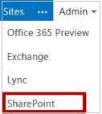
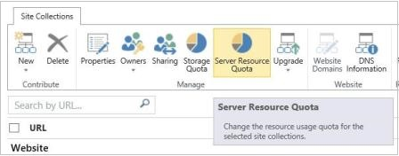

# You receive messages that a site collection has exceeded its usage quota or that it is running out of resources

## Problem

When you have a site collection that runs a sandboxed solution in SharePoint Online for Office 365, you may experience one of the following symptoms:

- You receive the following message:

   **The site collection containing this sandboxed solution has exceeded its daily resource usage quota.**

- If you're the site collection owner, you receive an email message that contains one of the following messages:

   **Your site collection is running low on resources to run custom user solutions. If you run out of resources, custom user solutions may not run until the next day. Please follow the link below to your SharePoint Web site to manage and monitor solution usage.**

   **Your site collection has run out of resources to run custom user solutions. Custom user solutions will not run until the next day. Please follow the link below to your SharePoint Web site to manage and monitor solution usage.**

## Solution

To resolve this issue, use one of the following methods, as appropriate for the Office 365 offering that you're using.

### Buy additional licenses

When you buy additional licenses, you increase the resource usage quota for your subscription.

### Change the resource usage quota for the site collection

To change the Server Resource Quota for the site collection, follow these steps:

1. Sign in to the Office 365 portal.

2. In the **Admin** drop-down list, click **SharePoint**.

   

3. In the list of site collections, click to select the check box that's next to the site collection whose resource usage quota you want to change.

4. On the ribbon, click **Server Resource Quota** in the **Manage** group.

   

5. In the **set server resource quota** dialog box, type the value in megabytes (MB) that you want for the resource usage quota in the resources box, and then click **Save**.

6. The changes to the site collection may take some time to be completed. A green spinning wheel is displayed to the right of the site collection in the list to indicate that the operation is still in progress. You can tell that the operation is complete when the wheel is no longer displayed.

## More information

This issue occurs if the site collection is running low on its resource usage quota, or the site collection has exhausted its resource usage quota.

The cumulative resource usage quota for a SharePoint Online site collection is reset to zero at the end of the day (24-hour period). For example, assume that the resource usage quota of a site collection is set to 300. If the specified quota is exceeded during a 24-hour period, the accumulated resource usage quota that's used is reset to zero at the beginning of the next day, and you can run sandboxed solutions on the site collection.

Still need help? Go to [Microsoft Community](https://answers.microsoft.com).
