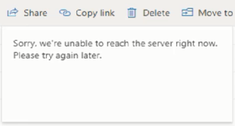
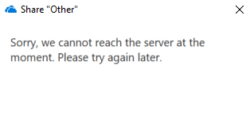
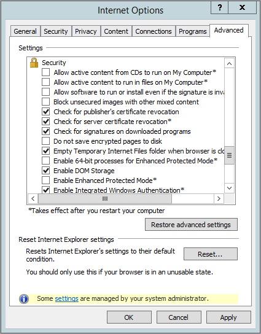
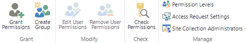

# "Unable to reach the server right now" error message when sharing files

## Symptoms

You may see the error message "Sorry, we're unable to reach the server right now. Please try again later." when you attempt to share a OneDrive file from Windows Explorer or SharePoint Online websites.

> [!NOTE]
> If the sharing option is missing within the OneDrive folder, refer to [Unable to share OneDrive files](https://support.office.com/article/18755580-24f3-408d-afda-bd8d0f7ed5a2).

## Resolution

**Clear the "Do not save encrypted pages to disk" option in Internet Options**

1. Open **Internet Explorer**, go to **Tools** and select **Internet Options**.

1. Select the **Advanced** tab and a scroll to the **Security** section of the **Settings**.

1. Clear the check box titled **Do not save encrypted pages to disk**.

   

1. Restart your browser for the settings to take effect.

**Enable the "Allow members to share the site and individual files and folders" feature**

1. Navigate to the site where the issue is happening and to go to the **Site Settings**.

1. Select **Site permissions** under the Users and permissions.

1. Click in **Access Requests Settings** and enable **Allow members to share the site and individual files and folders**.

   

**Unique security scopes per list or library**

In some situations, when you try to share files or folders with users, you may receive the following message:

**You cannot break inheritance for this items because there are too many items with unique permission in this lists.**

This occurs when you use the classic experience. This message means that you are reaching the unique security scopes in the list or library. For more information about the unique security scopes in the list or library, see [SharePoint Online Limits](https://support.office.com/article/8f34ff47-b749-408b-abc0-b605e1f6d498).
