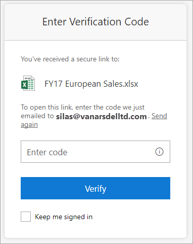

# No verification code when external recipients access shared secure links

Assume that you share a [secure link](https://docs.microsoft.com/sharepoint/what-s-new-in-sharing-in-targeted-release?redirectSourcePath=%252farticle%252fcc78357c-6d48-499c-9cc7-dae447d0d391) from SharePoint Online with users outside your organization. When external recipients access the secure link, they are prompted to provide a verification code, as shown in the following screenshot.

However, users can't respond to the prompt because they don't receive the indicated email message that contains the verification code. In this situation, users should check their Junk Email or Spam folder to locate the verification message.
