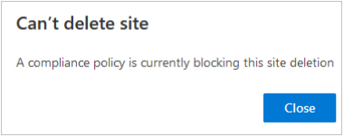
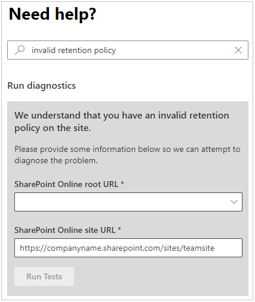
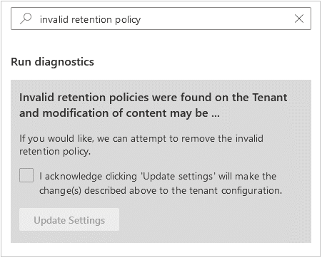

# Error 'A compliance policy is currently blocking this site deletion' when trying to delete a SharePoint site

## Symptoms

When you try to delete a SharePoint site, the following message appears:

**Can’t delete site.**

**A compliance policy is currently blocking this site deletion.**

## Cause

There are several reasons for this error to occur:

- There might be a compliance policy that is currently invalid.
- A valid policy can be present, and the SharePoint site shouldn't be deleted. In this situation, contact your administrator to determine whether you can exclude or remove this site from the policy.

## Resolution

To remove the **Invalid retention hold**, try one of the following methods, depending on your level of permissions.

### Non-administrators

If you receive the **Compliance policy** error message, contact your [Microsoft 365 Administrator](/microsoft-365/admin/add-users/about-admin-roles).

### Administrators

If you're an administrator, and you're unable to delete the site:

1. Go to the [Microsoft Admin site](https://admin.microsoft.com).

2. In the navigation pane, select **Support**, and then select **New Service Request**.

   > [!Note]
   > This selection activates the **Need Help?** pane on the right side of the screen.

3. In the **Briefly describe your issue** area, enter **invalid retention policy**, and then select **Enter**.

4. In the Run diagnostic section, type or paste the **SharePoint site URL**, and then select **Run Tests**.

   

5. If the test finds an **invalid retention policy**, and the policy is blocking the site deletion, you may choose to remove the policy.

   

## More information

Still need help? Go to the [SharePoint Community](https://techcommunity.microsoft.com/t5/sharepoint/ct-p/SharePoint).