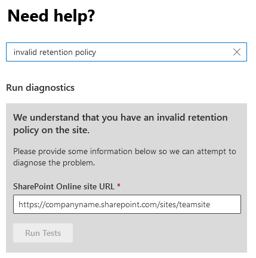

# "A compliance policy is currently blocking this site deletion" when deleting a SharePoint site

## Symptoms

When you try to delete a SharePoint site, the following message appears:

**Can't delete site.**

**A compliance policy is currently blocking this site deletion.**

## Cause

There are several reasons for this error to occur:

- There might be a compliance policy that is currently invalid.
- A valid policy can be present, and the SharePoint site shouldn't be deleted. In this situation, contact your administrator to determine whether you can exclude or remove this site from the policy.

## Resolution

To remove the **Invalid retention hold**, try one of the following methods, depending on your level of permissions.

### Non-administrators

If you receive the **Compliance policy** error message, contact your [Microsoft 365 Administrator](/microsoft-365/admin/add-users/about-admin-roles).

### Administrators

> [!NOTE]
> This feature is not available for Microsoft 365 Government, Microsoft 365 operated by 21Vianet, or Microsoft 365 Germany.

If you're an administrator, and you're unable to delete the site:

1. Select **Run Tests** below, which will populate the diagnostic in the Microsoft 365 Admin Center. 

   > [!div class="nextstepaction"]
   > [Run Tests: Invalid Retention Hold](https://aka.ms/PillarInvalidRetention)

2. In the Run diagnostic section, type or paste the **SharePoint site URL**, and then select **Run Tests**.

   

3. If the test finds an **Invalid retention policy**, and the policy is blocking the site deletion, you may choose to remove the policy.

   

## More information

Still need help? Go to the [SharePoint Community](https://techcommunity.microsoft.com/t5/sharepoint/ct-p/SharePoint).
