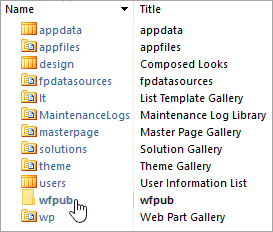
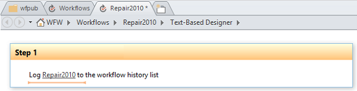

# SharePoint Designer 2013 shows empty wfpub library  

## Symptoms  

In a Microsoft SharePoint site collection, you can't add a globally reusable workflow (such as "Approval - SharePoint 2010") to a list or library. 

Deactivating and then reactivating the site collection feature **Workflows** doesn't resolve the issue. Additionally, you see that the wfpub library is empty and the wfpub icon may be a regular folder icon instead of a catalog icon when you follow these steps:   

1. Open the root website of the site collection in SharePoint Designer 2013.
2. Under **Site Objects**, select **All Files** > **_catalogs** > **wfpub**.   
          

## Resolution  

To resolve this issue, follow these steps:    

1. Open the root website of the site collection in SharePoint Designer 2013.    
2. Under **Site Objects**, select **Workflows**.    
3. In the **New** section of the **Workflows** ribbon, select **Reusable Workflow**.    
4. On the **Create Reusable Workflow** form, enter the name **Repair2010**. For **Platform Type**, select **SharePoint 2010 Workflow**, and then select **OK**.   
        
5. Add a single "Log to history list" action to "Step 1" of the workflow.   
        
6. In the **Save** section of the **Workflow** ribbon, select **Publish**.    
7. In the **Manage** section of the **Workflow** ribbon, select **Publish Globally**. In the confirmation dialog box that appears, select **OK**.    
8. In a web browser, locate the root website of the site collection, and then access **Site Settings **> **Site Collection Features**. Then, toggle the **Workflows** feature:
   - If the feature is Activated, click **Deactivate**. Then, select **Activate**.     
   - If the feature is Deactivated, select **Activate**.       

The issue is now resolved. You can safely remove the Repair2010 workflow from the site collection through SharePoint Designer 2013: Open the site collection in SharePoint Designer, go to **Site Objects** > **Workflows**, select **Repair2010**, and then select **Delete**.
