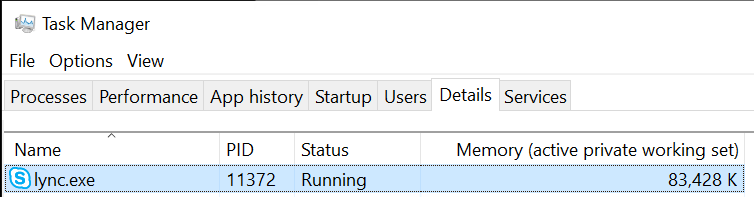
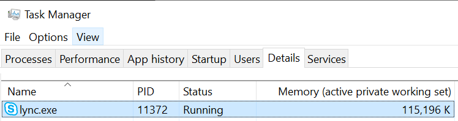
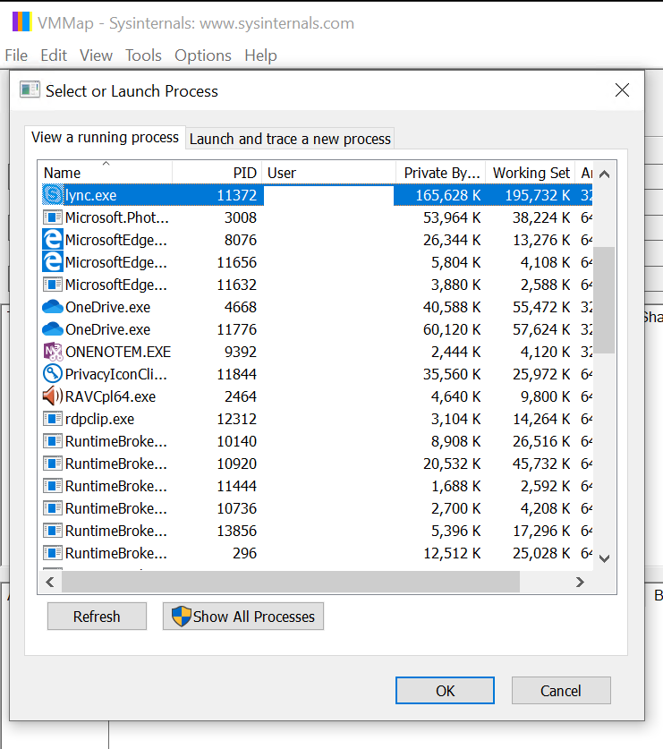
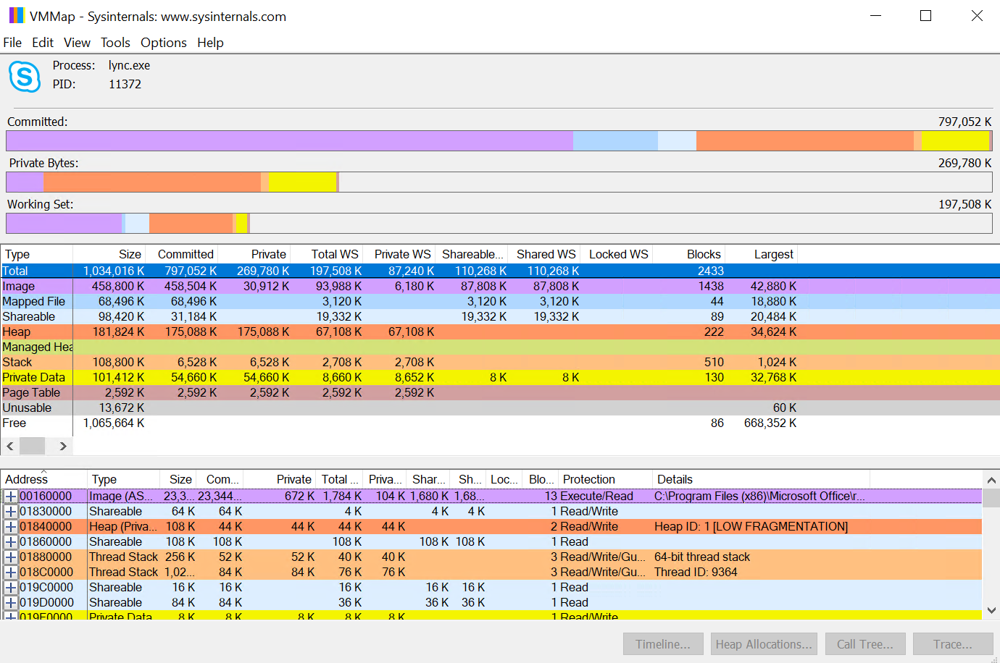
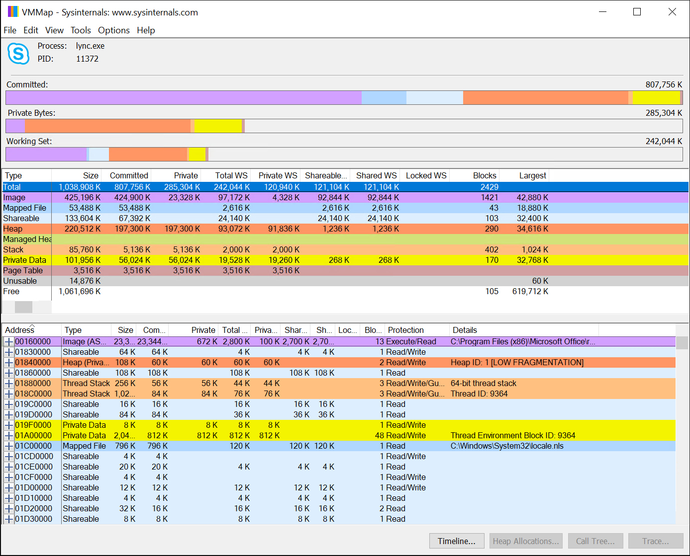

# The Great Skype for Business Memory Mystery

This article was written by Kenn Guilstorf, Skype for Business Escalation Engineer.

As an escalation engineer, I assist customers with some of the more "persnickety" Skype for Business issues. Lately, I've received quite a few cases that are "performance-based" – basically, complaints that Skype for Business is slow or sluggish, won't allow application sharing, or is simply using too much memory. Many times, an investigation into these cases shows that the user has let Skype for Business run for weeks; and, over time, the memory has crept up until it affects performance. I've even noticed it myself when I let Skype run for a long time. So, what is Skype doing, and why is it holding so much memory? (Here's a little hint: This is completely normal and by design. Nothing is actually wrong – any and every native program runs into this.)

## How much memory can it chew through?

The first step to fix any issue is to understand the problem, and the first step to understanding any problem is to define it. This isn't as easy to do as it sounds.

When Skype for Business (SfB) first starts, memory usage is comparably small (if you can count 100 MB as small). We can see this occur in any number of tools, such as **Task Manager**:

Figure 1: Don't be fooled: Lync.exe is the process name for SfB (32-bit version)

Over time, the amount of memory that the process uses is going to grow. How large it grows will be determined by how much Skype is used, what it is used for, and so on. As an example, here's that same client after about 24 hours:

Figure 2: The same SfB 24 hours later

So, Skype has consumed about 32 MB in 24 hours. That isn't much, right? It really isn't – until I explain that Skype was just sitting idle for all those 24 hours. Basically, I started Skype for Business on a computer, locked it, and waited about 24 hours before unlocking it. In use, the toll would have been much higher – especially if I joined meetings, used app sharing or desktop sharing in those meetings, used IM, and so on. I've seen cases in which Skype for Business memory usage grew to 300–500 MB in a single day. Things can get dicey after one or more weeks of usage – especially on the far more memory-constrained 32-bit client.

## Show me the memory

There are many tools that can profile memory. One of the most popular – at least at Microsoft – is the SysInternals tool VMMap, available at [VMMap v3.26](https://docs.microsoft.com/sysinternals/downloads/vmmap). We can use it to look at the process memory, and see whether we can profile the Skype for Business memory.

After you've downloaded **VMMap**, run it. As it starts, it will open a process list so that you can choose the process that you want to examine. I'll choose **lync.exe** and click **OK**.

Figure 3: VMMap at Start

Next, you see a graphic tha's a multi-colored representation of the current memory profile for the executable that you've selected – Lync.exe, in this case.

Figure 4: Beginning VMMap for recently started Lync.exe

There's a lot of information here, and describing it all would fill up one or more blog posts of its own. If you're really interested, there are several really great books and online articles that can help explain it. (Personally, I recommend "Advanced Windows" by Jeffrey Richter – currently out of print but still excellent in explaining how memory works. You can find used copies of it at your favorite book store.)

As you can see, the memory shown in **Task Manager** doesn't align with any category in **VMMap**. **Task Manager** is a more generalized representation; it's accurate, it just doesn't count everything. **VMMap** is much more comprehensive.

Here's our Skype instance after the 24-hour waiting period:

Figure 5: VMMap for Skype after 24-hours

## Where's the memory?

If you compare each individual category, nothing really lines up. Actually finding what is consuming the memory is difficult to do because the categories of memory fluctuate as objects and memory requests are made and released, and memory gets reserved and committed for storing various objects. The "kernel of knowledge" (for the purposes of this blog, anyway) is the "Free" category. In our example, "free" memory is all the available space that's "reserved" for the Lync executable. But only a certain type of "committed" memory is shown in **Task Manager**. The reserved memory isn't counted because it isn't in use. 

So, where's the memory? That becomes difficult to pinpoint because the memory isn't really lost. Contrary to popular belief, the Skype team was not subsidized by desktop memory manufacturers. There is no nefarious plot to get customers to upgrade any systems or memory. This isn't even a case of planned obsolescence. The truth is a bit more difficult to explain.

Let's backtrack a bit to make things clearer. When you first start the Skype for Business client, it has a relatively small memory footprint – typically 100 MB or so, depending on the number of contacts it's keeping track of for you and other overhead (you can clearly see this in the data above). After a few days, you'll notice that this footprint grows several hundred thousand bytes to several megabytes. In certain situations, this can be a problem – but it isn't necessarily a problem in Skype for Business itself. Rather, it's an effect of the Windows programming paradigm and how it handles memory natively.

## Windows programming what?

I'm only going to give a very simplistic view of Windows memory here. Windows memory is handled through very expensive (in terms of computer cycles and resources) procedures known as allocations and de-allocations. When a program needs memory, it asks Windows to allocate it. When it's through with the memory, the program asks Windows to de-allocate it. Internally, Windows goes through several processes to manage the memory requests.

When a request is made, Windows checks the memory that it has already committed to the process but that the process isn't using. Windows is looking to see whether there's a large enough memory block to use. If there is, the system uses it and goes on its merry way. If there isn't, it then checks reserved memory. If there's a large enough block of reserved memory, it commits it (in operating system-defined chunks known as "pages"), and stores the variable in it. The memory is now committed, and we've just grown the memory footprint of the executable.

What happens if there isn't enough reserved memory to handle the request? The operating system tries to reserve more memory – if it can. Here's where the difference between 32-bit architecture and 64-bit architecture comes into play. A 32-bit process can use only a maximum of 4 GB of memory. This is because 4 GB is the maximum amount that a 32-bit register can address. (A bit can only hold a 1 or a 0 – binary. Therefore, 32-bits means that 232 is the highest address that's allowed). Thanks to 32-bit architecture, only about 2 GB of that memory is usually assigned to the process itself, the rest being used by the operating system to map common DLLs, take care of common kernel-mode objects, and so on. In a 64-bit system, the 64-bit long registers can handle 264, which turns out to be about 18 exabytes. However, Windows artificially limits the amount of memory that's available to be reserved to between 2 and 4 terabytes (TB), depending on the Windows version.

After memory is reserved, it will get committed and then used as before. The de-allocation process is largely the reverse - except for one or two small but important details.

First, unless specifically requested, Windows never "clears" memory. When memory is de-allocated, it is just marked as **free** in the Windows memory map. Whatever it held is actually still there and will remain there until it's overwritten by another allocation. Next, Windows rarely de-commits memory unless specifically requested to do so. As I said earlier, memory operations are fairly resource-expensive. So, if a program needed the memory allocated previously, Windows is assumes that it may need that memory again and will hold off de-committing the memory until it absolutely has to. Finally, Windows never "coalesces" memory. This means that memory that Windows frees is never "aggregated," and blocks of free memory are never "moved together" to make larger blocks of free memory. (All these functions are lumped together into a category that's known as "garbage collection." .NET Framework famously *does* have some garbage collection features. However, Skype for Business is a "native" or non-.NET application.)

Skype for Business processes many objects every second that are mainly variably sized. It has to do this in order to be the stunning tool that we want it to be. We ask it to manage contacts, manage calendars (meetings), IM with our friends, relatives, and colleagues and even speak to them by using both voice and video, share desktops or windows, and so on. Well, to quote the late, great Robert Heinlein, among others: "There ain't no such thing as a free lunch."

Managing so many objects of such differing and often variable sizes creates allocations and de-allocations of variably sized chunks of memory. Over time, this causes memory fragmentation – at times severe – that increases the memory footprint of Skype for Business.

An example might better illustrate this point. Let's assume that Skype (or any native program, really) allocates 64 objects, numbered 1-64, that are 4 K bytes each in size:

Figure 6: 64 Objects, each using 4 KB of memory

This causes a 256 KB memory allocation and commitment. Now, let's assume that the program doesn't require the even-numbered objects, so it releases them:

Figure 7: Releasing all the even-numbered objects frees up 128 KB of memory!

If you look at the larger picture of overall memory (by using VMMap or a similar tool), you'll see that one of the committed columns (likely in the **Heap** section, but it depends on exactly how the program requested the memory) has 128 KB less, and the **Free** section has grown by 128 KB. In Task Manager, the program now owns only 128 KB bytes of memory.

Let's next assume that our program has a single 8 KB object that it has to store. This should be simple. After all, it has 128 KB free. However, trying to store that 8 KB object will create a new memory reservation instead of storing the memory in the 128 KB free space. This is because, if you look at the memory, you can see that it's still segmented into 4 KB chunks! Windows doesn't have a large enough memory block to hold the 8 KB object, so it has to reserve and commit more memory to the program.

This is a rather contrived example, but it illustrates the difficulty of Skype's memory management. Skype manages a very large number of objects that don't have an easily definable size. These objects are all variably-lengthed. This means that as objects are stored and freed – especially over a long period of time, such as days or weeks – the memory fragmentation can become severe and, because Windows has to allocate more memory for storing the new objects, the memory footprint grows excessively.

When this causes issues in the 32-bit client, we frequently suggest moving to the 64-bit client because memory is far less constrained there, thanks to 64-bit vs 32-bit architecture. However, excessive memory growth, among other considerations, can cause sluggishness in even the 64-bit client. Those other considerations include overall system memory, disk speeds (because program memory is typically backed by virtual memory in the [Windows paging file](https://support.microsoft.com/help/2860880/how-to-determine-the-appropriate-page-file-size-for-64-bit-versions-of)), how many other applications are open, and so on. In both cases, as the Skype for Business memory footprint grows over time, the worse it's going to perform. In the 32-bit client case, this can cause the larger objects that Skype requires – such as its internal buffer for application sharing – to run out of space and cause failures.

To be fair, memory is only one resource that is consumed over time – but it *is* the most obvious. Handle usage can grow, threads will increase over time, paged-pool memory will increase, and so on. Each of these increases can have an impact on the process and, in certain cases, on the entire operating system. This is one of the myriad reasons why we suggest – even for the 64-bit client – that users exit and restart Skype daily (or, at least, weekly) as a best practice.

## What do I do about this, and can I force Skype to restart?

There are several ways to force a Skype restart, but there is no single, best way. One way, of course, is user education. Users are the arbiters of their desktop usage in most cases, so it's generally pragmatic to teach them to sign out and close Skype when they leave for the day. This can also be done as a mandatory step by writing a custom script or executable, and then running either one as a Task Scheduler task. That approach is a bit ham-fisted, and can cause Skype to cycle even when it's "in use" (although this can be mitigated somewhat through Task Scheduler conditions). There are also third-party opportunities for desktop and computer management, potential BIOS options, and so on.

The bottom line is that it's usually best for Skype for Business to cycle it daily – or, at least, weekly. If you can train your users to recycle Skype for Business on a regular basis – or, at least, when things get weird – you'll likely have a lot fewer Helpdesk calls and many more happy users.
