# Quality of Service for Skype for Business/Lync - configuration and best practice guide
 
*This article was written by Balu Ilag, System Administrator, Microsoft MVP*

## Overview 
As you know, Microsoft Skype for Business is a great product which has multiple features that help enterprise users communicate and collaborate effectively from anywhere. To get Skype for Business to work correctly for internal and external users is a complex task as we are dealing with a vast product. Improving Quality of Service is very important. This admin guide describes why you need Quality of Service and how to configure it end to end.

## Why is QoS required? 
Quality of Service (QoS) is a combination of networking technologies that enables companies to optimize the end-user experience for real time audio, video, and application sharing communications. 

QoS is commonly used when network bandwidth is limited and the network is congested. Because bandwidth limitation and network congestion are factors that are always present in a network, we must have QoS configured correctly to optimize the end-user experience. 

As QoS can be configured end to end, it’s more useful that your media traffic traverse over a Wide Area Network (WAN) because a Local Area Network might not have the same network congestion and bandwidth issues. When we talk about WAN, most organizations that utilize WAN use a Multi-Protocol Label Switched (MPLS) network. This is an L3 WAN built by a service provider to sell its bandwidth to multiple customers and allows QoS to be  guaranteed QoS. With that said, QoS is always required. ☺ 

### How does QoS work? 
Basically, all port ranges are provided to the Skype for Business/Lync client via in-band provisioning. This means that once your Skype for Business/Lync client signs in, they will start using these locked down port ranges, which are configured on a Skype for Business/Lync Server and pushed down to Skype for Business/ Lync clients. When the client initiates media traffic using applications like lync.exe, communicator.exe, or attendeeconsole.exe, all applications that utilize the audio/video, app sharing, or file transfer ports will get Differentiated Services Code Point (DSCP) markings stamped by the operating system via Group Policy Object (GPO).  

Operating systems such as Windows 10, Windows 8, Windows 8.1, Windows 7, or Windows Vista utilize the policy-based QoS, which has the benefit of restricting the QoS at the application level.  This means that all client apps which utilize the audio, video, and app sharing file transfer ports that are configured for audio, video, app sharing, or file transfer will get DSCP markings stamped.

In other words, the Windows or Windows Server operating system can identify the traffic type and apply the appropriate DSCP to each packet according to the port that it uses. 

Below is the client application with its executable file name: 

- Office Communicator 2007/R2 and Lync 2010 – communicator.exe
- Lync 2010 and Lync Attendant Console – attendantconsole.exe 
- Lync 2013, Skype for Business 2015, and Skype for Business 2016 – lync.exe 

Listed in the table below are the port ranges and DSCP values associated with their media type: 

| Media Type | Communication |Port Range | Port Count | DSCP Values |
| -- | -- | -- | -- | -- |
| Audio | Conferencing Server | 49152-57500 | 8348 | 46 |
| Audio | Mediation Server | 49152-57500 | 	8348 | |
| Audio | Clients | 50020-50059 | 40 | 46 |
| Video | Conferencing Server | 57501-65535 | 8034 | 34 |
| Video | Clients | 58000-58019 | 20 | 34 |
| App Sharing | Conferencing Server | 40803-49151 | 8348 | 24 |
| App Sharing | Clients | 42000-42019 | 20 | 24 |
| File Transfer | Clients | 40783-40802 | 20 | 14 |
| Signaling | Client and Server | 5060-5061 | 2 | 46 |

> [!NOTE]
> Skype for Business clients for iOS Version 6.17 and later now support QoS.  This QoS capability is only applicable to Skype for Business clients and IP phone devices which are registered directly to an internal Skype for Business or Lync pool Server on managed networks. QoS is not applicable for traffic routed over the Internet.

Let us start with QoS configuration:  

1.	**Enable QoS for all clients, which is disabled by default:**<br/>
QoS is not enabled by default on Skype for Business/Lync servers. <br/><br/>
You can run the Get-CsMediaConfiguration command from PowerShell to see if “EnableQoS” shows “True” or “False”. By default, it shows as **False**.<br/><br/> 
To Enable QoS globally, run the following PowerShell command: 

```
Set-CsMediaConfiguration -EnableQoS $True 
```

In case you want to enable QoS site wide, run the following commandlet:

```
Set-CsMediaConfiguration -Identity Site:<sitename> -EnableQoS $True
``` 
 
2.	**Configure the port ranges for conferencing and peer-to-peer media traffic:** <br/>
For QoS to work correctly, configure identical port ranges for audio, video, file transfer, and app sharing on your Conferencing, Application, and Mediation servers. These port ranges must not overlap in any ways. (For example, if you use ports 57501 through 65535 for video on your Conferencing servers, then you must also reserve ports 57501 through 65535 for video on your application servers. If you do not, QoS will not work as expected.) <br/><br/>
You must use Power Shell to configure port ranges. You can verify the existing port ranges for your Conferencing, Application, and Mediation servers by running power shell commands.

```
Get-CsService -ConferencingServer | Select-Object Identity, AudioPortStart, 
AudioPortCount, VideoPortStart, VideoPortCount, AppSharingPortStart, 
AppSharingPortCount 
```

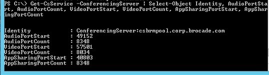

```
Get-CsService -ApplicationServer | Select-Object Identity, AudioPortStart, AudioPortCount 
Get-CsService -MediationServer | Select-Object Identity, AudioPortStart, 
AudioPortCount 
```

> [!NOTE]
> Application servers and Mediation servers only support QoS for audio. You do not need to change video or application sharing ports in your Application servers or Mediation servers. 
 
Each port type – audio, video, and application sharing – is assigned two separate property values: the port start and the port count. The port start indicates the first port used for that modality and the port count the number of ports dedicated. (For example, if the audio port start is equal to 49152, it means that the first port used for audio traffic is port 49152. If the audio port count is 8348, it means that 8,348 ports are allocated for audio, and the last port should be 57500 [port ranges should be contiguous]. Thus, the port range for audio would be ports 49152 through 57500.)

**To make changes in all Pool Servers:**<br/>

```
Get-CsService -ConferencingServer | ForEach-Object {Set-CsConferenceServer Identity $_.identity -AppSharingPortStart "40803" -AppSharingPortCount "4348" -
AudioPortStart "49152" -AudioPortCount "4348" -VideoPortStart "57501" -
VideoPortCount "8034"}
``` 
 
**To modify instant messaging SIP port in all Pool Servers (optional):**<br/>

```
Get-CsService -ConferencingServer | ForEach-Object {Set-CsConferenceServer -
Identity $_.Identity -ImSipPort 5062}
``` 
 
You can make changes to mediation and application server audio port ranges. 
 
**To set Edge servers:** <br/>

With Edge servers, you do not have to configure separate port ranges for audio, video, and app sharing; likewise, the port ranges used for Edge servers do not have to match the port ranges used with your Conferencing, Application, and Mediation servers.

```   
Get-CsService -EdgeServer | ForEach-Object {Set-CsEdgeServer -Identity 
$_.Identity -MediaCommunicationPortStart 50000 MediaCommunicationPortCount 10000} 
```
 
**Configure client port ranges for peer-to-peer media:**<br/>
Run the command below to find existing media client ports:  

```
Get-CsConferencingConfiguration | fl Client* 
```
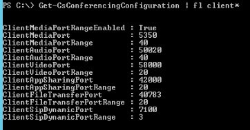

**To make changes in client port ranges:**

```
Set-CsConferencingConfiguration -ClientMediaPortRangeEnabled $True ClientAudioPort "50020" -ClientAudioPortRange "40" -ClientVideoPort "58000" -
ClientVideoPortRange "20" -ClientAppSharingPort "42000" ClientAppSharingPortRange "20" -ClientFileTransferPort "40783" -
ClientFileTransferPortRange "20" 
```

3. **Configure separate Group Policy Objects for client and server:**<br/>
After defining port ranges, you must also create QoS policies that specify the DSCP code to be associated with each port range. Restricting a set of ports to a specific type of traffic does not result in packets traveling through those ports being marked with the appropriate DSCP code. In addition to defining port ranges, you must also create QoS policies that specify the DSCP code to be associated with each port range. 

   Associating these DSCP values with port ranges can be achieved via GPO which has policy-based QoS. 
 
   If you already have all port ranges and DSCP values associated with communication types, then continue the process below. If not then decide port ranges and follow Step Two to configure port ranges. 
 
   Microsoft outlines the complete steps here:
   
   [Configuring a Quality of Service policy in Lync Server 2013 for your Conferencing, Application, and Mediation servers](https://technet.microsoft.com/enus/library/jj205076(v=ocs.15).aspx)


   1. You must have consolidated all your computer objects to a single Organization Unit (OU). (E.g., a computer.)
   2. Sign in to the Domain Controller or computer which has Group Policy Management installed.
   3. Open the Group Policy Management tool (<b>run</b> > <b>gpmc.msc</b>) and then right click the OU (computer). Select <b>Create a GPO in this domain, and Link it here</b> to create a new GPO. (For example,  SfBLyncClient-QoS.) You must have the required permission (Domain Admin) to create and link a policy object.
   4. Right-click the new GPO and select <b>Edit</b> to open the Group Policy Management editor. Then expand <b>Computer Configuration</b> > <b>Policies</b> > <b>Windows Settings</b>. Right-click <b>Policy-based QoS</b> and then select <b>Create new policy</b>.
   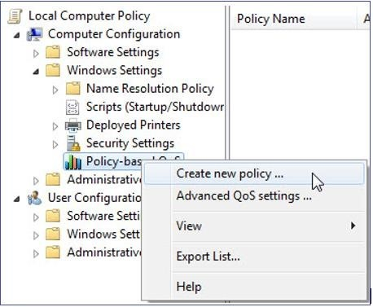
   5. In the policy-based QoS page, give the policy a name such as "Lync2013-Audio". Then set <b>Specify DSCP Value</b>: at 46 and select <b>Next</b>.
   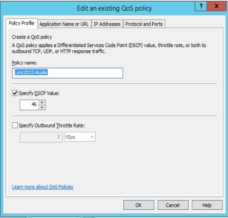
   6. On the next page, enter lync.exe in the field <b>Only applications with this executable name</b> and select <b>OK</b>.
   > [!NOTE]
   > This option ensures that the Lync.exe application will match packets from the specified port range with the specified DSCP code.
   
   

   7. On the next screen, make sure that both <b>Any source IP address and Any destination IP address</b> are selected and then select <b>Next</b>.
   > [!NOTE]
   > These two settings ensure that packets will be managed regardless of which computer (IP address) sent those packets and which computer (IP address) will receive those packets.

   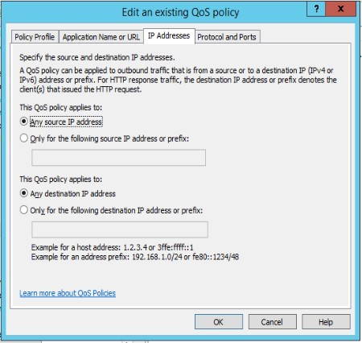

   8. On the next screen, select <b>TCP and UDP</b> and then select <b>From this source port or range</b>. In the field, type the port range reserved for audio transmissions.
   > [!NOTE]
   > Transmission Control Protocol (TCP) and User Datagram Protocol (UDP) are the two networking protocols most commonly used by Skype for Business/ Lync servers and their client applications.

   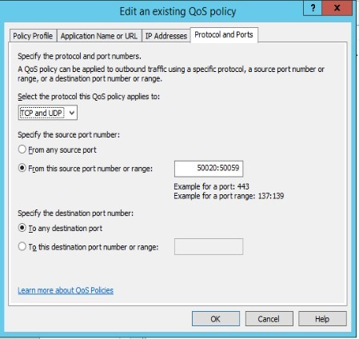
   
   9. Follow steps **e** through **h** to create new policy objects and label them “Lync2013-Signaling”, “Lync2013-AppShare”, “Lync2013-File Transfer”, and Lync2013-Video” with the above ports ranges and DSCP values.
   10. After you have configured all policy objects, it will look like the image below:
   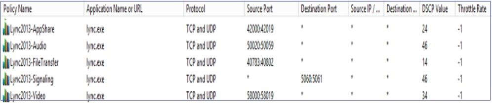
   11. Open Group Policy Management and then right-click <b>OU (Server)</b>. Select <b>Create a GPO in this domain, and Link it here</b> to create a new GPO. (For example, SfBLync-Server-QoS.) You must then add your Skype for Business/Lync Server-to-Server OU. Repeat steps **d** through **i** to create a policy object for the server as well.  After configuring all policy objects for the server, it will look like the image below:
   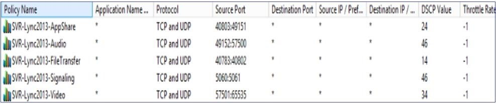


4. **Finally test the QoS.**
> [!NOTE]
> As a best practice, validate the QoS configuration and DSCP tagging on a quarterly basis.
  
**How to enable QoS for Skype for Business/Lync Phone devices**<br/>
The Skype for Business/Lync Phone edition primarily supports audio, therefore you only need to define DSCP values for audio traffic.

To enable QoS on a Skype for Business/Lync Phone Edition device, edit the VoiceDiffServTag and Voice8021p settings on the device. By default, VoiceDiffServTag is set to 40, and Voice8021p is set to 0. 

The settings screen is found by selecting **Clients** > **Device Configuration** from the Lync/Skype Server control panel.

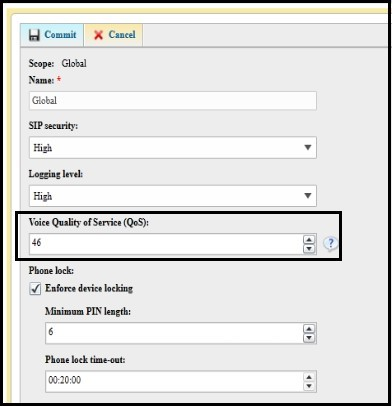

You can enable QoS using PowerShell as well. Open the Skype for Business/Lync Management Shell and type the command below: 

```
Set-CsUcPhoneConfiguration -VoiceDiffServTag <value> -Voice8021p <value>
```
 
E.g.:

```  
Set-CsUcPhoneConfiguration -VoiceDiffServTag 46 -Voice8021p 0
```
 
Restart the device for the changes to take effect. 
 
#### Test1: 

1. First, we need to test whether the GPO policy correctly applied or not, after the newly created GPO is applied and linked to the OU where Computer and Server objects are stored (separate OUs). Before testing, you can force the policy by running "*gpupdate.exe /force*" on a testing computer and server which will refresh the policy. 
2. After the policy refresh on the client computer, go to  **Start** > **Run** > **cmd** (open as administrator). Then type ***Gpresult /h result.htm***.
3. The policy will output in HTML format with the name “result.htm”. Open this file to view your QoS policy.   

#### Test2: 
Enable Skype for Business/ Lync client log. Sign in to Skype for
Business/Lync client and then open the Skype/Lync (UCCAPILOG) logs in Notepad or Snooper. Make sure the **qosenabled** shows **true** and verify all client port numbers. The log file locations are found here: 
- Skype for Business 2015/Lync2013 client: 
%userprofile%\appdata\local\Microsoft\Office\15.0\Lync\Tracing\ 
- Skype for Business 2015 client: 
%userprofile%\appdata\local\Microsoft\Office\16.0\Lync\Tracing\ 

The screenshot below shows the correct client ports. 
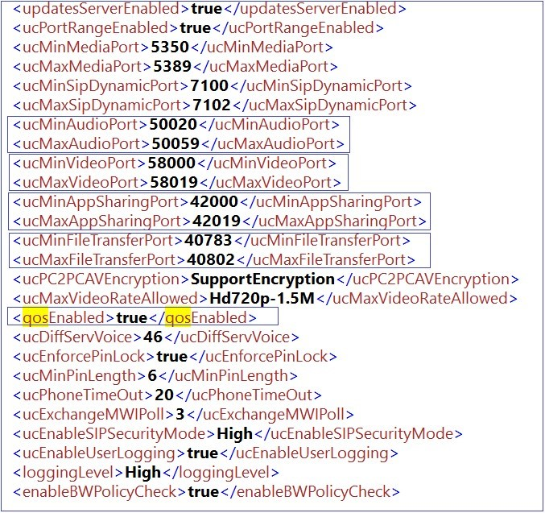

#### Test3: 
Make an audio call with another internal user and capture network traffic to verify whether the QoS tagging shows correctly or not. Verify two-way packets and check that the DSCP value shows correctly. 
The screenshot below shows UDP traffic DSCP: FE (Expedited Forwarding (46)), which is the correct tagging. 
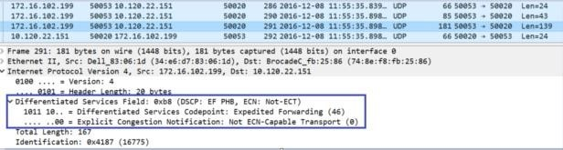

#### Test4:  
1. On a Windows machine, open “regedit” and then browse to the folder: <br/><br/>
HKEY_LOCAL_MACHINE\SOFTWARE\Policies\Microsoft\Windows\QoS<br/><br/>
Here you can see all QoS policies applied to this machine: 
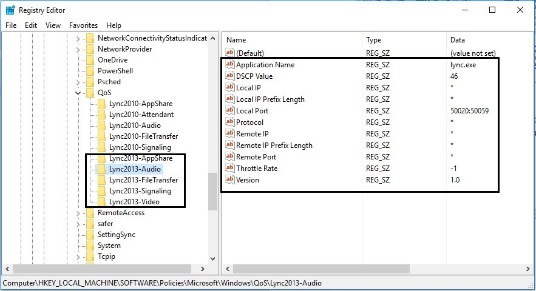
2. On the FE Server, you don’t have to define the application name because on this server, all applications are related to Skype and Lync.
3. Open “regedit”  and then browse to:<br/><br/>
HKEY_LOCAL_MACHINE\SOFTWARE\Policies\Microsoft\Windows\QoS<br/><br/> The Front End Server should appear as in the image below:  
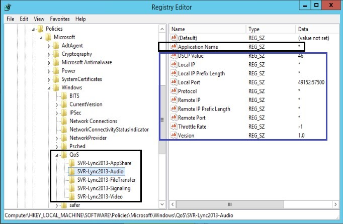

## Best practices
1.	Audit QoS policies every quarter and observe the tagging. 
2.	Check with the WAN provider (MPLS) for QoS plane. 
3.	We recommend that you validate the QoS end-to-end because sometimes incorrectly configured network devices (such as routers, wireless access points, or switches) might be set or change DSCP markings to something you did not intend, or even strip DSCP markings set to 0. 

## More information
Still need help? Go to [Microsoft Community](https://answers.microsoft.com/).
