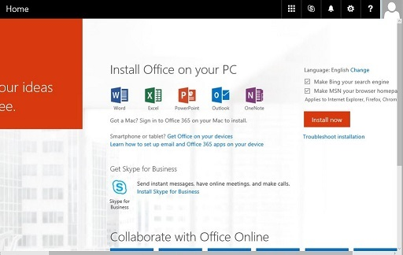

# Skype for Business 2016 isn't installed when you switch from Office 365 Small Business Premium to Office 365 Business Premium

## Problem 

Consider the following scenario:  
 
- You had a subscription to the Microsoft Office 365 Business Premium (P2) plan.    
- You switch to the current Office 365 Business Premium subscription and then install Microsoft Office 2016.    
 
In this scenario, Skype for Business 2016 isn't installed on your computer.  

## Solution 

To fix this issue, manually install Skype for Business 2016. To do this, follow these steps: 
 
1. Install a different version of Office. For more information about how to do this, go to the following Microsoft website:

    [Install a different version of Office on a PC after you switch Office 365 plans](https://support.office.com/article/switch-office-365-plans-using-the-switch-plans-wizard-2e5ad347-a6ab-4e7a-a9df-4663fb0a09dc#bkmk_updateyourofficeinstallation)
1. Upgrade to Office 2016. To for more information about how do this, go to the following Microsoft website: 

    [Ways to upgrade if you have Office 365 for business](https://support.office.com/article/how-do-i-get-the-new-office-2016-apps-using-office-365-for-business-35d332d7-ee81-40e3-99d2-1a4eed2efb52#bkmk_upgrade)
1. Sign in to the Microsoft 365 admin center, and then, on the Home page, click the **Install Skype for Business** link in the **Get Skype for Business** section.

        
  

## More information

Skype for Business 2016 must be installed separately from Office 2016 for customers who switch to Office 365 Business Premium.

For more information, go to the following Microsoft website: [Get the most from Office with Office 365](https://products.office.com/compare-all-microsoft-office-products?&activetab=tab:primaryr2)  

Still need help? Go to [Microsoft Community](https://answers.microsoft.com/).