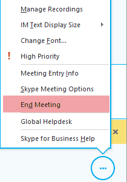

# Meeting organizer isn't prompted for leader PIN when joining Skype for Business Online meeting

## Problem

When you use a Microsoft dial-in conferencing number to join a Skype for Business Online meeting as the organizer, you experience the following symptoms: 

- You aren't prompted for your leader PIN.   
- Unauthenticated callers have already joined the call.   

## Solution

To resolve this issue, disable the **Allow unauthenticated callers to be the first people in a meeting. If not, then they will wait in the lobby until an authenticated user joins** option in the meeting. 

## More Information

When you assign Microsoft as the provider for dial-in conferencing to a user, there's an **Allow unauthenticated callers to be the first people in a meeting. If not, then they will wait in the lobby until an authenticated user joins** meeting option.

Organizers of Skype for Business Online Meetings should use this setting when they want to restrict dial-in users from joining calls before a leader has joined the call or when they want users to be prompted to enter a leader PIN if a leader hasn't yet joined the call. Until a leader has joined the call, all other callers should wait in the lobby. 

The default value for new users of dial-in conferencing is **Null**, or **$False**. 

> [!NOTE]
> The remote PowerShell parameter that corresponds to this setting is **AllowPSTNOnlyMeeting**.

When this option is set to **$False** (the default value for new users), the **Allow unauthenticated callers to be the first people in a meeting** check box is not selected, and dial-in conferencing behaves as follows:

- If a dial-in user is first to join a meeting, they'll be prompted to enter a leader PIN. If they don’t enter a leader PIN, they'll be prompted to record their name (if the option to **Ask callers to record their name before joining the meeting** is set in Microsoft Bridge **Options**), and then the caller will be informed that the leader has not yet arrived and to please wait in the lobby until a leader joins.   
- When an authorized user joins the meeting, dial-in callers will be automatically admitted to the meeting. This setting is equivalent in behavior to PSTN Callers Bypass Lobby in Skype for Business Server.

When this option is set to **$True**, the **Allow unauthenticated callers to be the first people in a meeting** check box is selected, and dial-in conferencing behaves as follows:

- If a dial-in user is first to join a meeting, they'll be admitted immediately because there's no requirement for an authenticated user to join the call first.   
- Callers will not be prompted to enter a leader PIN.

> [!IMPORTANT]
> Meeting organizers should always end meetings by selecting **End Meeting** from the Skype for Business meeting control menu. To do this, click the ellipses at the lower-right corner of the meeting window, and then select **End Meeting**. This makes sure that the meeting ends, that no unauthorized users can join without the organizer, and that all users are removed from the meeting. 
>
> 

For more information about Skype for Business dial-in conferencing, see the following Microsoft websites:

- [Set up Audio Conferencing for Skype for Business](https://support.office.com/article/getting-started-with-dial-in-conferencing-7cc7d3f3-d081-4c0e-b01d-ec1e420669ce)
- [Audio Conferencing troubleshooting and known issues](https://support.office.com/article/dial-in-conferencing-known-issues-72979911-5319-4de2-a275-4dd9a0f44fe6)   

Still need help? Go to [Microsoft Community](https://answers.microsoft.com/).
