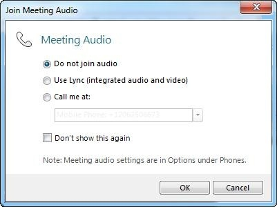

# Video is unavailable in a Skype for Business Online conference when you use the "call me" option

## Problem

When you join a Skype for Business Online (formerly Lync Online) conference by using the Lync client, you can't see or connect to the video feed. This issue occurs if you use the **call me** option when you connect to the conference. 

## Solution

To work around this issue, don't use the **call me** option when you join a conference in Lync. Instead, use a phone to dial in to the audio conference. Then, you can add video by using Lync. 

1. Click the link in the meeting invitation to join the Lync meeting.   
2. When the Join Meeting Audio window opens, select Do not join audio, and then click OK.

    

    > [!NOTE]
    > If you don't see the Join Meeting Audio window, you must enable it in **Options** before you join the meeting. In Lync, click **Options**, and then click **Phones**. Select Prompt me before joining to confirm or select another audio source.   
3. Use your telephone to join the audio part of the meeting with the telephone number and ID or PIN that is provided by the audio conferencing provider in the meeting invitation.   

## More Information

The **call me** option phones you when the conference occurs by using an audio connection that's set up by the Audio Conferencing Provider (ACP) Multipoint Conferencing Unit (MCU). To connect by using video, the Audio/Video (AV) MCU must link the audio and video connections. However, the audio connection is already used by the ACP MCU, and the client can only create a single audio connection.

Still need help? Go to [Microsoft Community](https://answers.microsoft.com/).