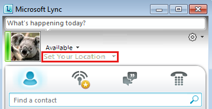

# You can't set your location in Lync from a virtual machine or remote desktop connection

## Problem

When you try to use the Set Your Location feature in Microsoft Lync 2010 or Microsoft Lync 2013, the **Set Your Location** field is unavailable (dimmed), and you can't set your location.

## More Information

This is expected behavior. This issue occurs when you install or sign in to Lync 2010 or Lync 2013 on a virtual machine or by using a remote desktop connection. When you're logged in to a remote desktop connection or a virtual machine, Lync disables the **Set Your Location** field because it can't accurately rely on the location information through a virtual host. Lync uses the Location Information Service (LIS) based on a network map to detect your location. Then, Lync automatically publishes your location to the organization. However, when you use a virtual machine, or you connect to a virtual machine by using a remote desktop connection, the LIS can't accurately determine your location. Therefore, the location is unavailable.

Still need help? Go to [Microsoft Community](https://answers.microsoft.com/).