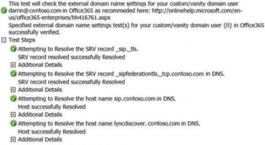

# Troubleshooting Skype for Business Online DNS configuration issues in Office 365

## Problem 

One or more of the following features don't work as expected in Skype for Business Online (formerly Lync Online): 

- Skype for Business Online Autodiscover and automatic sign-in   
- Skype for Business Online federation with external users   
- Public Internet Connectivity (PIC) together with Windows Live, MSN, and Outlook.com users   
- Outlook Web Access instant messaging   
- Sign in from Lync Mobile clients by using the Auto-Detect Server option   

Or, you receive one of the following error messages when you sign in to Lync 2010 or Lync 2013:

- *Lync couldn't find a Lync Server for contoso.com. There might be an issue with the Domain Name System (DNS) configuration for your domain. Please contact your support team.* 
- *Cannot sign in because the server is temporarily unavailable. If the problem continues, please contact your support team.*  

## Solution 

To resolve these issues, make sure that you add the following service (SRV) and alias (CNAME) records to your Domain Name System (DNS) host.

SRV records

Type|Service|Protocol|Port|Weight|Priority|TTL|Name|Target|
|-|-|-|-|-|-|-|-|-|
|SRV|_sip|_tls|443|1|100|1 hour|**\<DomainName>**|sipdir.online.lync.com|
|SRV|_sipfederationtls|_tcp|5061|1|100|1 hour|**\<DomainName>**|sipfed.online.lync.com|

> [!NOTE]
> SRV records are processed by ascending order of priority, i.e. lower numbers have a higher priority. For example, if a DNS SRV record has a weight of 20 and a priority of 40, and another has a weight of 10 and a priority of 50, the record with a priority of 40 will be picked first because 40<50.
>
> When two targets have the same priority, weight is considered. Larger weights have a higher probability of being selected. DNS administrators use a weight value of 0 if there's no server selection. Records with a weight value of 0 have low chances of being selected in the presence of records with greater values.
>
> If you have multiple SRV records with equal priority and weight, the Access Edge service will choose the first SRV record it received from the DNS server.

CNAME records

|Type|Host name|Destination|TTL|
|-|-|-|-|
|CNAME|sip.**\<DomainName>**|sipdir.online.lync.com|1 hour|
|CNAME|lyncdiscover.**\<DomainName>**|webdir.online.lync.com|1 hour|

> [!NOTE]
> The **\<DomainName>** placeholder in this table represents the name of the Session Initiation Protocol (SIP) domain of your organization, such as **contoso.com**.

## More information

This issue occurs if all the following conditions are true: 
 
- You use a custom domain in Office 365.  
- DNS SRV resource records, CNAME resource records, or both kinds of records are configured incorrectly for your domain.    
 
### Troubleshoot Skype for Business Online DNS issues with the Lync Remote Connectivity Analyzer (RCA)
 
Go to the [Lync Connectivity Analyzer](https://www.testconnectivity.microsoft.com/?testid=o365lyncdns) and select **Office 365 Custom/Vanity Domain Name Settings Test for Lync**. Enter the sign-in address that you're using when you to try to sign in to Skype for Business Online (for example, darrin@contoso.com), and start the test.

This test examines all four DNS records that are required by Skype for Business Online to determine whether they're correctly configured.

If any issues are detected, check the DNS configuration with your domain registrar. For instructions about how to configure DNS for the most common DNS providers, go to the following Microsoft Office 365 website: [Create DNS records at any DNS hosting provider for Office 365](https://support.office.com/article/Create-DNS-records-at-any-DNS-hosting-provider-for-Office-365-e21a9a4a-7b14-42cb-b39b-03aee92da95f) 

### If you can't add SRV records through your DNS host
 
Some DNS hosts can't host SRV records, or the DNS hosts don't have options to host SRV records. This condition blocks the ability to communicate with external users (Federated and PIC). In these cases, there is currently no workaround except to change DNS hosts or to manage DNS through an on-premises DNS host.

Some UNIX or Linux OS servers that host DNS don't require the underscore (_) when you add SRV records to the DNS host. If your DNS host is running UNIX or Linux and the SRV records aren't resolving correctly, remove the underscore from the host name of the SRV record. 

## References

For more information about how to create and verify DNS SRV records if you have an on-premises DNS host, go to the following Microsoft TechNet website: 

[Create and Verify DNS SRV Records](/previous-versions/office/lync-server-2013/lync-server-2013-create-and-verify-dns-srv-records) 

For Office 365 for professionals and businesses, go to this article in the Microsoft Knowledge Base:

[2526143](https://support.microsoft.com/help/2526143) You can't sign in to Skype for Business Online by using a domain that is configured for full redelegation  

Still need help? Go to [Microsoft Community](https://answers.microsoft.com/).