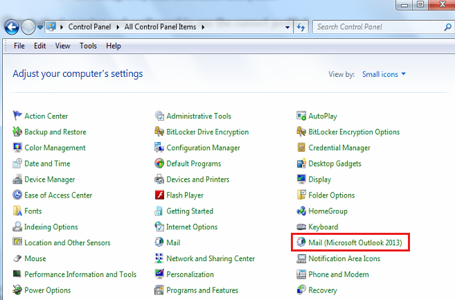
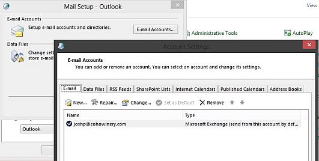
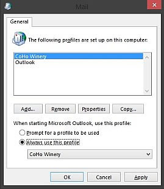

# "There was a problem connecting to Microsoft Office Outlook" when you sign in to Skype for Business Online

## Problem

When you sign in to Skype for Business Online (formerly Lync Online) by using Lync 2010 or Lync 2013 on a computer that's running Outlook, you receive the following error message:

```adoc
There was a problem connecting to Microsoft Office Outlook. The email address used in your default Outlook profile is different from the sign-in address used in Lync 2010. Change your default Outlook profile to match the sign-in address you are using in Lync, and then sign out and sign back in to Lync.
```

## Solution

### Solutions for Skype for Business Online users

#### Are you using the most up-to-date Lync client?

Make sure that you're using the most up-to-date Lync client. For more information, go to the following Microsoft websites:

- [Updates resource center for Lync 2013](/SkypeForBusiness/software-updates)   
- [Updates resource center for Lync 2010](/SkypeForBusiness/software-updates)   

#### Is the Personal Information Manager in Lync configured correctly?

Make sure that the Personal Information Manager is configured correctly. To do this, follow these steps:

1. Open Lync Options, and then in the Personal settings, set the **Personal information manager** option to **Microsoft Exchange or Microsoft Outlook**.   
2. Make sure that the following options are selected: 
   - **Update my presence based on my calendar information**   
   - **Save IM conversations in my email Conversation History folder**   
   - **Save call logs in my email Conversation History folder**   

#### Is Outlook running and configured to use the correct profile?

For the best experience, add your Exchange email account to Outlook, and then set it as the default mail profile. Typically, your Exchange email address and Lync sign-in address are the same, but in some cases they may differ. 

  - Is Outlook configured to use the correct Exchange email account?
     - In most cases, the Lync sign-in address and Exchange email address are the same. Open the Windows Control Panel, and then click **Mail** (in Classic View) to make sure that the Exchange account in Outlook is using the same email address as your Lync sign-in.

       

     - Click **E-Mail Accounts**, and then verify that the default email account (joshp@cohowinery in the following example) is the same as the Lync sign-in address:

          
   
- Is the correct default profile selected?
   - From the **Mail Setup** window in Control Panel, select **Show Profiles**, click **Always use this profile**, and then select the profile that uses the email account that you verified in the previous section. In the following example, the CoHo Winery profile is configured as the default profile.

         


### Solutions for Office 365 administrators

To resolve this issue, make sure that the Exchange account in Outlook matches the account that's used to sign in to Skype for Business Online. If the Exchange mailbox and the Lync account are both hosted by Microsoft Office 365, make sure that the user's Exchange primary SMTP address matches the user principal name (UPN). 

You can use the Set-MsolUserPrincipalName cmdlet from Microsoft Azure Active Directory Module for Windows PowerShell to set the UPN, SMTP, and Session Initiation Protocol (SIP) addresses to the same value. For more information, go to the following Microsoft websites:  

- [Manage Azure AD using Windows PowerShell](/previous-versions/azure/jj151815(v=azure.100))
- [Set-MsolUserPrincipalName](/previous-versions/azure/dn194135(v=azure.100))

The issues that are described in the "Problem" section typically occur when the Exchange mailbox and the Lync account are hosted in different environments or use different domain namespaces. If the Exchange mailbox is hosted elsewhere (for example, if the mailbox is hosted on an on-premises Exchange server), see the following Microsoft Knowledge base articles:

- [2614242 ](https://support.microsoft.com/help/2614242) Integrating Exchange Server 2013 with Lync Server 2013, Skype for Business Online, or a Lync Server 2013 hybrid deployment
- [2614614 ](https://support.microsoft.com/help/2614614) Integrating Exchange Online with Skype for Business Online, Lync Server 2013 or a Lync Server 2013 hybrid deployment

After the UPN, primary SMTP, and SIP address are configured correctly, repair or re-create the Outlook mail profile by using the new primary SMTP address. Then, restart Lync.

## More Information

This error is typically caused by a mismatch between the accounts that are used in Outlook and Lync. The Exchange mailbox to which Outlook is connected must be associated with the same Office 365 user account to which Lync is connected. If Outlook is connected to a mailbox that's part of another Office 365 organization or another on-premises Exchange organization, you may experience this error. When Lync tries to make a connection with Outlook, it compares the SMTP (email) address in Outlook with the sign-in address that's used to connect to Skype for Business Online. If the SMTP and Lync sign-in addresses don't match, you may experience this error. 

This error may also occur when Lync is expecting to integrate with a mailbox that's different from the mailbox that's configured in Outlook. For example, if Lync expects the user's email address to be joe@contoso.com, but Outlook is connected to the mailbox for joe@fabrikam.com, you may experience this error.

Lync uses the **WindowsEmailAddress** or MAIL attribute to determine which Exchange server Outlook should connect to. If Lync makes that connection through Exchange Autodiscover and Exchange Web Services (EWS), and if Outlook is configured for another user's mailbox, Lync registers that as a problem and returns this error.  

Still need help? Go to [Microsoft Community](https://answers.microsoft.com/).