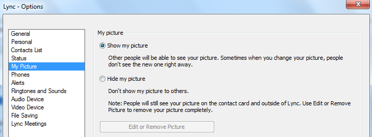

# You can't upload a photo from Lync 2013 to Skype for Business Online

## Problem

In Skype for Business Online (formerly Lync Online), you can't edit or remove your contact photo from Lync 2013. When you view the My Pictures setting under Options, the option for Edit or Remove Picture is unavailable (appears dimmed).

## Solution

Lync 2013 uses the Exchange service to upload contact photos to the user's mailbox. If the user doesn't have an Exchange mailbox, the Edit or Remove Picture button in the Lync Options is unavailable.

## Workaround

To work around this issue, the admin will have to perform one of the following actions:

- If the user doesn't have an Exchange Online mailbox, assign an Exchange Online license to the user.   
- Synchronize the thumbnail photo from the on-premises Active Directory.   

## More Information

If you have an Exchange mailbox, and the button is still unavailable, see [User contact photos in Lync aren't displayed correctly](https://support.microsoft.com/help/2497721). 

Still need help? Go to [Microsoft Community](https://answers.microsoft.com/).
