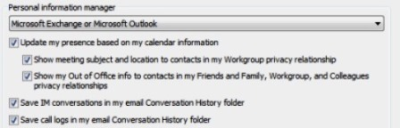

# Lync contact list is empty or read-only after a user's Exchange mailbox is disconnected, unlicensed, or moved

## Problem

Skype for Business Online (formerly Lync Online) users may notice that their contact list is empty or read-only after their Exchange mailbox becomes unavailable or is disconnected, unlicensed, or moved to Exchange 2007 or Exchange 2010. When you try to add, remove, or change contacts or groups in the user's contact list in this situation, the user receives the following error message: 

```adoc
Cannot add, remove, or move contacts or groups at this time. Please try again later.
```

If the user had a contact photo associated with the Exchange mailbox, the photo is now unavailable to other contacts.

Additionally, if you try to move an Exchange 2013 mailbox to an Exchange 2010 mailbox on-premises, you'll receive the following warning message:

```adoc
You shouldn't migrate mailbox to Exchange 2010 or an earlier version while the user's Instant Messaging contact list is stored in Exchange. If you do, the user could permanently lose access to their Instant Messaging contact list, which will cause serious data loss. The Exchange copy might be the only copy of the user's contact list. To continue, please contact your Instant Messaging administrator and make sure that the user's contact list is moved back to the Instant Messaging server. After this has been done, you should be able to complete this migration. If you must migrate the mailbox despite the potential data loss, you can do so by running 'Set-UMMailbox mailboxID -ImListMigrationCompleted $false'.
+CategoryInfo: InvalidArgument: (:MailboxOrMailUserIdParameter) [New-MoveRequest], UnableToMoveUCS…nlevelException
+FullyQualifiedErrorId: [Server=BN1PR04MB219,RequestId=e8740227-f060-4dd6-ac29-98aca24df8da,TimeStamp=7/24/2013 7:09:05 PM B1CB8EAD,Microsoft.Exchange.Management.RecipientTasks.NewMoveRequest+PSComputerName: pod51041psh.outlook.com
```

When Office 365 was upgraded in 2013, Exchange Online was configured to store Skype for Business Online users' contacts and photos as part of their Exchange mailbox. This is known as the Unified Contact Store (UCS), and when a user's Exchange mailbox becomes unavailable, Lync can no longer take advantage of UCS to add, remove, or change the Lync contact list.

Since then, this feature was disabled because by default, and Skype for Business Online contact lists are now managed by Skype for Business Online. However, some users might still be using the Exchange UCS and experience no issues or problems at all. If their mailbox is unavailable through Exchange Web Services (EWS) at any time, they won't be able to change or even access their contact lists. If this becomes an issue, you may want to migrate your contacts back to Skype for Business Online.

## Solutioin

### If you're experiencing this issue

Check the Lync **Configuration Information** screen. To do this, follow these steps: 
1. Press and hold the Ctrl key, and then right-click the Lync icon in the notification area.   
2. Select **Configuration Information**.    
3. If the mailbox is inaccessible, you should see **Exchange connection Down** next to **UCS Connectivity State**.

   

### Then, check the Personal Information Manager

Make sure that the **Personal information manager** is set to **Microsoft Exchange or Microsoft Outlook** in Lync. To check this setting, open Lync, click the gear icon, and then click **Personal**.



### Then, check the DNS configuration for EWS Connectivity

Next, if you're using a custom domain in Office 365, and the user has an Exchange Online mailbox, but the contact list is still unavailable, verify that all the necessary Domain Name System (DNS) records for Exchange Online Autodiscover are present. Lync uses the Exchange Autodiscover service to connect to the user's mailbox. If the Autodiscover service isn't working correctly, Lync won't be able to pull the user's contact list from the Exchange Unified Contact Store (UCS). For more information about how to verify the Exchange Autodiscover service, see "Method 2" of the Solution section in
[Outlook can't set up a new profile by using Exchange Autodiscover for an Exchange Online mailbox in Office 365](https://support.microsoft.com/help/2404385).

### If the mailbox was accidentally disconnected or unlicensed

You have 30 days to reconnect the mailbox without any consequences. The user's mail, settings, and contact list will be restored a short time after you reconnect the mailbox. After 30 days, the user's data is not recoverable.

### If the mailbox disconnect was intentional and you have to restore the user's contact list for Lync

To restore the user's contact list to the Lync Server, you have to temporarily reconnect the user's mailbox and then run the Skype for Business OnlineRemote PowerShell cmdlet **Invoke-CsUcsRollback** to have the user's contact list migrated from his or her Exchange mailbox to the Lync server.

### If you want to migrate your contacts back toSkype for Business Online

Confirm that the user is enabled for UCS. Press Ctrl while you right-click the Lync icon in the notification area, and then click **Configuration Information**. 

- If the **Value** for **Contact List Provider** is **UCS**, then the user's contacts are stored in the Exchange Unified Contact Store. Run the Skype for Business Online Remote PowerShell cmdlet **Invoke-CsUcsRollback** to migrate the user's contacts back to the Lync server.   
- If the **Value** for **Contact List Provider** is **NOT UCS**, then there's no need to migrate your contacts back. But if you still can't access your contact list, you may have to do additional troubleshooting. For more information, see [Contacts in Skype for Business Online appear offline or aren't searchable in the address book](https://support.microsoft.com/help/2435699).

> [!NOTE]
> If the mailbox is unavailable and you run the **Invoke-CsUcsRollback** cmdlet with the **force** parameter, you may cause additional problems with Lync and Exchange. Double-check to verify that the mailbox can be accessed before you perform a rollback.

Still need help? Go to [Microsoft Community](https://answers.microsoft.com/).