# Outlook Skype for Business "Contacts" folder doesn't sync with Skype for Business contacts

## Problem

Consider the following scenarios:

- You add a new Skype for Business contact. But the contact doesn't appear in the Outlook Skype for Business Contacts folder.   
- You remove a contact from Skype for Business. However, the contact isn't removed from the Outlook Skype for Business Contacts folder.   
- The Outlook Skype for Business Contacts folder contains stale contact information (it isn't updating). This stale data may still sync to Skype for Business contacts.   

In these scenarios, the Outlook Skype for Business (formerly Lync) Contacts folder doesn't sync with your Skype for Business contacts as the folder previously did.

## Workaround

To work around this issue, you can remove the contacts in the Outlook Skype for Business Contacts folder (but not the Contacts folder itself). To do this, follow these steps.

> [!NOTE]
> The steps to remove the contacts in the Contacts folder should only be performed by an administrator. After the following steps are performed, the Contacts folder will remain, but the contacts won't. And the contacts will no longer cause stale information to replicate.

1. Download and install MFCMapi from the following Microsoft website: [MFCMAPI](https://mfcmapi.codeplex.com).
2. Close Skype for Business and Microsoft Outlook.   
3. Open MFCMapi. If you're prompted, click **OK** on the usage notes box. 

    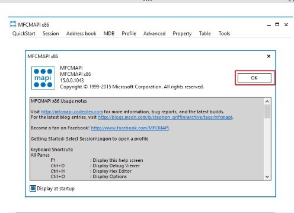

4. From the **Tools** menu, select **Options** .

    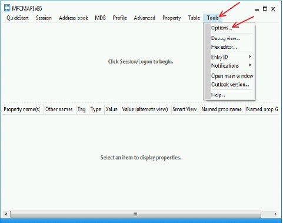   
5. In the **Options** dialog box, click to select **Use the MAPI_NO_CACHE flag when calling OpenEntry** and **Use the MDB_ONLINE flag when calling OpenMsgstore**, and then click **OK**.

    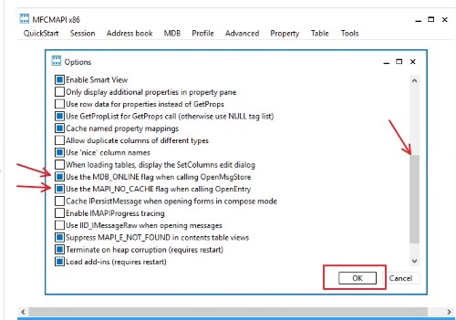   
6. To start a session, select **Logon** from the **Session** menu.

    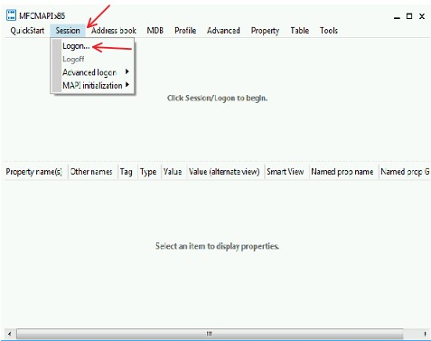   
7. In the **Choose Profile** box, type or click the arrow to select the name of the Outlook profile for the affected user, and then click **OK**.

    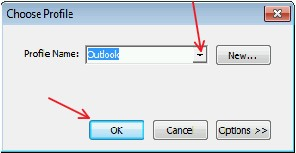   
8. In the window that opens, right-click the default Exchange mailbox store in the list, and then click **Open store**.

       
9. In the left column, locate and click to expand **Root Container**, expand **Top of Information Store**, and then expand **Contacts**.

   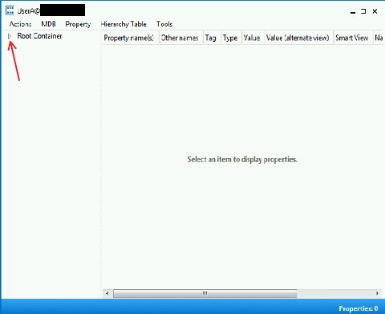   
10. Locate and right-click **Skype for Business Contacts**. Then select **Open contacts table**.

    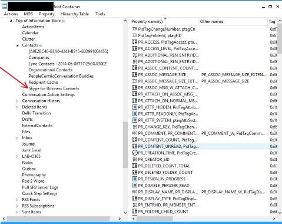   
11. To delete the contacts in the list, hold down the Ctrl key, and then click to select the individual contacts.

    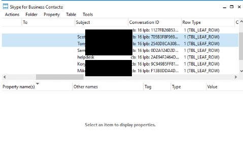   
12. From the **Actions** menu, select **Delete Messages**.

    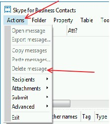   
13. In the **Delete Item** dialog box, locate the **Deletion style** drop-down list, select **Permanent deleted passing DELETE_HARD_DELETE (unrecoverable)**, and then click **OK**.

     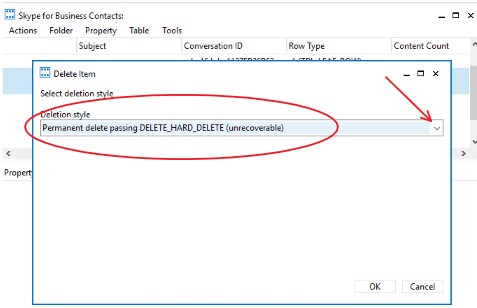  
14. To close all the windows, select **Exit** from the **Actions** menu.

     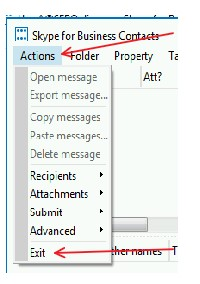   

## More Information

This behavior is by design. The sync between the Outlook Skype for Business Contacts folder and the Skype for Business contacts is deprecated. 

Still need help? Go to [Microsoft Community](https://answers.microsoft.com).