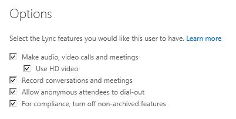
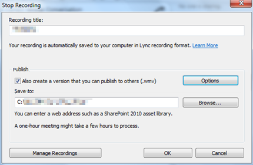
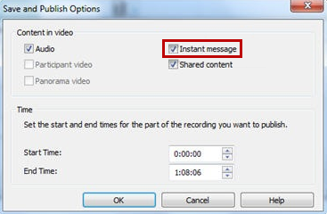

# How to troubleshoot recording online meetings in Skype for Business Online

## Problem

You experience one or more of the following symptoms in Lync 2010 or Lync 2013 while you're signed in to Skype for Business Online (formerly Lync Online):

- Scenario 1: A presenter can't record the meeting.   
- Scenario 2:Audio is missing from the whole recording, or audio is missing in the final 10 minutes of the recording.   
- Scenario 3:Recording options in Lync 2010 or Lync 2013 are unavailable.   
- Scenario 4:Instant messaging (IM) conversations in meetings aren't being recorded.   

## Solution

### Scenario 1: A presenter can't record the meeting

- Check with the meeting organizer to make sure that the user has presenter permissions in the meeting.    
- Check the Skype for Business Admin Center to verify recording capabilities are enabled for the user having problems.   
- If the error message indicates that only Audio/Video and Application Sharing won't be recorded, be aware that PowerPoint Sharing, Whiteboarding, and Instant Messaging are still recorded.   

### Scenario 2: Audio is missing from the whole recording, or audio is missing in the final 10 minutes of the recording

To troubleshoot this issue, verify that incoming audio was active during the online meeting. Outgoing audio was active, but incoming audio may have been disabled. This can occur if the users join the audio from the public switched telephone network (PSTN), and Voice over Internet Protocol (VoIP) audio isn't enabled. In this scenario, a notification is displayed to inform the user that audio isn't being recorded.

### Scenario 3: Recording options in Lync 2010 or Lync 2013 are unavailable

First, verify that recording is enabled for user having issues in the Skype for Business Admin Center. This setting can be enabled or disabled on a per-user basis. So, because one user can record, doesn't mean that all users can.

Lync 2010 and Lync 2013 include features that allow users to record conferences, audio/video (A/V) conferences and desktop sharing sessions, as long as the session is converted to an online meeting or conference. Recording peer-to-peer IM, Audio, or Video sessions aren't supported.

Users who have started a two-person A/V call won't have recording features available to them until they invite a third participant. This converts the peer-to-peer conversation to a Skype for Business Online conference where recording is allowed.

### Scenario 4: IM conversations in meetings aren't being recorded

If you want to distribute the IM conversations together with your recording, make sure that you set the recording options settings after the meeting ends. To make sure that IM conversations are included in the recording, follow these steps:

1. When you are finished recording, click **Stop Recording**. In the **Stop Recording** dialog box, click **Options**.

       
2. In the **Save and Publish Options** dialog box, click to select the **Instant message** check box, and then click **OK**.

    

    When you publish the recording, the IM conversations will be included.   

## More Information

- Scenario 1: Usually, this occurs if the recording is disabled on an organization level or if the conversation wasn't converted to a conference.   
- Scenario 2: Typically, this occurs if audio is muted from the source device or if the Audio Conferencing Provider (ACP) conference isn't associated with the Skype for Business Online conference.   
- Scenario 3: Recording is disabled on an organization level or on a user level.   
- Scenario 4: The Instant messaging check box in the Recording Options dialog box isn't selected.   

Still need help? Go to [Microsoft Community](https://answers.microsoft.com/).