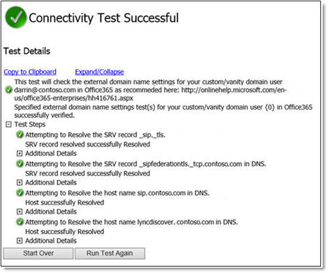

# Incoming Lync To Phone calls aren't transferred to Exchange Online Unified Messaging voice mail

## Problem

Consider the following scenario. You are set up for Office 365, and you have valid Skype for Business Online (formerly Lync Online) and Exchange Online licenses. Lync To Phone and Exchange Online voice mail are set up according to the documentation. You can answer calls that are made to the Lync To Phone number, and you can make calls to other numbers. 

In this scenario, if an incoming call isn't answered, the call isn't transferred to Exchange Online Unified Messaging voice mail as expected. Instead, the person who is calling you hears a fast busy tone. The call never is transferred to voice mail. 

## Solution

To resolve this issue, use the [Lync Remote Connectivity Analyzer](https://www.testconnectivity.microsoft.com/?testid=o365lyncdns) to make sure that the DNS records for your domain are set up correctly. To do this, follow these steps: 

1. In a web browser, go to [Lync Remote Connectivity Analyzer](https://www.testconnectivity.microsoft.com/?testid=o365lyncdns).   
2. Select **Office365 Vanity/Custom Domain Name Settings Test for Lync**. and then click **Next**.   
3. Type the sign-in address that you use for Skype for Business Online, type the CAPTCHA text, click to select the check box to agree to the terms, and then click **Perform Test**.   
4. Review the results, and make sure that the _sipfederationtls._tcp.<**domain**>.com DNS SRV record resolves successfully and is configured correctly. 

    The following is an example screenshot of the results of the test:

       

## More Information

For calls to be transferred to voice mail, all DNS records must be configured correctly. Be aware that the _sipfederationstls._tcp.domain.com DNS SRV record must be added, even if you do not federate with any other domains. This is because of how the Skype for Business Online servers communicates with the Exchange Online servers

Still need help? Go to [Microsoft Community](https://answers.microsoft.com/).