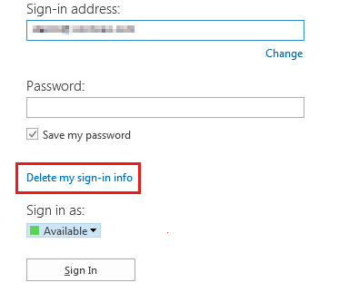

# You can't sign in to Skype for Business Online because the certificate can’t be acquired or validated

## Problem

When an Office 365 user tries to sign in to Skype for Business Online (formerly Lync Online) by using Lync 2010 or Lync 2013, the user receives the following error message: 

```adoc
There was a problem acquiring a personal certificate required to sign in. If the problem continues, please contact your support team.
```

Additionally, when you try to sign in to Lync after a network outage or a Skype for Business Online service outage, you receive the following error message: 

```adoc
Cannot sign into Lync. There was a problem verifying the certificate from the server.
```

## Cause

This issue may occur if one or more of the following conditions are true:

- The software is out of date.
  - The Lync client is out of date.   
  - The Microsoft Online Services Sign-In Assistant is out of date.    
   
- The certificates cannot be acquired or validated.
  - The Skype for Business Online personal certificate or the cached credentials are corrupted or are out of date.   
  - Part of the certificate chain is untrusted and the certificate chain fails validation.   

## Solution

### Resolution for Lync 2013

#### Delete the sign in information

During the sign in process, Lync 2013 caches your credentials and other information about its connection to Skype for Business Online. If you have trouble signing in to Skype for Business Online, click **Delete my sign-in information** and Lync 2013 will automatically remove any saved password, certificates, and connection settings for the user account.



### Resolution for Lync 2010

1. Update the Lync client to the latest version that's available on the Downloads page of the Office 365 portal.    
2. Update the [Microsoft Online Services Sign-In Assistant](https://www.microsoft.com/download/details.aspx?id=28177) to the latest version.    
3. Clear your cached certificates, credentials and connections.

#### Additional troubleshooting steps for Lync 2013 and Lync 2010

> [!NOTE]
> Follow the steps in this section carefully. Serious problems might occur if you modify the registry incorrectly. Before you modify it, [back up the registry for restoration ](https://support.microsoft.com/help/322756) in case problems occur.

If the steps earlier in this article don't resolve the issue, try the following methods, as appropriate for your situation:

- When Lync connects to a specific front-end server, it caches that endpoint to make the sign-in process faster in the future. However, sometimes the endpoint can be changed and can cause sign-in to fail. To delete the endpoint cache, follow these steps:
  1. Locate the local application data folder: 
     - Windows Vista, Windows 7 and Windows 8 (excluding Windows 8 RT):

       %LOCALAPPDATA%\Microsoft\Communicator\<sip_address@contoso.com>\    
    - Windows XP:

      %USERPROFILE%\Local Settings\Application Data\Microsoft\Communicator\<sip_address@contoso.com>\       
  2. Delete the folder associated with your sign-in address.   
  3. Restart Lync, and then try to sign in to Skype for Business Online.   
   
- If you're using Lync 2010, delete the Skype for Business Online personal certificate and then download a new one. Be aware that when the user clicks **Save Password** in Lync 2010, this action also saves the certificate in Windows Certificate Manager. 

  To delete a personal certificate, follow these steps:
  1. Delete the certificate in Windows Certificate Manager. To do this, follow these steps:
     1. Open Windows Certificate Manager. To do this, press **Windows + R**, type certmgr.msc, and then click **OK**.    
     2. Expand **Personal**, and then expand **Certificates**.    
     3. Sort by the **Issued By** column, and then look for a certificate that's issued by Communications Server.    
     4. Verify that the certificate is present and that it isn't expired.    
     5. Delete the certificate and try to sign in to Skype for Business Online. If you can't sign in to Skype for Business Online, go to step 2.      
  2. If you're running Windows 7, remove the user's stored credentials in Windows Credential Manager. To do this, follow these steps:
     1. Open **Control Panel**, and then click **Credential Manager**.    
     2. Locate the set of credentials that's used to connect to Skype for Business Online.    
     3. Expand the set of credentials, and then select **Remove from Vault**. 
     4. Try to sign in to Skype for Business Online again, and then type your new set of credentials.

        > [!NOTE]
        > These steps aren't necessary in Lync 2013 because the steps that were previously mentioned that delete sign in information removes the certificates automatically.      
- Flush the DNS cache. To do this, follow these steps:
  1. Press **Windows + R**, type the following command, and then press Enter:

     Ipconfig /flushdns   
- Warning Serious problems might occur if you modify the registry incorrectly by using Registry Editor or by using another method. These problems might require that you reinstall the operating system. Microsoft cannot guarantee that these problems can be solved. Modify the registry at your own risk.

  On the affected computers, check the following registry key:

  **HKEY_LOCAL_MACHINE\SOFTWARE\Microsoft\Cryptography\MachineGuid**

  If the value of **MachineGuid** contains braces around the GUID (for example, {c1cbd94c-0d35-414c-89ef-dd092b984883}), then remove the braces, restart Lync, and then try to sign in again.    

#### Resolution for Skype for Business Online administrators: Validate the certificate chain

End-users may receive an error stating that the certificate can’t be validated, and this usually happens because one of the certificates in the chain is untrusted and can’t be validated. This typically occurs for customers who use single sign-on in Office 365 or for customers who have Lync hybrid deployments.

For more information about certificate validation with Lync, see [Lync Mobile users cannot sign in after they update to client version 5.4](https://support.microsoft.com/help/2965499).

> [!NOTE]
> Although this article is written for mobile devices, the same concepts apply to Lync clients.

## More Information

If the issue persists after you perform these troubleshooting steps, contact Microsoft Office 365 technical support or the Microsoft Office 365 Community forums. In certain cases, the Active Directory Domain Services user account may be incomplete or corrupted. Therefore, Skype for Business Online can't generate a personal certificate. This may not affect all of a tenant's accounts because the effect depends on the state of the server when the user account was created. 

To narrow the issue, determine whether the issue occurs for multiple user accounts on the same computer. Then, try to sign in to Skype for Business Online from the same computer by using multiple user accounts. This process indicates whether the problem is related to the configuration of the computer or an issue with the Skype for Business Online user account.

Did this fix the problem?

- Check whether the problem is fixed. 
  - If the problem is fixed, you are finished with these steps.    
  - If the problem isn't fixed, go to [Microsoft Community](https://answers.microsoft.com/), or [contact support](https://support.microsoft.com/contactus/).   
- We'd appreciate your feedback. To provide feedback or to report any issues with this solution, please leave a comment on the "[Fix it for me](https://blogs.technet.com/fixit4me/)" blog or send us an [email](mailto:fixit4me@microsoft.com?subject=kb) message.

Still need help? Go to [Microsoft Community](https://answers.microsoft.com/).
