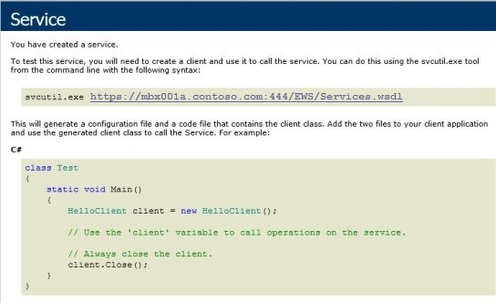

# Conversation history, contact cards, Free/Busy, and Out of Office information are unavailable when Lync fails to connect to Exchange

## Problem

When you try to sign in to Skype for Business Online (formerly Lync Online) by using Lync 2010 or Lync 2013 on a computer that's running Outlook, you may experience the following issues:

- Conversation history
  - Conversation history isn't saved to Outlook.   
  - Conversation history tab is empty in Lync 2013.   
   
- Office contact cards
  - Contact cards display incorrect information or nothing at all.   
  - There's no availability or Free/Busy information in contact cards.   
  - You can't open or view contact cards.   
   
- Notifications
  - Out of Office messages aren't displayed.   
  - You don't receive voice mail notifications.   
  - You don't receive Missed Conversation notifications.   

In the Lync client, you may receive one of the following error messages:

- Lync cannot connect to the Exchange server. Lync will attempt to retry the connection. History, voice mail and Outlook-related features will be unavailable.   
- Cannot connect to Exchange Web Services to retrieve Calendar and Out of Office Information.   
- Lync is in the process of determining the location of Exchange Web Services. This process may take a few minutes.   
- Lync is experiencing connection issues with the Exchange server. Lync will attempt to repair the connection until it is fully restored. History, voice mail, and Outlook-related features might be unavailable or out of date until the connection is restored.   

## Solution

### Solutions for Skype for Business Online users

#### Are you using the most up-to-date Lync client?

Make sure that you're using the most up-to-date Lync client. For more information, go to the following Microsoft websites:

- [Updates resource center for Lync 2013](https://technet.microsoft.com/lync/dn146014.aspx)   
- [Updates resource center for Lync 2010](https://technet.microsoft.com/lync/gg131945.aspx)   

#### Is Outlook running and configured to use the correct profile?

For the best experience, add your Exchange email account to Outlook and then set it as the default mail profile. Typically, your Exchange email address and Lync sign-in address will be the same, but in some cases they may be different. For help configuring your Outlook profile or contact your administrator, or go to the following Microsoft Knowledge Base article:

[2436962 ](https://support.microsoft.com/help/2436962) "There was a problem connecting to Microsoft Office Outlook" error when you sign in to Skype for Business Online

#### Is Lync discovering the correct Exchange server?

1. Press and hold Ctrl, right-click the Lync icon in the notification area, and then click **Configuration Information**. Look for the Exchange Web Services (EWS) setting at **EWS External URL**.   
2. Use the value that you found in the **EWS External URL** setting, and then change it so that it ends with Exchange.asmx. For example: 
   1. Default **EWS External URL**: https://mail.outlook.com/EWS/Exchange.asmx/WSSecurity   
   2. Changed **EWS External URL**: https://mail.outlook.com/EWS/Exchange.asmx
3. Enter the changed **EWS External URL** address into a browser. If you're prompted, enter your Exchange mailbox credentials. You should see the EWS XML document displayed in the web browser as shown in the following picture. This indicates that EWS can be accessed and that you shouldn't be experiencing any issues. If the page doesn't display or if you're denied access, contact your Support Team.

    

#### Are you entering the correct credentials to connect to Exchange?

If your Exchange email address and your Skype for Business Online sign in address are the same, and you typically don't have any problems, you shouldn’t be prompted for additional credentials after you sign in to Lync. However, if Lync prompts you for additional credentials to connect to Exchange, make sure that you use the credentials for connecting to Exchange instead of your credentials to sign in to Skype for Business Online.

If your credentials aren't accepted, and you're continuously prompted for credentials, see the following Microsoft Knowledge Base article: 

[2298541 ](https://support.microsoft.com/help/2298541) You're repeatedly prompted for Exchange credentials after you sign in to Lync

#### Can Outlook connect to the Free/Busy Service in EWS?

1. Open a command prompt. To do this, click **Start**, click **Run**, type cmd, and then press Enter.   
2. Go to the Outlook installation folder:
   - Microsoft Office 2013: C:\Program Files\Microsoft Office 15\root\office15
   - Microsoft Office 2010: C:\Program Files\Microsoft Office\Office14   
   - Microsoft Office 2007: C:\Program Files\Microsoft Office\Office12   
3. Type the following command, and then press Enter.

    ```powershell
    outlook.exe /cleanfreebusy
    ```

#### Is your system time accurate?

If the time on your computer differs from the time on the server that you're trying to sign in to, your attempt to sign in may fail. Set your computer's time as close to the correct local time as possible.

### Solutions for Skype for Business Online Administrators in Office 365

#### Where are the users' mailboxes located?

Many of the deployment requirements for Exchange and Lync integration depend on where the user’s mailbox is located.

The following articles cover deployment requirements. These include DNS configuration, Exchange Server configuration, and Lync Server configuration.

Is the user part of an on-premises Exchange Server organization, or are they in Office 365 Exchange Online? 

- If the user's mailbox is located in Exchange Online, see [How to integrate Exchange Server 2013 with Lync Server 2013, Skype for Business Online, or a Lync Server 2013 hybrid deployment](https://support.microsoft.com/help/2614242).
- If the user’s mailbox is homed on an on-premises Exchange server, see [How to integrate Exchange Online with Skype for Business Online, Lync Server 2013, or a Lync Server 2013 hybrid deployment](https://support.microsoft.com/help/2614614).

## More Information

These issues occur when Lync can't determine the user’s email address, can't locate the user’s Exchange server, or can't connect to the user’s Exchange server.

When the Lync client tries to discover the Exchange server of the Skype for Business Online user, the Lync client references the Active Directory **WindowsEmailAddress** attribute (or the MAIL attribute). Lync then tries to connect to the Exchange server through the Autodiscover process by using the domain suffix of the email address in the **WindowsEmailAddress** AD attribute. If the Skype for Business Online user doesn’t have an Exchange Online mailbox, or if the necessary attributes aren’t being synced from on-premises, Exchange integration with Lync fails.

After Lync determines where it should look for the Exchange server, it uses Autodiscover to find the user’s mailbox server and connect to it. If the Autodiscover service on whichever Exchange server the user’s mailbox resides is unavailable, the integration between Exchange and Lync fails.

As soon as Lync has the correct mailbox server to connect to, it tries to authenticate by using the Skype for Business Online user credentials first. If those credentials fail, Lync prompts for credentials after you sign in. If the wrong credentials are entered, or the user clicks cancel, the integration between Exchange and Lync fails.

Still need help? Go to [Microsoft Community](https://answers.microsoft.com/).
