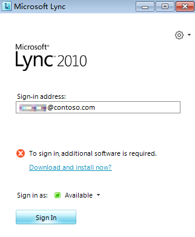

# Lync 2010 requires additional software to sign into Skype for Business Online

## Problem 

When you try to sign in to Skype for Business Online (formerly Lync Online) by using Lync 2010, you receive the following message: 

**To sign in, additional software is required.**

When you click **Download and install now?**, you're prompted to download and install the Microsoft Online Services Sign-In Assistant.

## Solution

To work around this issue, install the Microsoft Online Services Sign-In Assistant, restart your computer, and then try to sign in to Skype for Business Online by using Lync 2010. To install the Microsoft Online Services Sign-In Assistant, see [Microsoft Online Services Sign-In Assistant for IT Professionals RTW](https://www.microsoft.com/download/details.aspx?id=28177).

## More Information

This issue occurs if you try to sign in to Skype for Business Online by using Lync 2010 on an operating system that doesn't have the Microsoft Online Services Sign-In Assistant. 

Still need help? Go to [Microsoft Community](https://answers.microsoft.com/).
