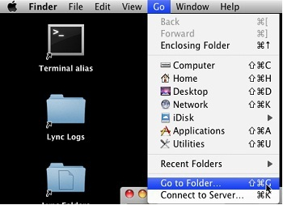
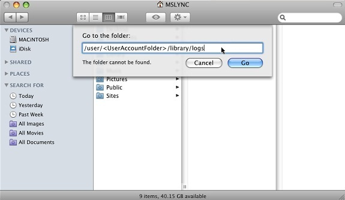
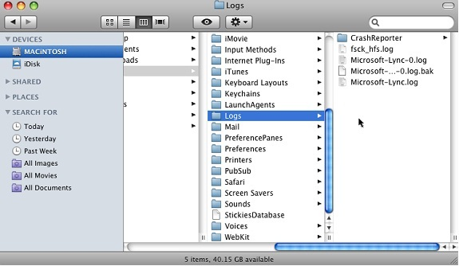

# Troubleshoot sign-in issues for Lync for Mac 2011 in Skype for Business Online

## Introduction

This article contains information about how to troubleshoot Lync for Mac issues in Skype for Business Online (formerly Lync Online). It also discusses how to sign in to Skype for Business Online by using Lync for Mac and how to collect log files and system information for Lync for Mac issues. 

## Procedure

### Before you troubleshoot

First, make sure that users follow the correct steps when they sign in to Skype for Business Online. If users are signing in to Skype for Business Online correctly and the issue persists, use one or more of the other methods later in this article to troubleshoot the issue, as appropriate for your situation. 

> [!NOTE]
> To connect Lync for Mac 2011 to Skype for Business Online in Office 365, you must have Lync for Mac version 14.0.6 or a later version installed. If you use a version that's earlier than version 14.0.6, you may have problems when you sign in to Skype for Business Online because earlier versions have issues that prevent authentication to Skype for Business Online. You can find the latest update at [Update for Lync for Mac 2011](https://www.microsoft.com/download/details.aspx?id=36517).

#### Make sure that users follow the correct steps when they sign in to Skype for Business Online

To sign in to Skype for Business Online by using Lync for Mac, users should follow these steps:

1. Start Lync for Mac.   
2. Enter your email address, user ID, and password.   
3. Next to **Sign in as**, select the presence status that you want to display after you sign in.   
4. If you want to save your credentials, click to select the **Remember my password** check box. Your credentials will be saved in the Mac OS Keychain and will work until the next time that your password changes or expires.   
5. To configure additional options for connecting to Skype for Business Online, click **Advanced**. You can configure the following options:

    - Automatic Configuration: In most cases, this is the correct setting. If the necessary DNS records are present and automatic configuration isn't working, try **Manual Configuration**.   
    - Manual Configuration: Select this option if automatic configuration is failing, and specify the following values: 

      - Internal server name: sipdir.online.lync.com:443   
      - External server name: sipdir.online.lync.com:443   

    - Kerberos authentication:Leave this option cleared. Office 365 uses the Microsoft Azure AD authentication system for authentication.   

### If you still can't sign in

The following table describes error messages that may occur when users sign in or use Lync for Mac with Skype for Business Online.

|Error|Cause|Type|Resolution|
|---|---|---|---|
|The service might not be available, or you might not be connected to the Internet. Make sure the server is available. Also, make sure your network connection cable is securely connected.|This issue may occur if Lync can’t detect a suitable Lync Server.|Client|To troubleshoot this issue, see the [Make sure that users follow the correct steps when they sign in to Skype for Business Online](#make-sure-that-users-follow-the-correct-steps-when-they-sign-in-to-skype-for-business-online) section.|
|Lync was unable to sign in. Please verify your logon credentials and try again. If the problem continues, please contact your support team.|Various causes.|Client|To troubleshoot this issue, see the [Users may be unable to sign in unless they first use an incorrect sign-in address](#Users-may-be-unable-to-sign-in-unless-they-first-use-an-incorrect-sign-in-address) section.|
|The user name, password, or domain appears to be incorrect. Ensure that you entered them correctly. If the problem continues, please contact your support team.|This issue may occur in scenarios in which a federated user tries to sign in, and this user has a password that's longer than 16 characters.|User Account|To troubleshoot this issue, see the [Federated users synchronized from on-premises Active Directory Domain Services can't sign in by using a password that's longer than 16 characters](#Federated-users-synchronized-from-on-premises-active-directory-domain-services-cant-sign-in-by-using-a-password-thats-longer-than-16-characters) section.|
|EXC_BAD_ACCESS|This issue may occur if Lync for Mac tries to integrate or schedule meetings with an Exchange mailbox that isn't hosted in Exchange Online.|Client|To troubleshoot this issue, see the [Lync for Mac crashes and the user receives an EXC_BAD_ACCESS error](#lync-for-mac-crashes-and-the-user-receives-an-excbadaccess-error) or [Clear cached data and corrupted certificates in Lync](#clear-cached-data-and-corrupted-certificates-in-lync) sections.|

### Troubleshoot Lync for Mac issues

Use one or more of the following methods, as appropriate for your situation.

#### Users may be unable to sign in unless they first use an incorrect sign-in address

1. Try to sign in to Skype for Business Online by using an incorrect sign-in address. That is, a sign-in address that you know won't work. For example, \EmailAddress @contoso.com. 

    > [!NOTE]
    > When you do this, sign-in will fail. This is expected behavior.   
2. After the sign-in fails, sign in by using the correct sign-in address. For example, **EmailAddress**@contoso.com.   

#### If Lync for Mac stops working after an Internet connectivity issue, flush the DNS cache

To flush the DNS cache, do one of the following, depending on the version of Mac OS that you're running:

- If you're running Mac OS X 10.5, Mac OS X 10.6, or Mac OS X 10.7 Lion, start Terminal, and then run the following command: dscacheutil -flushcache   
- If you're running Mac OS X 10.4 Tiger, start Terminal, and then run the following command: lookupd -flushcache   

#### Clear cached data and corrupted certificates in Lync

First, delete the following folders:
- **Users/Home Folder/Library/Caches/com.microsoft.Lync**   
- **Users/Home Folder/Documents/Microsoft User Data/Microsoft Lync History**   

Then, delete any corrupted or cached certificates. To do this, follow these steps:

1. Open the Keychain Access certificate management utility. To do this, in Finder, click **Applications**, click **Utilities**, and then click **Keychain Access**. Or, search for Keychain Access by using Spotlight.   
2. In the left pane, click **login**, and then click **Certificates**.   
3. In the right pane, find a certificate that's named **Unknown** or **Communications Server**, select it, and then delete it.

   **Note** You may have to unlock your keychain by using your password.   
4. Close Keychain Access.   
5. Restart Lync for Mac.   

> [!IMPORTANT]
> Before you perform the next step, try reproduce the issue by using a new test user account. If the issue doesn't repeat in the new account, then follow these steps:
> 1. Open Keychain Access **Preferences**, and then click **Reset My Default Keychain**.   
> 2. Open Finder, locate the following folders, and then delete them: 
>
>     **/Users/Home Folder/Documents/Microsoft User Data/Microsoft Lync Data**
>
>     **/Users/Home Folder/Documents/Microsoft User Data/Microsoft Lync History**   

#### Federated users synchronized from on-premises Active Directory Domain Services can't sign in by using a password that's longer than 16 characters

Organizations that have on-premises customer password policies may allow for passwords to exceed 16 characters. By default, the password policy in Office 365 restricts passwords to 16 characters or less. Because of the Windows Challenge/Response (NTLM) authentication mechanism in the Mac OS, passwords that are longer than 16 characters aren't recognized correctly, and this causes sign-in to fail. 

To work around this issue, the user should change his or her password to be 16 characters or less.

#### Lync for Mac crashes and the user receives an EXC_BAD_ACCESS error

This error message usually occurs when Lync for Mac tries to integrate or schedule meetings with an Exchange mailbox that isn't hosted in Exchange Online. This scenario isn't supported in Skype for Business Online. For the best experience, you should use both Skype for Business Online and Exchange Online. However, if that isn't an option, follow these steps as a potential workaround:

1. Open Finder, locate the following folder, and then delete it: 

   **Documents\Microsoft User Data\Microsoft Lync Data**
1. Start Lync for Mac, and then sign in to Skype for Business Online.   
1. On the Lync for Mac menu, click **Preferences**, click **Account**, and then clear the **Use Microsoft Exchange for managing personal information** check box.

   **Note** You must perform step 3 quickly after you sign in.   

### Collect log files and system information for Lync for Mac issues

To collect log files and system information for Lync for Mac issues, follow these steps:

1. Verify the version of the operating system that's used.   
2. Verify the error message that's returned.    
3. Turn on logging for troubleshooting in Lync for Mac. To do this, follow these steps:

   1. On the Lync menu, click **Preferences**, and then click **General**.   
   2. Under **Logging**, click to select the **Turn on logging for troubleshooting** check box.   
   
4. Exit Lync for Mac, and then restart Lync for Mac to create a log file.   
5. Reproduce the issue.   
6. Turn off logging for troubleshooting. To do this, follow these steps:

   1. On the Lync menu, click **Preferences**, and then click **General**.   
   2. Under **Logging**, clear the **Turn on logging for troubleshooting** check box.   
   
7. Collect the log files for Lync for Mac. To do this, follow these steps:

   1. On the menu bar in Finder, click **Go**, and then click **Go to Folder**.

          
   2. In the **Go to the folder** box, type the path of the logs folder. For example, type /user/**<Useraccountfolder>**/library/logs. Then, click **Go**.

       

        > [!NOTE]
        > **\<Useraccountfolder>** is usually the same as the user name that the user uses to log on the computer. The user name can also be found next to the House icon at the top of the Finder window.
        >
        > 

   3. In the Logs folder, collect the log files. 

          

### Uninstall and reinstall Lync for Mac 2011

If the steps in this article don't resolve the issue, try to do a clean uninstallation of Lync for Mac 2011, and then reinstall the application. For more information about how to do a clean uninstallation of Lync for Mac 2011, see [How to do a clean uninstallation of Lync for Mac 2011](https://support.microsoft.com/help/2691870).

## More Information

If you're using third-party virtualization software for the Mac, it can coincide with various performance-related issues including but not limited to slow desktop sharing, unexpected poor media quality, possible sign-in and Exchange integration issues. In order to continue, Microsoft technical support may have to confirm that the issue occurs on a computer where the third-party virtualization software isn’t present.

**Third-party information disclaimer**

The third-party products that this article discusses are manufactured by companies that are independent of Microsoft. Microsoft makes no warranty, implied or otherwise, about the performance or reliability of these products.

Still need help? Go to [Microsoft Community](https://answers.microsoft.com/).
