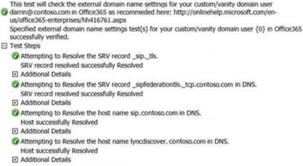

# "Cannot connect to the server" error message when Skype for Business Online users try to sign in to the Lync 2010 mobile client on a mobile device

## Problem

A Skype for Business Online (formerly Lync Online) user tries to sign in to the Lync 2010 mobile client from a Windows Phone, Apple iPhone or iPad, Google Android, or Nokia Symbian device by using the Auto-Detect Serveroption to determine the Skype for Business Online server. However, the user receives the following error message:

```adoc
Cannot connect to the server. It might be unavailable. Also please check the network connection, sign-in address and server addresses.
```

## Solution

To troubleshoot this issue, follow these steps.

### Step 1: Verify the Lyncdiscover CNAME record

To verify that the Lyncdiscover CNAME record is present in the Domain Name System (DNS) records, go to the Lync Connectivity Analyzer, and select **Office 365 Custom/Vanity Domain Name Settings Test for Lync**. Enter the sign-in address that you're using when you to try to sign in to Skype for Business Online (for example, darrin@contoso.com), and start the test. 



If any issues are detected, check the DNS configuration with your domain registrar.

### Step 2: Try a Wi-Fi connection

After you verify that the Lyncdiscover CNAME record exists in DNS, check whether a Wi-Fi connection is available. If a Wi-Fi connection is available, try to connect to Skype for Business Online. This test determines whether the DNS lookup failure is occurring on the mobile carrier, the Wi-Fi connection, or both.

### Step 3: Query DNS from the mobile carrier

The next step to check whether the mobile device can resolve the Lyncdiscover CNAME record in DNS is to query DNS from the phone itself. This is difficult to do because most mobile devices don't include integrated network diagnostic tools. So, users have to download an application that performs these kinds of functions. Demonstrating the use of these applications is outside the scope of this article and outside the scope of Office 365 technical support. You may need to contact your carrier for additional assistance if the connection is only failing when connected to your data carrier.

## More Information

This issue occurs if the Lync Mobile Autodiscover process fails and the user's Skype for Business Online server can't be determined. This issue may occur if one of the following conditions is true:

- The Lyncdiscover CNAME record isn't set up.   
- The Lyncdiscover CNAME record is set up incorrectly.   
- The Wi-Fi connection is blocking DNS queries.   

For the Lync Mobile Auto-Detect Serveroption, specific CNAME records must be present in DNS for the Lync 2010 mobile client to determine the home server of the Skype for Business Online user. The Lync 2010 mobile client tries to discover the user's home server by querying the following CNAME records in DNS:

- LyncdiscoverInternal.<**domain**>   
- Lyncdiscover.<**domain**>   

Additionally, the CNAME records in DNS must meet the following criteria. Otherwise, the Lync Mobile sign-in process will fail if the Auto-Detect Server option is used.

- DNS Record Type: CNAME   
- Name: Lyncdiscover   
- Value/Destination: webdir.online.lync.com   

For more information about Lync Mobile client devices, see the following websites: 

- [2636318 ](https://support.microsoft.com/help/2636318 ) How to troubleshoot issues that you may encounter when you use the Lync 2010 mobile client for Windows Phone 7 
- [2636320 ](https://support.microsoft.com/help/2636320 ) How to troubleshoot issues that you may encounter when you use the Lync 2010 mobile client for Apple iOS  
- [2636313 ](https://support.microsoft.com/help/2636313 ) How to troubleshoot issues that you may encounter when you use the Lync 2010 mobile client for Google Android

The third-party products that this article discusses are manufactured by companies that are independent of Microsoft. Microsoft makes no warranty, implied or otherwise, about the performance or reliability of these products.

Still need help? Go to [Microsoft Community](https://answers.microsoft.com/).