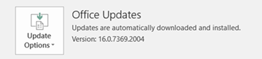
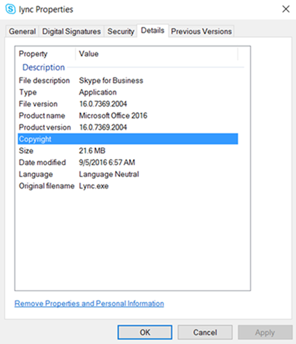

# How to check the version of Skype for Business 2016

## Summary

This article describes how to determine the exact version of the copy of Microsoft Skype for Business 2016 that you have installed. 

Note In Office 2016, the **Help** > **About** window actually shows the version of the MSO library that's used by that particular application. So that method can no longer be used to find the application version.

## How to find the version number 

The following methods help you determine the installed version of Skype for Business 2016 on your computer. 

### Method 1

1. Open any Office application, such as Word or Excel, and then create a document.   
2. On the **File** tab, select either the **Account** or **Help** command.   
3. Under **Product Information**, you'll see your Office product name and, in some cases, the full version number.

       

### Method 2

1. Open Task Manager while the Skype for Business 2016 is running.
2. On the **Details** tab, locate **Lync.exe**.   
3. Right-click **Lync.exe**. and then select **Open file location**. 
4. In the **Description** list, locate the product version number.

       

### Method 3

See the following Microsoft website to learn how to create a PowerShell script to check the version number of Skype for Business:

[https://gallery.technet.microsoft.com/How-to-check-the-version-bbf20466](https://gallery.technet.microsoft.com/how-to-check-the-version-bbf20466)

## More information

Still need help? Go to [Microsoft Community](https://answers.microsoft.com/).
