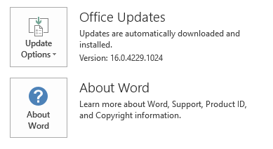
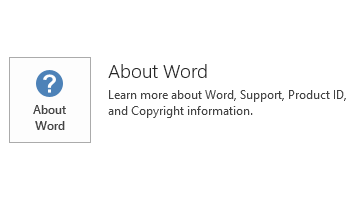

# Skype for Business 2016 freezes on a computer that has Malware bytes is installed

## Symptoms

On a computer that has Malware bytes Anti-Malware client software installed, Microsoft Skype for Business 2016 freezes when you try to start an A/V scenario, such as making an audio or video call or joining the Audio or Video portion of a meeting, file transfer, or Application or Desktop Sharing. Additionally, the following event is logged in the Application log:

## Resolution

To fix this problem, install the [latest update for Skype for Business 2016](https://support.microsoft.com/help/3123065). 

#### Skype for Business 2016 Click-to-Run clients

Current Branch for Business: 16.0.6741.2048 and later builds

First Release Current Branch for Business, First Release Monthly Channel, Monthly Channel: 16.0.6965.2058 and later builds

For more information about C2R Channel builds, see [Office 365 client update channel releases](/officeupdates/release-notes-microsoft365-apps).

## Workaround

To recover the computer from this condition, try the following methods in the given order:

- Exit Malware bytes client. This may let Lync.exe (Skype for Business 2016) exit completely.   
- Restart the computer.   

After the computer is recovered, add Lync.exe to the Web Exclusions list in Malware bytes, as shown in the following screenshot. 

For more information about how to set Web Exclusions, go to the following Malware bytes website:

[Web Exclusions](https://www.malwarebytes.com/support/guides/mbam-legacy/WebExclusions.html)

## More Information

To determine whether your Office installation is Click-to-Run or MSI-based, follow these steps:

1. Start an Office 2016 application.   
2. On the **File** menu, select **Account**.   
3. For Office 2016 Click-to-Run installations, an **Update Options** item is displayed. For MSI-based installations, the **Update Options** item isn't displayed.   

|Office 2016 Click-to-Run installation|MSI-based Office 2016|
|-|-|
|||

## Status

Microsoft is researching this problem and will post more information in this article when the information becomes available.

[!INCLUDE [Third-party information disclaimer](../../../includes/third-party-information-disclaimer.md)]

[!INCLUDE [Third-party contact disclaimer](../../../includes/third-party-contact-disclaimer.md)]

Still need help? Go to [Microsoft Community](https://answers.microsoft.com/).