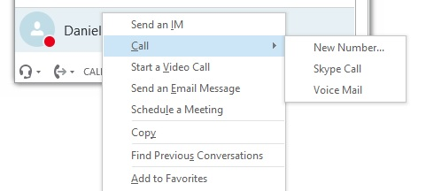
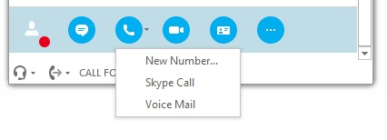
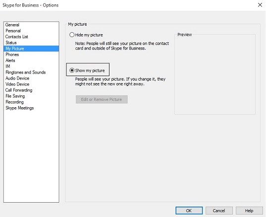
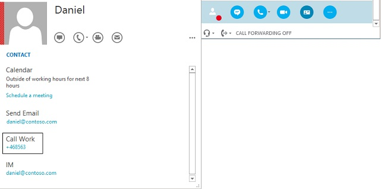

# Telephone numbers of contacts are missing in Lync 2013 or Skype for Business

## Symptoms 

When you use one of the following methods to call a user in Microsoft Lync 2013 or Microsoft Skype for Business, the telephone number (or numbers) may not be displayed:

- You right-click the contact, as in the following screen shot:

   

- You select the call menu, as in the following screen shot:

      

## Cause

This issue may occur in the following scenario: 

- The user is included in the contact list.   
- The user has explicitly blocked his or her photo from being published.   
- You have to scroll down in order to see the affected user.   
- The user has at least one associated phone number.   

### Hotfix or update information

- Microsoft is currently investigating this issue.   

## Workaround

To work around this issue, use one of the following methods as a user with admin permissions:

- Make sure that the **Show my picture** option is enabled for all users, even if they haven't published a photo:

  

- Expand the contact card details before you try to call that particular user, as in the following screen shot:

  
