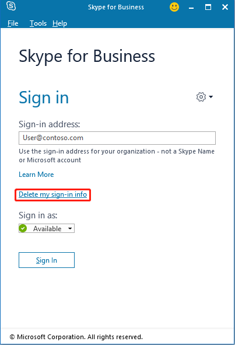

# How to troubleshoot being unable to sign in to Skype for Business

## Overview

Microsoft Skype for Business caches files locally on your computer. This may prevent you from being able to sign in to Skype for Business. If you suspect that this issue is affecting you, try the following method:

1. Sign out of the Skype for Business client.
2. Delete all cached sign-in credentials.
3. Sign in to Skype for Business again.

## Resolution

To delete cached sign in credentials, follow the Skype for Business troubleshooter scenario in the Support and [Recovery Assistant for Office 365](https://aka.ms/SaRA-SkypeForBusinessSignIn) (SaRA) tool. Or, manually clear the cached information.

To manually fix this issue, follow these steps.

### Step 1. Clear your Skype for Business cache

1. Click the gear icon in the upper-right corner of the Skype for Business client, click **File** menu, and then click **Sign Out**.
2. Click **Delete my sign-in info**.

   
3. Locate your local AppData folder:
   - If you're using Skype for Business 2016, the folder is located here:
    **%LOCALAPPDATA%\Microsoft\Office\16.0\Lync**
   - If you are using Skype for Business 2013, the folder is located here:
   **%LOCALAPPDATA%\Microsoft\Office\15.0\Lync**
4. Delete the folders that contain your sign-in information. The folder name resembles sip_user@contoso.com.
5. Delete all files in the Tracing folder.
6. Sign in to Skype for Business again.

If you still cannot sign in, go to Step 2 to clear the registry keys.

### Step 2: Clear the Skype for Business registry keys

1. Start Registry Editor. To do this, right-click **Start**, click **Run**, type *regedit* in the **Open** box, and then press **OK**.
2. Locate the following subkey:

    - If you are using Skype for Business 2016, locate: **HKEY_CURRENT_USER\Software\Microsoft\Office\16.0\Lync**
    - If you are using Skype for Business 2013, locate: **HKEY_CURRENT_USER\Software\Microsoft\Office\15.0\Lync**
3. Delete the folder has the name of your sip address. For example: user@contoso.com.

If the issue persists, go to Step 3 to remove the cache.

### Step 3: Remove Skype for Business cache

1. Locate your local and roaming AppData folder:
   - If you are using Skype for Business 2016, locate the following subkey:
**%LOCALAPPDATA%\Microsoft\Office\16.0\Lync**
**%userprofile%\appdata\roaming\Microsoft\Office\16.0\Lync**
   - If you are using Skype for Business 2013, locate the following subkey:
**%LOCALAPPDATA%\Microsoft\Office\15.0\Lync**
**%userprofile%\appdata\roaming\Microsoft\Office\15.0\Lync**
2. Delete the folders that have the name of your sip address.
3. Delete the AccountProfiles.dat file.
