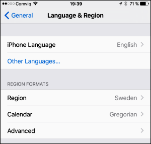

# "You can't sign in with this version of Lync" error in Lync for iPad or Lync for iPhone on iOS 9

## Symptoms

When you try to sign in to Microsoft Lync 2013 for iPhone or Microsoft Lync 2013 for iPad on Apple iOS 9, you receive the following error message:

```adoc
You can't sign in with this version of Lync. Please install a newer version. If that doesn't work, contact your support team.
```

## Cause

This problem occurs because the **Language** and **Region** settings on your device don't match. For example, the language value is **English** and the region value is **Sweden**. When this problem occurs, your settings may resemble the settings in the following screen shot.



## Resolution

To resolve this issue, install the Skype for Business for iOS client (version 6.0). 

**Third-party information disclaimer**

Microsoft provides third-party contact information to help you find technical support. This contact information may change without notice. Microsoft does not guarantee the accuracy of this third-party contact information.

## Workaround

> [!NOTE]
> No fix for this issue is scheduled for Lync 2013 for iPhone and Lync 2013 for iPad. 

To work around this problem in for Lync 2013 for iPhone and Lync 2013 for iPad, follow these steps.

> [!NOTE]
> This workaround does not apply to the **Chinese Simplified** language setting. If you have **Language** set to **Chinese Simplified**, you cannot sign in by using the Lync 2013 iPhone or Lync 2013 for iPad apps, regardless of the **Region** setting.

1. Verify that the **Language** and **Region** settings match. To do this, follow these steps:

   1. Tap **Settings**.   
   2. Tap **General**.   
   3. Tap **Language & Region**.   
2. If the settings don't match, do either of the following:
   - Change the language:
     1. Tap **iPhone Language** or **iPad Language**.
     1. Select a language that matches the **Region** setting. For example, if the region setting is **Israel**, select **Hebrew**.
     1. Tap **Done**, and then confirm the change when you're prompted.
       
     After several seconds, your device should return to the **Home** screen and display the new language that you selected.

   - Change the region:

     1. Tap **Region**.   
     2. Select a region that matches the **Language** setting. For example, if the language setting is **English**, select **United States** or **United Kingdom**.   
     3. Tap **Back**.      

**Third-party information disclaimer**

The third-party products that this article discusses are manufactured by companies that are independent of Microsoft. Microsoft makes no warranty, implied or otherwise, about the performance or reliability of these products.

## References

[3097592 You can't join a meeting from outside Lync 2013, Lync 2010, or Skype for Business on iOS 9 or 9.1](https://support.microsoft.com/help/3097592)
