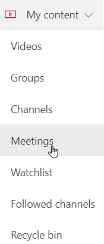
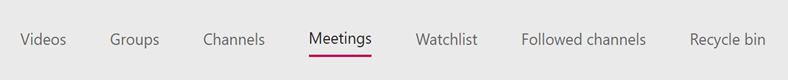
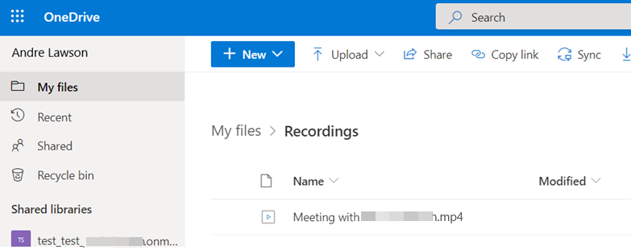
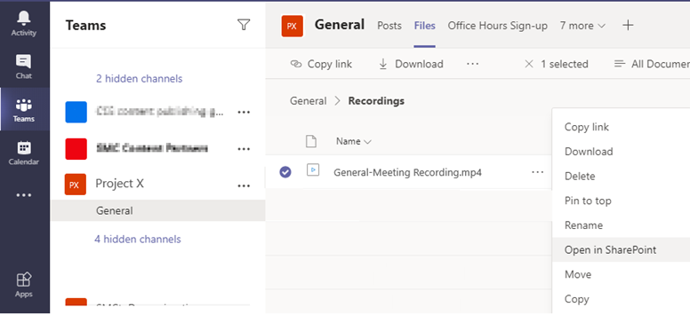
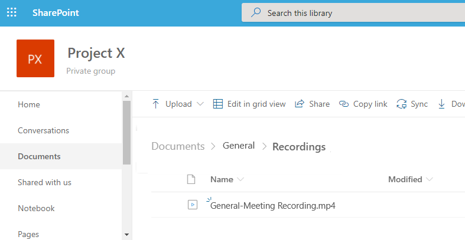

# Issues with meeting recordings

You experience one of the following issues in Microsoft Teams:

- The meeting recording button is missing.
- The meeting recording link isn't included or visible in a chat window.

To determine if there's a problem with your account, run the [Teams Meeting Recording Test](https://aka.ms/MRCA-TMR). This diagnostic checks if your account meets all requirements to record a meeting in Teams. If the issue persists, continue with the following information.

To troubleshoot the issue, begin by asking your administrator to run the [Meeting Recording Support Diagnostic](https://techcommunity.microsoft.com/t5/microsoft-teams-support/new-diagnostic-for-teams-meeting-recording/ba-p/1918982) that's available in the Microsoft 365 admin center.

The diagnostic can check the following prerequisites for Teams meeting recordings:

- You must be assigned the correct license.
- You must have the correct meeting policies.
- You must have a supported storage location (Stream, OneDrive for Business, or SharePoint).

For more information about user requirements for Teams meeting recording, see [Prerequisites for Teams cloud meeting recording](/microsoftteams/cloud-recording#prerequisites-for-teams-cloud-meeting-recording).

## Run the Meeting Recording Support Diagnostic

1. Sign in to Microsoft 365 admin center, and type **Diag: Meeting Recording** in the **Need Help?** search box.
2. Enter the Session Initiation Protocol (SIP) address, and select **Run Tests**.

:::image type="content" source="./media/troubleshoot-meeting-recording-issues/diagnostic.png" alt-text="Screenshot of start the Meeting Recording Support Diagnostic.":::

If the diagnostic reports that your organization is configured for Microsoft Stream storage, but you're in a region or country that isn't supported yet by Stream, use one of the following options:

- Replace the Stream storage with OneDrive for Business or SharePoint. For more information, see [Use OneDrive for Business and SharePoint or Stream for meeting recordings](/microsoftteams/tmr-meeting-recording-change).
- Set the meeting policy to save recordings outside the local region by using the `-AllowRecordingStorageOutsideRegion` attribute in the [Set-CsTeamsMeetingPolicy](/powershell/module/skype/set-csteamsmeetingpolicy) cmdlet.

## Workaround

Begin by making sure that you have the [latest Teams updates](https://support.microsoft.com/office/update-microsoft-teams-535a8e4b-45f0-4f6c-8b3d-91bca7a51db1) installed.

If the issue isn't resolved by an update, use the following workaround for the appropriate issue.

### Issue 1: The Meeting recording button is missing

- Leave and rejoin the meeting. This might restore the recording functionality.
- Use the [Teams web client](https://teams.microsoft.com/) to join and record the meeting.
- Disable the new meeting experience:

  1. Select the profile picture at the top of the Teams app, and then select **Settings**.
  2. On the **General** tab, clear the **Turn on new meeting experience (New meetings and calls will open in separate windows. Requires restarting Teams.)** check box.

     :::image type="content" source="./media/troubleshoot-meeting-recording-issues/feature.png" alt-text="Screenshot of disabling the new experience.":::

  3. Right-click the Teams icon in the Windows task bar or Cmd-click the Teams icon in the Mac dock.
  4. Select **Quit**.
  5. Restart Teams.

Try again to record the meeting. If the issue still isn't resolved, ask your administrator to open a support ticket with Microsoft.

### Issue 2: The meeting recording link isn't visible in a chat window

In high-volume chat sessions, a known issue prevents the meeting recording link from appearing for one or more users.

Try scrolling up to the top of the chat window and then scrolling back to the bottom. This action might trigger a chat service event and restore the meeting recording link.

If the meeting recording link still isn't visible, use either of the following methods to locate the recording, depending on your storage location. The location is provided in the diagnostic report.

**Method 1: Meeting recordings are stored in Stream**

1. Sign in to [Microsoft Stream](https://stream.microsoft.com).
2. In the Stream navigation bar, select **My content** > **Meetings** to open the Meetings page.

   

   The options from the **My content** menu appear on a bar at the top of each page. You can pivot to Teams meeting recordings from any page by selecting the **Meetings** tab on the bar.

   

For more information, see [Find meetings in Microsoft Stream](/stream/portal-filter-meetings).

**Method 2: Meeting recordings are stored on OneDrive for Business or in SharePoint**

- For non-channel meetings, the recording is stored in the **Recordings** folder under **My files**.

  Example: <*Recording user's OneDrive for Business*>/My files/Recordings

  

- For channel meetings, the recording is stored in the Teams site documentation library in the **Recordings** folder in SharePoint.

  To find the recording link in the Teams channel, select **Files** > **Recordings** > **Open in SharePoint**.

  Example in Teams: <*Teams channel name*>/Files/Recordings

  

  Administrators can also find the recording link for users directly in SharePoint from the **Recordings** folder under **Documents**.

  Example in SharePoint: <*SharePoint/Documents/Channel name*>/Recordings

  
