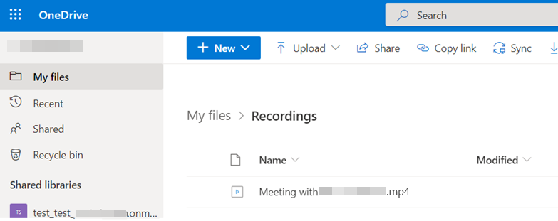

# Troubleshooting Teams meeting recording issues

This article helps Microsoft Teams administrators guide users to troubleshoot meeting recording issues such as:

- The meeting recording button is missing.
- The meeting recording link isn’t included or visible in a chat.

## Run the Meeting Recording Support Diagnostic

If users can't record Teams meetings, the administrator should run the [Meeting Recording Support Diagnostic](https://techcommunity.microsoft.com/t5/microsoft-teams-support/new-diagnostic-for-teams-meeting-recording/ba-p/1918982) available in the Microsoft 365 admin portal first to check if users meet these conditions:

- User licenses
- Meeting policies
- Storage locations

To start the diagnostic, sign in to Microsoft 365 admin center and type **Diag: Meeting Recording** in the **Need Help** dialogue box.

:::image type="content" source="./media/troubleshoot-meeting-recording-issues/diagnostic.png" alt-text="Screenshot of start the Meeting Recording Support Diagnostic.":::

For more information about user requirements for Teams meeting recording, see [Prerequisites for Teams cloud meeting recording](/microsoftteams/cloud-recording#prerequisites-for-teams-cloud-meeting-recording).

If the diagnostic reports that your organization is on the Microsoft Stream storage but you're in a region or country that isn't supported by Stream yet, the administrator can use one of the following options:

- Use OneDrive for Business or SharePoint storage to replace the Stream storage. To do this, see [Use OneDrive for Business and SharePoint or Stream for meeting recordings](/microsoftteams/tmr-meeting-recording-change).
- Set the meeting policy to save recordings outside the local region through the `-AllowRecordingStorageOutsideRegion` attribute in the [Set-CsTeamsMeetingPolicy](/powershell/module/skype/set-csteamsmeetingpolicy) cmdlet.

  **Note** This option allows users to still use the Stream storage but has their recordings stored outside the local region.

If the diagnostic shows that the affected users meet the conditions, here's how to guide them:

## The Meeting recording button is missing

**Note** A known issue with the [New Meeting Experience](https://techcommunity.microsoft.com/t5/microsoft-teams-blog/new-meeting-and-calling-experience-in-microsoft-teams/ba-p/1537581) in Teams prevents some users from recording meetings. Microsoft has rolled out an update to fix this issue globally. First, instruct users to [check and make sure they have the latest Teams updates](https://support.microsoft.com/office/update-microsoft-teams-535a8e4b-45f0-4f6c-8b3d-91bca7a51db1). Administrators can also [control how often their tenants get updates](/microsoft-365/admin/manage/release-options-in-office-365), which may affect when their users can receive new features.

If the issue isn't resolved, here's how users can work around this issue:

- Leave the meeting and join the meeting again. The recording function might be restored.
- Use the [Teams Web client](https://teams.microsoft.com/) to join and record the meeting.
- Disable the new meeting experience, restart Teams, and try to record the meeting again.

Here's how to disable the new meeting experience:

1. Select the profile picture at the top of the Teams app, and then select **Settings** > **General**.
2. Uncheck the **Turn on new meeting experience (New meetings and calls will open in separate windows. That requires restarting Teams)** checkbox.

   :::image type="content" source="./media/troubleshoot-meeting-recording-issues/feature.png" alt-text="Screenshot of disabling the new experience.":::

3. Restart Teams by following these steps:

    1. Right-click or Cmd-click the Teams icon in the Windows task bar or Mac System Tray.
    2. Select **Quit**.
    3. Start Teams again.

If the issue still isn't resolved, the administrator should open a support ticket with Microsoft.

## The meeting recording link isn’t included or visible in a chat

**Note** In high volume meeting chats, a known issue prevents the meeting recording link from appearing for one or more users.

Instruct affected users to scroll up to the top of the meeting chat and then scroll back to the bottom. This action may trigger a chat service event and restore the meeting recording link.

If the meeting recording link still can't be found, direct users to one of the two following methods depending on [the report of the diagnostic](#run-the-meeting-recording-support-diagnostic).

### Method 1: Meeting recordings are stored in Stream

1. Sign in to Microsoft Stream.
2. In the Stream navigation bar, go to **My content** > **Meetings**.

   

3. You can also pivot to Teams meeting recordings from your other pages under **My content**.

   

For more information, see [Find meetings in Microsoft Stream](/stream/portal-filter-meetings).

### Method 2: Meeting recordings are stored in OneDrive for Business or in SharePoint

- For non-channel meetings, the recording is stored in a folder named **Recordings** in **My files** at the top level of the OneDrive for Business window.

  Example: *Recorder's OneDrive for Business*/My files/Recordings

  

- For channel meetings, the recording is stored in the Teams site documentation library in a folder named **Recordings** in SharePoint. In the Teams channel, select **Files** > **Recordings**, and then select **Open in SharePoint** to find the recording link.

  Example in Teams: *Teams name - Channel name*/Files/Recordings

  

  Alternatively, the administrator can find the recording link directly in SharePoint for users from the **Recordings** folder in **Documents**.

  Example in SharePoint: SharePoint/Documents/*Channel name*/Recordings
  
  
