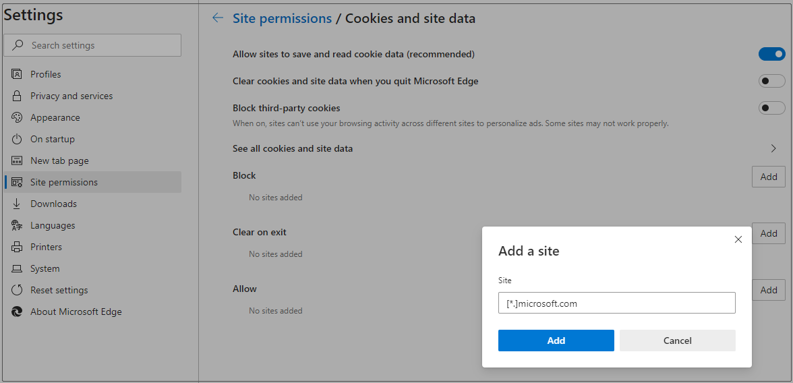
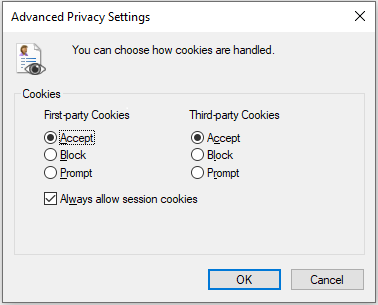

# Microsoft Teams is stuck in a login loop in Edge or Internet Explorer

## Symptoms

When you try to sign in to Microsoft Teams in Microsoft Edge or Internet Explorer, the site continually loops, and you can never sign in. 

## Cause

This issue occurs if your organization uses **Trusted Sites** in Internet Explorer and doesn't enable the URLs for Microsoft Teams. In this case, the Teams web-based application cannot sign in, as the trusted sites for Teams are not enabled. 

## Resolution

Change Microsoft Internet Explorer or Edge settings using administrator rights or a Group Policy object (GPO).

### Microsoft Edge

1. In the Edge **Settings** window, select **Site permissions** and **Cookies and site data**.
2. Turn on **Allow sites to save and read cookie data (recommended)** and make sure **Block third-party cookies** is turned off. Alternatively, follow step 3 if you need to keep third-party cookies blocked.
3. In the same window, under **Allow**, select **Add** to add the following sites:

    - [*.]microsoft.com
    - [*.]microsoftonline.com
    - [*.]teams.skype.com
    - [*.]teams.microsoft.com
    - [*.]sfbassets.com
    - [*.]skypeforbusiness.com

    

### Internet Explorer

1. In the Internet Options window, select **Privacy** and **Advanced**.
2. Select **Accept** for **First-party Cookies** and **Third-party Cookies**, and select the **Always allow session cookies** check box. 

    

    Alternatively, follow steps 3 and 4 if you need to keep third-party cookies blocked.
3. In the Internet Options window, select **Security** > **Trusted Sites** > **Sites**.
4. Add the following sites:

    - https://*.microsoft.com
    - https://*.microsoftonline.com
    - https://*.teams.skype.com
    - https://*.teams.microsoft.com
    - https://*.sfbassets.com
    - https://*.skypeforbusiness.com

> [!NOTE]
> It's always good to validate and enable all trusted URLs for Teams and review the requirements in this article: [Office 365 URLs and IP address ranges](https://docs.microsoft.com/office365/enterprise/urls-and-ip-address-ranges?redirectSourcePath=%252farticle%252fOffice-365-URLs-and-IP-address-ranges-8548a211-3fe7-47cb-abb1-355ea5aa88a2#bkmk_teams).

## More information

Still need help? Go to [Microsoft Community](https://answers.microsoft.com/).

