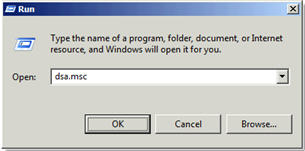
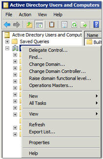
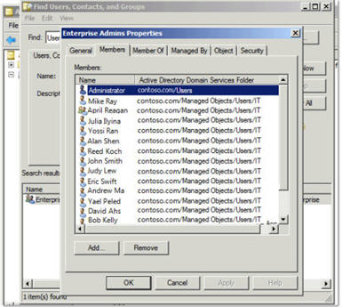

# Error when you try to run the Azure Active Directory Sync Tool Configuration wizard: The Enterprise Administrator credentials that you supplied are not valid

_Original product version:_ &nbsp; Cloud Services (Web roles/Worker roles), Azure Active Directory, Microsoft Intune, Azure Backup, Office 365 Identity Management  
_Original KB number:_ &nbsp; 2386471

## Symptoms

When you try to run the Microsoft Azure Active Directory Sync Tool Configuration Wizard, you receive the following error message:

> The Enterprise Administrator credentials that you supplied are not valid. Supply valid credentials and try again.

## Cause

This issue may occur if you entered incorrect credentials on the Active Directory Credentials page of the Directory Sync Tool Configuration Wizard.

## Resolution

To resolve this issue, follow these steps:

1. Make sure that you provide credentials for an account that has enterprise admin permissions for your company's local Active Directory installation.
2. Make sure that you enter the correct user name and password for the user account.
3. Make sure that the computer on which the Directory Sync Tool Configuration Wizard is installed can communicate with your company's domain controllers and can authenticate to the local Active Directory.

> [!NOTE]
> The account must have enterprise admin permissions in the Active Directory forest to which the computer that's running the Directory Sync Tool Configuration Wizard is joined.

To check whether an account has enterprise admin permissions, follow these steps:

1. On a domain controller or computer that has the Windows Server Administration Toolkit installed, start Active Directory Users and Computers. To do this, click **Start**, click **Run**, type dsa.msc in the **Open** box, and then click **OK**.

    

2. Right-click the domain, and then click **Find**.

    

3. In the **Name** box, type enterprise admins, and then click **Find Now**.

    

4. Double-click **Enterprise Admins**, and then click the **Members** tab.

    

5. Check whether the user is listed in the **Members** list. If the user isn't in the list, one of the members of this list must log on and add the user to this list. Or, a member of this list can use their credentials in the Directory Sync Tool Configuration Wizard.

## More information

Still need help? Go to [Microsoft Community](https://answers.microsoft.com/) or the [Azure Active Directory Forums](https://social.msdn.microsoft.com/Forums) website.
