# Troubleshoot dynamic groups

This troubleshooting guide helps a support engineer to diagnose and solve customer cases for dynamic groups in Azure Active Directory. 

## Dynamic Groups Docs Reference

- Public information on the Dynamic groups feature can be referenced here: [Creating Dynamic Membership Rules](https://docs.microsoft.com/azure/active-directory/users-groups-roles/groups-dynamic-membership#other-properties-and-common-rules).
- Public general groups troubleshooting information can be referenced at [Troubleshooting groups](https://docs.microsoft.com/azure/active-directory/users-groups-roles/groups-troubleshooting).

## Dynamic groups identification and management

To verify whether your group is a dynamic group, see [Evaluate whether a group is a dynamic group](#1).

- **Yes**: proceed to the next troubleshooting steps.

- **No**: [Create a basic group and add members using Azure Active Directory](https://docs.microsoft.com/azure/active-directory/fundamentals/active-directory-groups-create-azure-portal) or other applicable groups troubleshooting guide for additional troubleshooting information.

### Dynamic Group Creation Issues

Customers encountered these common issues in creating a dynamic group or rule.

- You're unable to create a dynamic group in Azure Portal, or you receive an error when creating a dynamic group in PowerShell: see [Cannot create a dynamic group](#4).

- You can't find the attribute to create a rule: See [Create a dynamic membership rule](#7).

- You receive a **"max groups allowed"** error when trying to create a Dynamic Group in PowerShell: You have reached 5,000 groups, the maximum limit for Dynamic groups in your tenant. To create new Dynamic groups, first delete existing Dynamic groups. There's no way to increase the maximum limit.

### Dynamic Membership Update Issues

Customers have created a dynamic group and configured a rule, but encountered these common issues:

No members appear in the group, some users or devices don't appear in the group, or the wrong users or devices appear in the group.

- Visit [Troubleshoot dynamic membership update issues](#9).

Existing members of the rule are removed.

- This behavior is expected. Existing members of the group are removed when a rule is enabled or changed, or attributes are changed. The users returned from the evaluation of the rule are added as members to the group.

You don’t see membership changes instantly after adding or changing a rule.

- Membership evaluation is performed periodically in a background process. The duration of the process is determined by the number of users in your directory, and the size of the group is created as a result of the rule. Typically, directories with small numbers of users will see group membership changes within a few minutes. Directories with a large number of users can take 24 hours or longer to populate.

- Check the [membership processing status](https://docs.microsoft.com/azure/active-directory/users-groups-roles/groups-create-rule#check-processing-status-for-a-rule) to confirm whether the process is complete. Check the last updated date on the group **Overview** page in Azure portal to confirm that the page is updated.

- To force the group to be processed, see [Force the group to be processed now](#18).

You receive a rule processing error.

- See [Fix a rule processing error](#19).

### Dynamic Group Deletion or Restoration Issues

You receive an error when deleting a group.

- Before attempting to delete a group in Azure Active Directory, ensure that you have [deleted all assigned licenses](https://docs.microsoft.com/azure/active-directory/users-groups-roles/licensing-group-advanced#deleting-a-group-with-an-assigned-license). For more information about group deletion in general, see [Delete a group](#21).

You restored a deleted group but did not see any updated.

- When a dynamic group is deleted and restored, it's seen as a new group and repopulated according to the rule. This process might take up to 24 hours.

Get help with case.

- Ask question in [Group management Teams channel](https://teams.microsoft.com/l/channel/19%3ac6e22a9b887d4f77b177cd074d345616%40thread.skype/Group%2520management?groupId=56c43627-9135-4509-bfe0-50ebd0e47960&tenantId=72f988bf-86f1-41af-91ab-2d7cd011db47) to get further help from aztabot, SMEs, TAs, and PG members. Alternatively, file an IcM incident.

Communicate with the customer.

- Communicate with the customer to determine the root cause and solution.

## Evaluate whether a group is a dynamic group<a id="1"></a>

There are two options to check when you determine whether a group is dynamic group.

Customers can check on Azure portal.

- Select the group in the **Overview** tab, then check whether the **membership type** is set to **Dynamic**.

   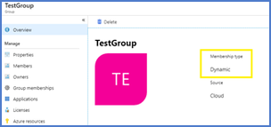

CSS can check the Azure Support Center.

1. Go to the [Azure support center](https://azuresupportcenter.msftcloudes.com/).
2. Log in with your **Microsoft account**.
3. Enter the **support request ID**.
4. Go to **Azure AD explorer** tab at the top, then navigate to **Groups** in the left panel.
5. Select **Search by Object ID**, then provide the **group_id** in the search bar, and run the query to get the group properties. If the **groupType** property equals **DynamicMembership**, it's a dynamic group.

   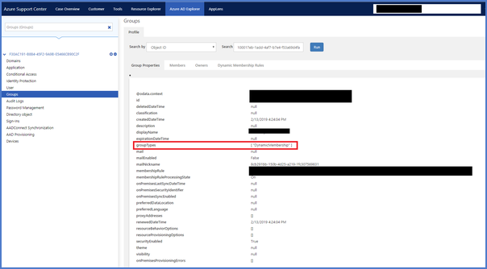

## Validate dynamic group membership rules<a id="2"></a>

Azure Active Directory (Azure AD) now provides the means to validate dynamic group rules. On the **Validate rules** tab, you can validate your dynamic rule against sample group members to confirm that the rule is working as expected.

 When creating or updating dynamic group rules, administrators want to know whether a user or a device will be a member of the group. This information helps evaluate whether user or device meets the rule criteria and aid in troubleshooting when membership isn't expected.

For more information, see [Validate a dynamic group membership rule (preview) in Azure Active Directory](https://docs.microsoft.com/azure/active-directory/users-groups-roles/groups-dynamic-rule-validation)

## Troubleshoot dynamic group creation issues<a id="3"></a>

Customers encountered issues in creating dynamic group or rule.

### Cannot create a dynamic group<a id="4"></a>

You don't see option to create a dynamic group in the Azure portal, or there was an error in creating a dynamic group in PowerShell.

1. Ensure that your tenant has the appropriate license.

   1. Dynamic groups require the tenant to have an Azure Active Directory **P1/P2 Premium license**. For more information, check [Azure Active Directory license plans](https://www.microsoft.com/cloud-platform/azure-active-directory-pricing)

2. Ensure that the user creating the group has the appropriate administrator permissions:

   1. Ensure that the user is authorized to create a new group. Global administrators can disable group creation in the Azure portal or Access Panel. The user may need an administrator create the new group for them, or give the user appropriate permissions.

### Check group creation permissions<a id="5"></a>

Check that group creation permissions are enabled for the type of group being created.

- Global administrators can manage group creation permissions for security or Office 365 groups created in the Azure portal or Access Panel, by setting the **Users can create security groups in Azure portals** or **Users can create Office 365 groups in Azure portals** settings in the Azure portal under **All groups** > **General (Settings)**. This setting applies to dynamic groups as well.

Check that the specific user is in the list of users that can create a group.

- Global administrators can restrict group creation to select a group of users if you have an Azure Active Directory P1 Premium license. The user should verify that they have the appropriate permissions.

### Cannot find the attribute to create a rule<a id="6"></a>

   1. Ensure that the user attributes are in the [list of supported properties](https://docs.microsoft.com/azure/active-directory/active-directory-groups-dynamic-membership-azure-portal#supported-properties). If they're not in the list, they're not currently supported.
   2. Ensure that the device attributes are in the [list of device attributes](https://docs.microsoft.com/azure/active-directory/active-directory-groups-dynamic-membership-azure-portal#using-attributes-to-create-rules-for-device-objects). If they're not in the list, they're not currently supported. For more information, visit [Dynamic membership rules for groups in Azure Active Directory](https://docs.microsoft.com/azure/active-directory/enterprise-users/groups-dynamic-membership).

### Cannot create a dynamic membership rule<a id="7"></a>

1. Ensure that your tenant has the appropriate license. Dynamic groups require the tenant to have an Azure Active Directory P1 Premium license.

   - The list of Azure Active Directory **license plans** can be accessed at [Azure Active Directory pricing](https://www.microsoft.com/cloud-platform/azure-active-directory-pricing).

   - Enterprise Mobility + Security licensing plans can be accessed at [Enterprise Mobility+Security pricing options](https://www.microsoft.com/cloud-platform/enterprise-mobility-security-pricing).

2. If you cannot find the built-in **User Attributes**, ensure that the attribute is in the [list of supported properties](https://docs.microsoft.com/azure/active-directory/active-directory-groups-dynamic-membership-azure-portal#supported-properties). If it's not in the list, it's not currently supported.

3. If You're looking for built-in **Device Attributes**, ensure that the attribute is in the [list of device attributes](https://docs.microsoft.com/azure/active-directory/active-directory-groups-dynamic-membership-azure-portal#using-attributes-to-create-rules-for-device-objects). If it's not in the list, it's not currently supported.

4. If the attribute isn't found in the **Simple Rule** drop-down in the Azure portal, use the **Advanced Rule** to construct a rule.

   1. Ensure that the syntax is accurate and that both the property type and value match.

   2. Also ensure that you have added the appropriate object prefix to select the property.

      - For example: **user.country**, **device.deviceOSType**.

   3. Learn about the [guidelines on how to create an Advanced Rule](https://docs.microsoft.com/azure/active-directory/active-directory-groups-dynamic-membership-azure-portal#constructing-the-body-of-an-advanced-rule) including the list of supported operators and examples for common rules.

5. Also use [Extension Attributes](https://docs.microsoft.com/azure/active-directory/active-directory-groups-dynamic-membership-azure-portal#extension-attributes-and-custom-attributes) for dynamic user rules. These rules will be visible in the drop-down list while creating a simple rule.

   - The custom attribute name can be found in the directory by querying a user's attribute using **PowerShell**, and searching for the attribute name. These attributes could also be used when constructing an Advanced Rule.

6. Ensure that the **Role** of the user creating the Dynamic group, is either a **Company Administrator** or a **User Administrator**.

7. Allow time for the group to populate. Depending on the size of your tenant, the group may take up to 24 hours for populating for the first time, or after a rule change.

8. The Simple Rule builder supports up to five (5) expressions. To add more than five expressions to the rule, the text box must be used.

### You get a max groups allowed error when creating a Dynamic group in PowerShell<a id="8"></a>

This error means you have reached the max limit for Dynamic groups in your tenant.

1. Check the number of groups in the tenant. The max number of Dynamic groups per tenant is 5,000.
2. To create any new Dynamic groups, you'll first need to delete some existing Dynamic groups. There's no way to increase the limit.

### References

Recommended reference documents for group creation:

- [Create a new group and add members in Azure portal](https://docs.microsoft.com/azure/active-directory/fundamentals/active-directory-groups-create-azure-portal)
- [Create groups in PowerShell MSOnline](https://docs.microsoft.com/azure/active-directory/users-groups-roles/groups-settings-v2-cmdlets#create-groups)
- [Disable groups creation in PowerShell](https://docs.microsoft.com/azure/active-directory/users-groups-roles/groups-settings-v2-cmdlets#disable-group-creation-by-your-users)
- [Azure AD administrative roles](https://docs.microsoft.com/azure/active-directory/users-groups-roles/directory-assign-admin-roles)

## Troubleshoot dynamic membership update issues<a id="9"></a>

Customers have created a dynamic group and configured a rule, but encountered one of these issues:

- There are no members listed in the group.
- Some users or devices don't appear in the group.
- Incorrect users or devices appear in the group.

### Members are not added or removed as expected<a id="10"></a>

1. Check the [membership processing status](https://docs.microsoft.com/azure/active-directory/users-groups-roles/groups-create-rule#check-processing-status-for-a-rule) to confirm if it's complete, and check the last updated date on the group Overview page in Azure portal to confirm it's up-to-date.

   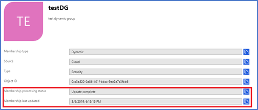

2. If membership processing status is **processing error** and **update paused**, ask the administrator or PG team to resume the group from processing error.

3. Verify that the users or devices satisfy the membership rule or not, following the steps in [Evaluate dynamic membership of a user or device](#11).

   - If the error an attributes error, fix the attributes accordingly or close the ticket because it's an expected behavior.
   - If the rule isn't correct, fix the rule and wait for the next round of processing to complete.

4. Verify that processing status is not impacted by the issue of guest user addition disallowed by policy, see [Check whether a tenant processing is impacted by a guest user addition disallowed by policy](#12).

   - If the group is an Office365 group and the user is a guest user, the guest user can't be added to a group if the directory setting does not allow a guest user addition in the tenant.

   - A guest user addition error in one group will block the updates of the same and other groups in the same tenant. you can choose to:

      - Allow a guest user addition by following the **Manage guest user** setting for groups in a tenant.
      - Change the group rule to exclude a guest user by adding: `(user.userType -eq "member”)`.
      - The least preferred option is to set the `GroupMembershipState` to **RuleIsInvalid**. This option disables the processing of the group and leaves no impact to other groups in the same tenant. Escalate this issue to an engineering team on-call to perform this action and provide both the < tenant-id > and < group-id > data.

    A new feature will soon be deployed to address the guest user blocking issues. No specific release date is available yet.

5. If everything looks correct, allow some time for the group to populate. Depending on the size of your tenant, the group may take up to 24 hours to populate the first time, or after a rule change.

6. If problem still exists after 24 hours and the processing status shows as complete, you can [reset processing for the group](#18) to resolve any transient system issue. If a reset doesn't resolve the issue, escalate for more help.

   If the processing status shows as **in processing**, continue to wait.

   You can get more information from audit logs and system logs using Kusto.

7. To check audit logs for the impacted object, see [Check audit logs for more information](#14).

8. Perform a system Log analysis with Kusto. Check pre-requisites for Kusto if you have not done so, then see [Use Kusto Log Analysis to get more information](#15).

### Evaluate dynamic membership of a user or device<a id="11"></a>

You have two options to evaluate whether a user or device satisfies the rule to be part of a group: **Manual validation** and **Validation using Geneva action**.

#### Manual validation

Validate the values for user or device attributes (In Azure Support Center, [Azure Portal](https://docs.microsoft.com/azure/active-directory/fundamentals/active-directory-users-profile-azure-portal?context=azure%2Factive-directory%2Fusers-groups-roles%2Fcontext%2Fugr-context#to-add-or-change-profile-information), or using [PowerShell](https://docs.microsoft.com/powershell/module/azuread/get-azureaduser)) in the rule.

- Ensure that there are users that satisfy the rule.
- For devices, check the device properties to ensure that synchronized attributes contain the expected values.

In Azure Support Center:

1. Get the **membershipRule** of the group.

   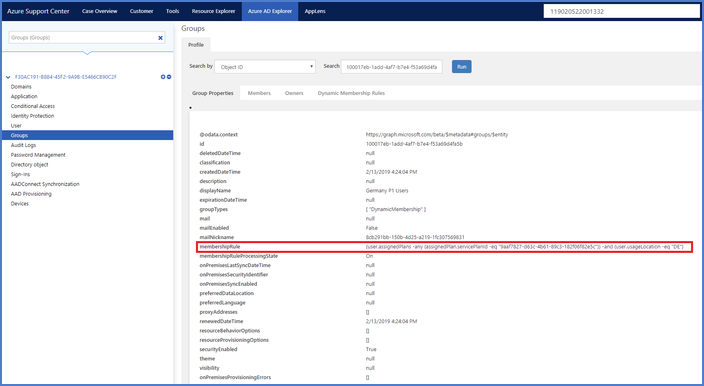

2. Double-check the existing membership.

   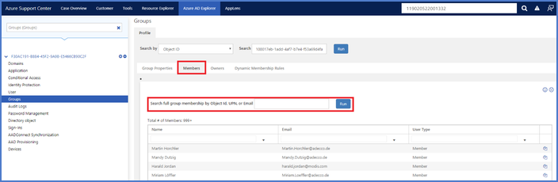

3. Read user attributes to check whether they satisfy the rule.

   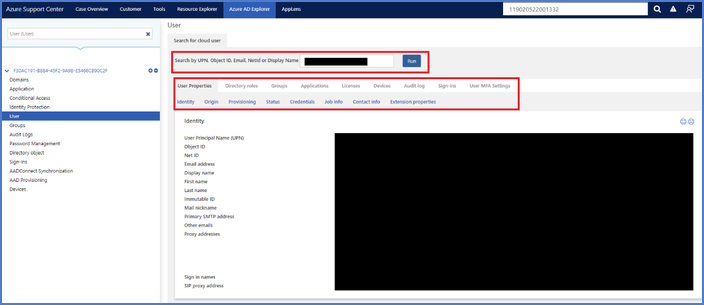

#### Validation using Geneva Action

Have the **tenant-id**, **group-id**, and the **object-id** of the user or device.

1. Navigate to [Geneva Actions](https://jarvis-west.dc.ad.msft.net/actions).

2. Select the appropriate environment:

   - **Public**: Prod
   - **Mooncake**: Mooncake
   - **FairFax**: FairFax
   - **BlackForest**: BlackForest

3. Log in using Microsoft credentials.

4. Navigate to **IAM-SSGM** -> **Global Data Management** -> **Evaluate Object DynamicGroup Membership**.

   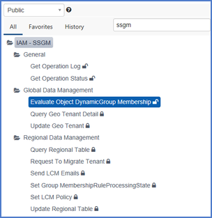

5. Type the **tenant-id** and the **object-id**, and the group **objectid** or group rule.

   - To evaluate the given object against a certain group, fill in the group ID.
   - To evaluate the given object against a specific rule (there may not be any group with this rule), fill in the group rule.
   - The group ID and group rule cannot be specified at the same time.

If you just want to know the overall evaluation result, don't check the checkbox "Include Detailed Diagnostic Information", otherwise check it.

   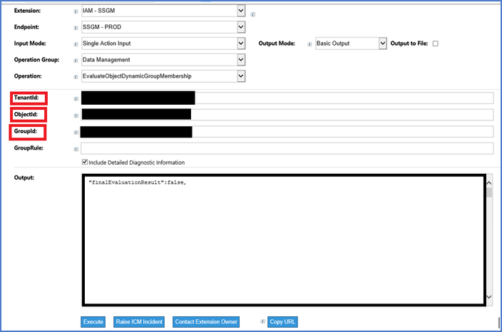

## Check whether tenant processing is impacted by a guest user addition disallowed by policy<a id="12"></a>

With a given **tenant-id**, use the following Kusto query to check whether group updates in a tenant are blocked by a guest user addition disallowed by the policy:

```
    Execute: [Web] [Desktop] [Web (Lens)] [Desktop (SAW)] https://idsharedwus.kusto.windows.net:443/aadssgmprod
    IfxDiagnosticsEvent
    | where env_time > ago(7d)
    | where Log_Level contains "warning"
    | where env_cloud_role contains "worker"
    | where Actor_TenantId contains "<tenant-id>"
    | where Log_Message contains "odata.error" and Log_Message contains "Guests users are not allowed to join this Unified Group due to policy setting"
```

## Manage guest user setting in office365 group<a id="13"></a>

First, [install the Azure AD PowerShell module](https://docs.microsoft.com/azure/active-directory/users-groups-roles/groups-settings-v2-cmdlets#install-the-azure-ad-powershell-module)

1. Connect to the directory. Visit [How to connect to the directory using PowerShell](https://docs.microsoft.com/azure/active-directory/users-groups-roles/groups-settings-v2-cmdlets#connect-to-the-directory) for more information.

2. Check the directory setting:

   1. Read the directory setting of the tenant: [Read settings at the directory level](https://docs.microsoft.com/azure/active-directory/users-groups-roles/groups-settings-cmdlets#read-settings-at-the-directory-level).
   2. Check the guest user setting: As shown in the following image, if **AllowToAddGuests** is **true**, check the setting in that particular group. If **AllowToAddGuests** is **false**, no matter what group level setting is, guest users can't be added.

   

3. Update the setting at the tenant level. To change the guest user setting at the tenant level, visit: [How to update setting at tenant level using PowerShell](https://docs.microsoft.com/azure/active-directory/users-groups-roles/groups-settings-cmdlets#update-settings-at-the-directory-level).

4. Check the setting for the group. To change the guest user setting to your target value if applicable, visit: [How to check and update setting for a specific group using PowerShell](https://docs.microsoft.com/azure/active-directory/users-groups-roles/groups-settings-cmdlets#update-settings-for-a-specific-group)

### Check audit logs for more information<a id="14"></a>

Ask the customer to provide or collect the following data before checking audit logs: the **Tenant-id**, the **Group-id**, the **Object-id** of the **user/device**, and the **timestamp** when the problem occurred.

#### Check audit logs

1. Query MSODS audit login Kusto:

   ```
   Execute: [Web] [Web (Lens)] [Desktop] [Desktop (SAW)] https://msodsuswest.kusto.windows.net:443/MSODS
   let startTime = datetime(YYYY-MM-DD HH:DD:SS);
   let endTime = datetime(YYYY-MM-DD HH:DD:SS);
   GlobalIfxAuditLoggingCommon
   | where env_time between (startTime.. endTime)
   | where targetObjectId == "< Object-id >"
   | project env_time, operationName , correlationId , actorIdentityType , actorObjectId
   ```

   Here is an example of the output:

   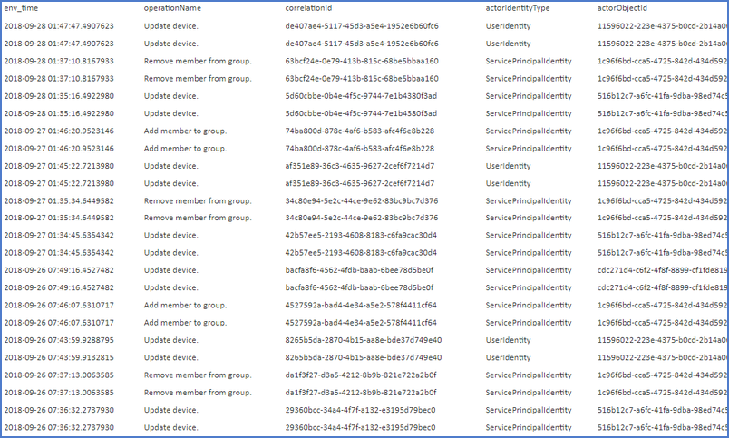

   In this example, the issue is between two services, **Intune** and **AD Connect**. AD Connect gets the information from Computer Object on-premises, and synchronizes. The device is enrolled in Intune, and Intune overwrites those two attributes. On the next sync cycle, AD Connect checks the attributes and corrects them. Intune then overwrites again. This behavior continues until the issue is fixed by the external services.

2. Use Azure Support Center:

    1. Go to [Azure support center](https://azuresupportcenter.msftcloudes.com/).
    2. Go to the **Azure AD explorer** tab at the top, navigate to **audit log** in the left panel.
    3. Set the time range to that which corresponds to the time when the customer indicated the problem began.
    4. Filter the columns with corresponding values if applicable. For example, add a filter in activity column to get **add member to group** logs.

    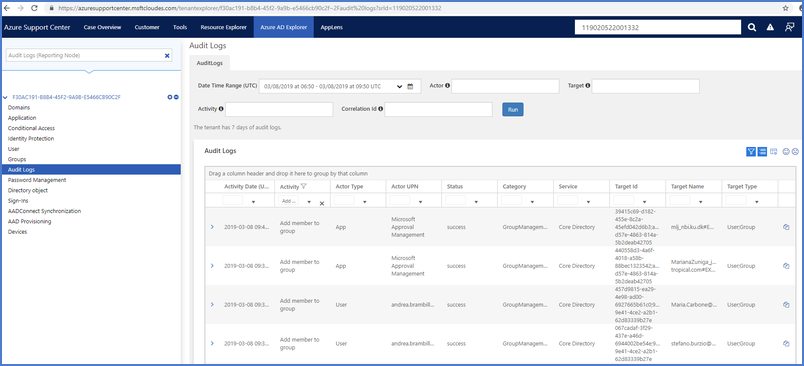

### Use Kusto Log Analysis to get more information<a id="15"></a>

Check latest processing status of the tenant with a given tenant_id:

```
    Execute: [Web] [Desktop] [Web (Lens)] [Desktop (SAW)] https://idsharedwus.kusto.windows.net:443/aadssgmprod
    // Check latest update status of a tenant in the last hour
    IfxDiagnosticsEvent  
    | where env_time > ago(1h)
    | where env_cloud_role contains "WorkflowWorker"
    | where Log_Message contains "Tenant info."
    | where Actor_TenantId contains "<tenant_id>"
    | project env_time, Actor_TenantId, Action_Scenario , Log_Message
    | order by env_time desc
    | take 1
```

   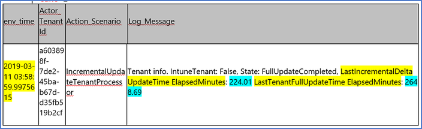

If the last tenant update is still slow after being reset, escalate the issue to an engineering team to perform a root-cause and fix the problem. This problem may be a system capacity, machine issue, or bug.

1. Check the last membership update of the group with given group_id and/or user_id in a time range:

   ```
    Execute: [Web] [Desktop] [Web (Lens)] [Desktop (SAW)] https://idsharedwus.kusto.windows.net:443/aadssgmprod
    let startTime = datetime(YYYY-MM-DD HH:MM:SS);
    let endTime = datetime(YYYY-MM-DD HH:MM:SS);
    IfxDiagnosticsEvent  
    | where env_time between (startTime.. endTime)
    | where Log_Message contains "<group_id>,<user_id>"
    | order by env_time desc
    | project env_time, Actor_TenantId, Action_Scenario, Log_Message
   ```

   - In the log_message, the membership change processed in the system with `"<group_id>,<user_id>,ACTION"`. Where the action is either add or remove.
   - If the correct membership change is logged by the system, then the system processed correctly, but encountered a throttling or permission issue when trying to update to graph.  Allow time for the transient throttling issue to be resolved. To double-check with throttling issue, you can use another Kusto Query.

2. Check whether the dynamic group encountering a transient throttling issue that blocks the tenant update with a given group_id:

   ```
    Execute: [Web] [Desktop] [Web (Lens)] [Desktop (SAW)] https://idsharedwus.kusto.windows.net:443/aadssgmprod
    let startTime = datetime(2019-03-04 23:45:26.732);
    let endTime = datetime(2019-03-04 23:48:26.732);
    IfxDiagnosticsEvent  
    | where env_time between (startTime.. endTime)
    | where Log_Level contains "warning"
    | where Log_Message contains "too many request"
    | where env_cloud_role contains "worker"
    | where Actor_TenantId contains "<tenant-id>"
   ```

    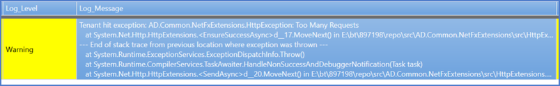

- There is a transient throttling issue which blocked the tenant update. Allow time for the transient throttling issue to be resolved. Escalate and/or create an IcM incident if the issue lasts for hours.

### Existing members of the rule are removed<a id="16"></a>

This behavior is expected. Existing members of the group are removed when a rule is enabled or changed or attributes are changed. The users returned from evaluation of the rule are added as members to the group.

### You don't see membership changes instantly after updating a rule<a id="17"></a>

Membership evaluation is done periodically in an background process. How long the process takes is determined by the number of users in your directory, and the size of the group created as a result of the rule. Typically, directories with small numbers of users will see the group membership changes in less than a few minutes.

 Directories with a large number of users can take 30 minutes or longer to populate. Check the membership processing status to confirm if it's complete, and the last updated date on the group **Overview** page in the Azure portal to confirm that the directory is up-to-date.

### Force the group to be processed now<a id="18"></a>

Reset processing for a dynamic group.

There are two options to reset the processing for a given group:

1. Ask customers to reset processing: In Azure portal, manually trigger the re-processing by updating the membership rule to add a whitespace at the end.
2. Escalate this issue to an engineering team on-call to reset processing for the group. Provide tenant-id and group-id for the case. The engineering team will figure out the possibility to open this operation to CSS engineering in a safe manner.

### Fix a rule processing error<a id="19"></a>

|Rule parser error|Error usage|Corrected usage|
|---|---|---|
|Error: Attribute not supported|(user.invalidProperty -eq "Value")|(user.department -eq "value")<br>Make sure the attribute is on the [supported properties list](https://docs.microsoft.com/azure/active-directory/users-groups-roles/groups-dynamic-membership#supported-properties).|
|Error: Operator isn't supported on attribute|(user.accountEnabled -contains true)|(user.accountEnabled -eq true)<br>The operator used isn't supported for the property type (in this example, -contains cannot be used on type boolean). Use the correct operators for the property type.|
|Error: Query compilation error|1. (user.department -eq "Sales")(user.department -eq "Marketing")<br>2. (user.userPrincipalName -match "`*@domain.ext`")|1. Missing operator. Use -and or -or two join predicates: (user.department -eq "Sales") -or (user.department -eq "Marketing")<br>2. Error in regular expression used with -match<br>(user.userPrincipalName -match "`.*@domain.ext`")<br>or alternatively: (user.userPrincipalName -match "@domain.ext$")|

## Troubleshoot Dynamic groups Deletion or Restoration<a id="20"></a>

Before attempting to delete a group in Azure Active Directory, ensure you have [deleted all assigned licenses](https://docs.microsoft.com/azure/active-directory/users-groups-roles/licensing-group-advanced#deleting-a-group-with-an-assigned-license) to avoid errors.

(For more information about group deletion in general, see [Delete a group](#21).

### Delete a group<a id="21"></a>

1. Groups can be deleted from the directory [using the Remove-AzureADGroup cmdlet in the Azure AD PowerShell module](https://docs.microsoft.com/azure/active-directory/users-groups-roles/groups-settings-v2-cmdlets#delete-groups).
2. Before attempting to delete a group in Azure Active Directory, ensure you have [deleted all assigned licenses  to avoid errors](https://docs.microsoft.com/azure/active-directory/users-groups-roles/licensing-group-advanced#deleting-a-group-with-an-assigned-license).

### Restore a deleted group<a id="22"></a>

- If an Office 365 group is deleted, it can only be restored up to 30 days before permanent deletion occurs. Once permanently deleted, the group can no longer be restored. Learn more about restoring groups at [Restore a deleted Microsoft 365 group in Azure Active Directory](https://docs.microsoft.com/azure/active-directory/fundamentals/active-directory-groups-restore-azure-portal).
- This functionality isn't supported for security groups and distribution groups.
- Verify that you're authorized to restore an Office 365 group. Only Global administrators, User account administrators, Intune service administrators, Partner Tier1/Tier2 support, or the owner of the group are able to restore a group.

## You restored a deleted dynamic group, but didn't see any update

When a dynamic group is deleted and restored, it's seen as a new group and re-populated according to the rule. This process might take up to 24 hours.

## Tools and Pre-requisites<a id="23"></a>

### Azure Support Center<a id="24"></a>

1. Go to [Azure support center](https://azuresupportcenter.msftcloudes.com/).
2. Log in with your Microsoft account.
3. Enter the support request ID.

    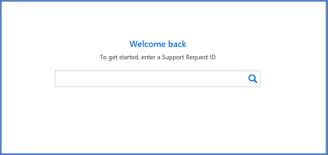

### Find audit logs in Azure Support Center<a id="25"></a>

1. Go to the [Azure support center](https://azuresupportcenter.msftcloudes.com/).
2. Log in with your **Microsoft account**.
3. Enter the **support request ID**.
4. Go to **Azure AD explorer** tab at the top, then navigate to **audit log** in the left panel.
5. Set the time range that corresponds to the time when the customer indicated the problem began.
6. Filter the columns with corresponding values if applicable. For example, add a filter in activity column to get **add member to group** logs.

   

### Read group data using Azure Support Center<a id="26"></a>

1. Go to the [Azure support center](https://azuresupportcenter.msftcloudes.com/).
2. Log in with your **Microsoft account**.
3. Enter the **support request ID**.
4. Go to **Azure AD explorer** tab at the top, then navigate to **Groups** in the left panel.
1. You can get **group properties**, **Members**, **Owners** and **Dynamic Rules** information with the corresponding inner panel, in the Group properties.

    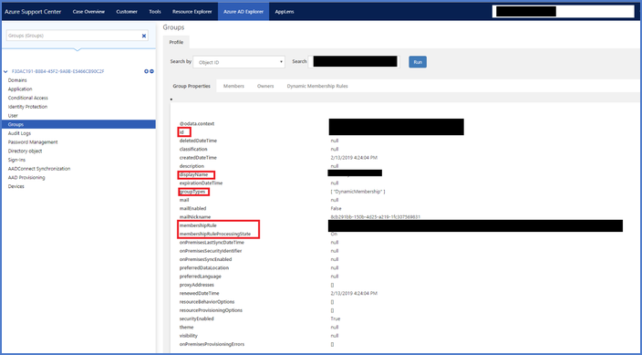

### Kusto for diagnostic and log analysis<a id="27"></a>

#### Access Kusto<a id="28"></a>

Download Kusto explorer:

|Explorer|Link|Information|
|---|---|---|
|Kusto.Explorer|[https://aka.ms/ke](https://aka.ms/ke)|Desktop UI tool for querying Kusto; [more details](https://kusto.azurewebsites.net/docs/tools/kusto-explorer.html)|
|Kusto.WebExplorer|[https://aka.ms/kwe](https://aka.ms/kwe)|Web UI tool for querying Kusto; [more details](https://kusto.azurewebsites.net/docs/tools/kusto-webexplorervnext.html)|
|Kusto.Explorer (SAW)|[https://aka.ms/kesaw](https://aka.ms/kesaw)|[More details](https://kusto.azurewebsites.net/docs/tools/kusto-explorer.html)|

#### Permissions<a id="29"></a>

For CSS members, make sure that you're part of the group **Azure Identity – 20630**. If not, join from [myAccess](https://aka.ms/myaccess).

For **Azure Gov.** customers, you must use Jarvis ([example query](https://jarvis-west.dc.ad.msft.net/277895BE))

1. Create a connection to the [idshared Kusto cluster](https://idsharedwus.kusto.windows.net:443):

   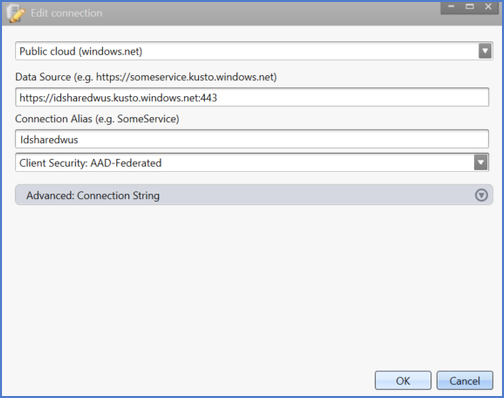

2. Access the Dynamic Group prod data in the database: `aadssgmprod`

3. View data in applicable tables:

   1. IfxDiagnosticsEvent: diagnostic events.
   2. VerboseMessage: verbose logs (a fallback for `IfxDiagnosticsEvent`).
   3. WarningEvent: logs in warning level (focus on warnings).
   4. ErrorEvent: logs in error level (focus on errors).

#### Dynamic Group Logs Anatomy<a id="30"></a>

#### IfxDiagnosticsEvent<a id="31"></a>

Important columns to query:

- **env_time**: time in UTC.
- **Log_Level**: warnings, errors, verbose env_cloud_environment: PROD, PPE, TEST.
- **env_cloud_role**: worker-role(WorkflowWorker), or Web-role (ApprovalManagementWebRole).
- **Log_Message**: log content env_cloud_location: Datacenter where the event triggered.
- **Actor_TenantId**: TenantId where the event triggered.
- **Actor_InternalCorrelationId**: Internal correlation to processing pipeline or objects depending on the log content.
- **Action_Scenario**: TenantProcessor scenario: incremental, fullUpdate or NewReset.
- **Action_SubScenario**: GroupProcessor sub-scenario: incremental, or fullUpdate.

#### Run log analysis for a Tenant<a id="32"></a>

For a given tenant objectId **tenant_id**, run the following **Kusto Query** to get the diagnostic logs for the last hour:

```
    Execute: [Web] [Desktop] [Web (Lens)] [Desktop (SAW)] [https://idsharedwus.kusto.windows.net:443/aadssgmprod]
    IfxDiagnosticsEvent
    | where env_time > ago(1h)
    | where env_cloud_role == "WorkflowWorker"
    | where * contains “<tenant_id>”
```

#### Run log analysis for a Group<a id="33"></a>

For a given group objectId **groud_id**, run the following **Kusto Query** to get the diagnostic logs for the group in a given time range:

```
    Execute: [Web] [Desktop] [Web (Lens)] [Desktop (SAW)] [https://idsharedwus.kusto.windows.net:443/aadssgmprod]
    IfxDiagnosticsEvent
    | where env_time between (datetime(2019-01-17 16:00:32.658).. datetime(2019-01-17 18:58:43.413))
    | where env_cloud_role == "WorkflowWorker"
    | where * contains “<groud_id>”
```

#### Dynamic groups processing in a tenant (Incremental Update)<a id="34"></a>

```
    Execute: [Web] [Desktop] [Web (Lens)] [Desktop (SAW)] [https://idsharedwus.kusto.windows.net:443/aadssgmprod]
    let startTime = datetime(2019-3-3 0:0:0.0);
    let endTime = datetime(2019-03-03 00:04:08);
    IfxDiagnosticsEvent  
    | where env_time between (startTime.. endTime)
    | where * contains "6baa4eb1-106a-440b-b4f6-50134497d36d"
    | where Action_Scenario == "IncrementalUpdateTenantProcessor"
    | project env_time, Actor_TenantId, Action_Scenario , Log_Message, Action_SubScenario
```

|env_time|Log_Message|Action_SubScenario|
|---|---|---|
|2019-03-03 00:01:54.4092242|Processing tenant started|_|
|2019-03-03 00:01:54.4092242|Tenant info. IntuneTenant: False, State: FullUpdateCompleted, LastIncrementalDeltaUpdateTime ElapsedMinutes: 2.08 LastTenantFullUpdateTime ElapsedMinutes: 1472.87|_|
|2019-03-03 00:01:54.4092242|Loading all the groups started|_|
|2019-03-03 00:01:54.4092242|Http request started<br>GET<br> https://graph.windows.net/6baa4eb1-106a-440b-b4f6-50134497d36d/groups?api-version=1.6-internal&$top=999&$filter=groupTypes/any(gt:gt eq 'DynamicMembership') and membershipRuleProcessingState eq 'On' client-request-id: 1919d12e-68a8-4f6b-8404-f3721672a9ee Accept: application/json|_|
|2019-03-03 00:01:54.9448445|Http request finished, took 533 ms<br>HTTP/1.1 200 OK Pragma: no-cache ocp-aad-diagnostics-server-name: Gb2x7qjWXmcL1WXWw2JJMQYvUggHuquZ6MYO+AXjTx8= request-id: a8f44ee6-40bc-4fd2-b637-2a2aec751957 client-request-id: 1919d12e-68a8-4f6b-8404-f3721672a9ee x-ms-dirapi-data-contract-version: 1.6-internal ocp-aad-session-key: wlMFmta1v97j4NBVxhZQec_vl4FRHD2Szu58vYknD_R5UFzeuRFzvQCu4Wtud-wYcPpv0OpaJ0F0DmhgZYyPhwUc7odOCqr6O_uTUk8eUrT7xRSCLLZ6U0aI6azlPh4W.hMUoBTRuxC2dlstQH4jMvrAMLSKpzXpA1OXv8nj-rTc DataServiceVersion: 3.0; Strict-Transport-Security: max-age=31536000; includeSubDomains Access-Control-Allow-Origin: * Duration: 5016718 Cache-Control: no-cache Date: Sun, 03 Mar 2019 00:01:53 GMT X-AspNet-Version: 4.0.30319 X-Powered-By: ASP.NET Content-Length: 176945 Content-Type: application/json; odata=minimalmetadata; streaming=true; charset=utf-8 Expires: -1<br><br>{{%PII%{PII:H101(UUlGSRx/AoptvYRPBmtWJassKGr33MLlzL4VwmVHxdI=)}%PII%}}|_|
|2019-03-03 00:01:54.9498439|Loading all the groups finished, took 539 ms|_|
|2019-03-03 00:01:54.9498439|Finding all the groups to be processed started|_|
|2019-03-03 00:01:54.9548440|Finding all the groups to be processed finished, took 6 ms|_|
|2019-03-03 00:01:54.9598672|Total groups: 91, Incremental groups: 91, Incremental processing groups: 0, NewResetGroups: 0|_|
|2019-03-03 00:01:54.9598672|Processing groups started|IncrementalUpdateGroupProcessor_|
|2019-03-03 00:01:54.9598672|Getting watermark started|IncrementalUpdateGroupProcessor_|
|2019-03-03 00:01:54.9598672|Getting watermark finished, took 0 ms|IncrementalUpdateGroupProcessor_|
|2019-03-03 00:01:54.9598672|Processing incremental groups started|IncrementalUpdateGroupProcessor_|
|2019-03-03 00:01:54.9598672|Getting first object collection started|IncrementalUpdateGroupProcessor_|
|2019-03-03 00:01:54.9598672|Http request started<br>GET<br>https://graph.windows.net/6baa4eb1-106a-440b-b4f6-50134497d36d/directoryObjects?deltaLink=qx6zUVqWXeVYOTrrouihVZfOfAs-O4e0EJ8A26fguserooNIsnpc5lTToilsULFxXADRKkcn2wzyk56lase6hBxpgEvb9hNOFtCkprENs9qaMUAdMPph8GKci8zG6RZRnnJcEihJ7f-LxRd0kxKNao3kJoCiPpuP-X6VDHxqT21BKFIDx6t_zwjn1AxPJmdOEUWituzH95sKAu-ZMQcQIXdwEL8gCD8u2a44eTIvDqywhmUhgI16Jfp5zln7q7D4gjXGn4mMZCgr8WmqmQJ-Wnh-fpTU4P89IAHtTxzL3EmIxpnTfZ5OkLPnT2Kjxsj_9TKq856ykfzEkmx659IYnRExYEeafvfII5xSHtNxNBWUz3K5_mYtLsvi8YQ_8R3TkzghDM_tOy-eQ_EAH31yhEjcDwtyIT_qnhbVquBmrQbtmQVnbBPEk_Dt4qn_HW-aJscqTFzfiR5Deyys2YuL_wdPLQgVEt6ksxPHd-fgKOBWIdYMWGEoBJQYwwKqVLO-2M7Nvu-3z1kuJlYwcwtTzbth4tv6BS6U3B38ta2D-wdJUVSCLrcJ12kfmxz-7vmVu9zlPRKL6kc3p2SFc6DyVjZSNUD0jm5A2o7D_ZSzL5CsIiIBG5P1QFtku4Qwqh9tc1pw7-EmRa50X0ox7SddLf7eWJQgKwWI4NYk7rl1Iv377NySXsHdh-5LfFrTQo8-re6LipzWpolMu9g2tDWSHRomMDPE9NC1Qq428QQNEopMKEfjkIETSVMSfH-MsWxeIGqclFjHa2Y2W64bPOnJchV2Zpqbp7XoTgUS3y-rMWXVZ79CCTj4TFWHfeV58Gd7eH_8NS-oazIsICn5UARpBQVfM7vlLlKnkgMBV46R2e7UWjxsauFSNMFBvT32qnLkMLbVE1Rb7L_4Z6Xueb3Q8XylSlkCQkUtjAlyNWpkrCGAdLmJOEv-H4UhfwPawZu8gopuoqA-rdHIvBymAN45ovNizaOhMgNC_CvSErvstJq_c4sr4XW2GF3DF-l8L0N4ycCH8bo9pncHRqpKJv-cdEhezzkLRCNcXwYw6wQYRjaQwUy-pZUezkgQm6OUI2HukMwvStq-aEh28UuAlHCruGB71M2kZzVz6UIdNxywvagFRbqZUjuHD80Y8NcljSmQwuSK-sHBDZaSH-JXLTr9xFKcan37HiZW3t5e3xeCIdHBA9hfKEcDqgaoJdZwFfl2x7UK-cvTuyX0LLO_weKNXV2_W4jKUPkJVoXILfJVH7t063P-w7BiP-ZzsDZ1joVxpdAhGZq6cApkWzS6onFE-uoMvmB6g9PHldKXuuCJiNm6o_EfIoJpqECJRSIXl8L-DTezxB5HePSlRRJ4UWhQzE7TvawKSqy__C8vORAtt5urUr9ubYwc-gb6LaLqEF1EZYAu_FMlrkF8dryPORZyjgtaGpqLqhSN-5NcQ|
IncrementalUpdateGroupProcessor_|
|2019-03-03 00:01:55.0548704|Http request finished, took 95 ms<br>HTTP/1.1 200 OK Pragma: no-cache ocp-aad-diagnostics-server-name: Z0X9hFo97H+PMbMMgRi5Lxqx3zmUUY4VDP6HENy2wKk= request-id: 2f32dc1d-9909-4638-a390-895c7098dc42 client-request-id: 46bfcb54-affe-41e7-9c97-5897c0a094d1 x-ms-dirapi-data-contract-version: 1.6-internal ocp-aad-session-key: YcPutPRYyIE48L7IHYU-s1pjBFDkACzned6ZxNe6smPI2d05VJosFj9t3lQY2ztZ_B4s0OYBd89CYFt1vLFabYmVPKnR3MYUrbfJejwL8vzpvbUn3W2TKdt3YZCVjbhc.B5Tz1HT-s9DXWE582h7im6xACHZrGFHU7wy_T3Fa8O8 X-Content-Type-Options: nosniff DataServiceVersion: 3.0; Strict-Transport-Security: max-age=31536000; includeSubDomains Cache-Control: no-cache Date: Sun, 03 Mar 2019 00:01:54 GMT X-AspNet-Version: 4.0.30319 X-Powered-By: ASP.NET Content-Length: 2237 Content-Type: application/json; odata=minimalmetadata; streaming=true; charset=utf-8 Expires: -1<br><br>{{%PII%{PII:H101(zzKfjMldQSG7VjWO9BpGSKfbEnH34ivDbcqkcSP96LE=)}%PII%}}|IncrementalUpdateGroupProcessor_|
|2019-03-03 00:01:55.0548704|Getting first object collection finished, took 96 ms|IncrementalUpdateGroupProcessor_|
|2019-03-03 00:01:55.0548704|Processing incremental groups finished, took 96 ms|IncrementalUpdateGroupProcessor_|
|2019-03-03 00:01:55.0548704|Updating watermark started|IncrementalUpdateGroupProcessor_|
|2019-03-03 00:01:55.0598441|Updating watermark finished, took 5 ms|IncrementalUpdateGroupProcessor_|
|2019-03-03 00:01:55.0598441|Processing groups finished, took 103 ms|IncrementalUpdateGroupProcessor_|
|2019-03-03 00:01:55.0598441|Processing tenant finished, took 650 ms|_|
|2019-03-03 00:04:07.9983645|Processing tenant started|_|
|2019-03-03 00:04:07.9983645|Tenant info. IntuneTenant: False, State: FullUpdateCompleted, LastIncrementalDeltaUpdateTime ElapsedMinutes: 2.22 LastTenantFullUpdateTime ElapsedMinutes: 1475.10|_|
|2019-03-03 00:04:07.9983645|Loading all the groups started|_|

#### Check for errors or warnings within tenant processing<a id="35"></a>

For a given tenant objectId < tenant_id >, run the following **Kusto Query** to get diagnostic logs in the last 24 hours:

```
    Execute: [Web] [Desktop] [Web (Lens)] [Desktop (SAW)] [https://idsharedwus.kusto.windows.net:443/aadssgmprod]
    IfxDiagnosticsEvent
    | where env_time > ago(24h)
    | where env_cloud_role == "WorkflowWorker"
    | where Log_Level contains "error" or Log_Level contains "warning"
    | where * contains “<tenant_id>”
```

### Scoping question and sufficient data for support request<a id="36"></a>

Ask the customers to provide data for a set of scoping questions depending on factors such as area. If data is missing, ask customers to provide accordingly.

#### Get sufficient data in support request for dynamic group<a id="37"></a>

Get sufficient data in support request for dynamic group in a support request submitted similar to the following example.

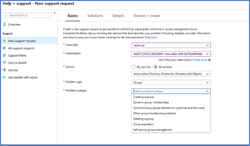

#### Dynamic membership rules configuration Scoping questions<a id="38"></a>

Help the customer with the **Assigned Plan** and **Device rules**:

- Environment used (example: UX, Browser, API, PowerShell)
- Tenant ID
- Group Object ID
- Rule
- User/Device Object ID
- Error Message ((example: Screenshot)
- Time when issue occurred
- User performing the operation

## Reference: Example emails<a id="39"></a>

The following template can be used as models for communicating to customers about common problems with dynamic groups:

**Issue**: Users are not showing up in a group

I have diagnosed the problem in support case < xxxxxxx > as follows:

**Problem**: Some dynamic group users not showing up in the right group.
**Root cause**:
**Solution**:
**Resources**:
