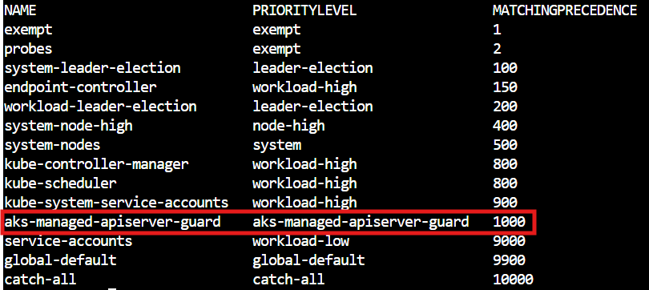
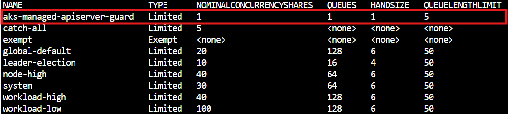

# Troubleshoot API server and etcd problems in AKS

This article helps you identify and resolve problems that you might encounter within the API server in large Microsoft Azure Kubernetes Services (AKS) deployments.

Microsoft has tested the reliability and performance of the API server at a scale of 5,000 nodes and 200,000 pods. The cluster that contains the API server can automatically scale out and deliver [Kubernetes Service Level Objectives (SLOs)](https://github.com/kubernetes/community/blob/master/sig-scalability/slos/slos.md). If you experience high latencies or timeouts, the cause is likely a resource leakage on the distributed `etc` directory (etcd), or an offending client that has excessive API calls.

## Prerequisites

- The [Azure CLI](/cli/azure/install-azure-cli).

- The Kubernetes [kubectl](https://kubernetes.io/docs/reference/kubectl/overview/) tool. To install kubectl by using Azure CLI, run the [az aks install-cli](/cli/azure/aks#az-aks-install-cli) command.

- AKS diagnostics logs (specifically, kube-audit events) that are enabled and sent to a [Log Analytics workspace](/azure/aks/monitor-apiserver). To determine whether logs are collected by using [resource-specific](/azure/azure-monitor/essentials/resource-logs#resource-specific) or [Azure diagnostics](/azure/azure-monitor/essentials/resource-logs#azure-diagnostics-mode) mode, check the **Diagnostic Settings** blade in the Azure portal.

- The Standard tier for AKS clusters. If you're using the Free tier, the API server and etcd contain limited resources. AKS clusters in the Free tier don't provide high availability. This condition is often the root cause of API server and etcd problems.

- The [kubectl-aks](https://go.microsoft.com/fwlink/p/?linkid=2259767#install) plugin for running commands directly on AKS nodes without using the Kubernetes control plane.

## Basic health checks

- Check resource health events

  AKS provides Resource health events for critical component downtime. Before you proceed, make sure that no critical events are reported in [Resource Health](/azure/service-health/resource-health-overview).

   :::image type="content" source="media/troubleshoot-apiserver-etcd/resource-health-event.png" alt-text="Screenshot that shows a resource health event." lightbox="media/troubleshoot-apiserver-etcd/resource-health-event.png":::

- Diagnose and solve problems

  AKS provides a dedicated troubleshooting category for **Cluster and Control Plane Availability and Performance**.

  :::image type="content" source="media/troubleshoot-apiserver-etcd/cluster-control-plane-availability-performance.png" alt-text="Screenshot that shows the 'Cluster and Control Plane Availability and Performance' category." lightbox="media/troubleshoot-apiserver-etcd/cluster-control-plane-availability-performance.png":::

## Symptoms

The following table outlines the common symptoms of API server failures.

| Symptom | Description |
|---|---|
| API server pod in `CrashLoopbackOff` status or facing webhook call failures | Verify that you don't have any custom admission webhook (such as the [Kyverno](https://kyverno.io/docs/introduction/) policy engine) that's blocking the calls to the API server. |
| Timeouts from the API server | Frequent timeouts that are beyond the guarantees in [the AKS API server SLA](/azure/aks/free-standard-pricing-tiers#uptime-sla-terms-and-conditions). For example, `kubectl` commands timeout. |
| High latencies | High latencies that make the Kubernetes SLOs fail. For example, the `kubectl` command takes more than 30 seconds to list pods. |
| • Elevated HTTP 429 responses from the API server <br> <br> • Following message for **kubectl get** commands: <br> "The server is currently unable to handle the request" | API server is overloaded and is throttling calls. Refer to Cause 4 and Cause 5 |


## Cause and Resolution

### Cause 1: A network rule blocks the traffic from agent nodes to the API server

A network rule can block traffic between the agent nodes and the API server.

To check whether a misconfigured network policy is blocking communication between the API server and agent nodes, run the following [kubectl-aks](https://go.microsoft.com/fwlink/p/?linkid=2259767) commands:

```bash
kubectl aks config import \
    --subscription <mySubscriptionID> \
    --resource-group <myResourceGroup> \
    --cluster-name <myAKSCluster>

kubectl aks check-apiserver-connectivity --node <myNode>
```

The [config import](https://go.microsoft.com/fwlink/p/?linkid=2259867#importing-configuration) command retrieves the Virtual Machine Scale Set information for all the nodes in the cluster. Then, the [check-apiserver-connectivity](https://go.microsoft.com/fwlink/p/?linkid=2259674) command uses this information to verify the network connectivity between the API server and a specified node, specifically for its underlying scale set instance.

> [!NOTE]
> If the output of the `check-apiserver-connectivity` command contains the `Connectivity check: succeeded` message, then the network connectivity is unimpeded.

### Solution 1: Fix the network policy to remove the traffic blockage

If the command output indicates that a connection failure occurred, reconfigure the network policy so that it doesn't unnecessarily block traffic between the agent nodes and the API server.

### Cause 2: A custom webhook causes a deadlock in API server pods

A custom webhook, such as Kyverno, might cause a deadlock within API server pods.

Check the events that are related to your API server. You might see event messages that resemble the following text:

> Internal error occurred: failed calling webhook "mutate.kyverno.svc-fail": failed to call webhook: Post "https\://kyverno-system-kyverno-system-svc.kyverno-system.svc:443/mutate/fail?timeout=10s": write unix @->/tunnel-uds/proxysocket: write: broken pipe

#### Retrieve API Server Logs

##### [**Resource-specific**](#tab/resource-specific)

```kusto
AKSControlPlane
| where TimeGenerated between(now(-1h)..now())
| where Category=="kube-apiserver"
| where Message contains "Failed calling webhook, failing closed"
| limit 100
| project TimeGenerated, Level, Message
```

##### [**Azure diagnostics**](#tab/azure-diagnostics)

```kusto
AzureDiagnostics
| where TimeGenerated between(now(-1h)..now())  // When you experienced the problem
| where Category == "kube-apiserver" 
| where log_s  contains "Failed calling webhook, failing closed"
| extend event = parse_json(log_s) 
| limit 100
| project TimeGenerated, event, Category
```
---
In this example, the validating webhook is blocking the creation of some API server objects. Because this scenario might occur during bootstrap time, the API server and Konnectivity pods can't be created. Therefore, the webhook can't connect to those pods. This sequence of events causes the deadlock and the error message.

### Solution 2: Delete webhook configurations

To fix this problem, delete the validating and mutating webhook configurations. To delete these webhook configurations in Kyverno, review the [Kyverno troubleshooting article](https://kyverno.io/docs/troubleshooting/).

### Cause 3: An offending client leaks etcd objects and causes a slowdown of etcd

A common situation is that objects are continuously created even though existing unused objects in the etcd database aren't removed. This situation can cause performance problems if etcd handles too many objects (more than 10,000) of any type. A rapid increase of changes on such objects could also cause the default size of the etcd database (by default, 8 gigabytes) to be exceeded.

To check the etcd database usage, navigate to **Diagnose and Solve problems** -> **Cluster and Control Plane Availability and Performance** in the Azure portal. Run the **Etcd Capacity Issues** and **Etcd Performance Issues** diagnosis tool. The diagnosis tool shows the usage breakdown and the total database size.

:::image type="content" source="media/troubleshoot-apiserver-etcd/etcd-detector.png" alt-text="Azure portal screenshot that shows the Etcd Capacity Issues Diagnosis Tool for Azure Kubernetes Service (AKS)." lightbox="media/troubleshoot-apiserver-etcd/etcd-detector.png":::

To get a quick view of the current size of your etcd database in bytes, run the following command:

```bash
kubectl get --raw /metrics | grep -E "etcd_db_total_size_in_bytes|apiserver_storage_size_bytes|apiserver_storage_db_total_size_in_bytes"
```

> [!NOTE]
> - If your Control Plane is unavailable, the kubectl commands will not work. Please use **Diagnose and Solve problems** in Azure portal as shown in the section above. 
 - The metric name in the previous command is different for different Kubernetes versions. For Kubernetes 1.25 and earlier versions, use `etcd_db_total_size_in_bytes`. For Kubernetes 1.26 to 1.28, use `apiserver_storage_db_total_size_in_bytes`. An Etcd database with size > 2 gigabytes is considered a large etcd db.

### Solution 3: Define quotas for object creation, delete objects, or limit object lifetime in etcd

To prevent etcd from reaching capacity and causing cluster downtime, you can limit the maximum number of resources that are created. You can also slow the number of revisions that are generated for resource instances. To limit the number of objects that can be created, [define object quotas](https://kubernetes.io/docs/concepts/policy/resource-quotas/#object-count-quota).

If you identified objects that are no longer in use but consume resources, consider deleting them. For example, delete completed jobs to free up space:

```bash
kubectl delete jobs --field-selector status.successful=1
```

For objects that support [automatic cleanup](https://kubernetes.io/docs/concepts/architecture/garbage-collection/), set Time to Live (TTL) values to limit the lifetime of these objects. You can also label your objects so that you can bulk delete all the objects of a specific type by using label selectors. If you establish [owner references](https://kubernetes.io/docs/concepts/overview/working-with-objects/owners-dependents/) among objects, any dependent objects are automatically deleted after the parent object is deleted.

Also refer to [Solution 6](#solution-6-use-existing-diagnostic-tools-to-identify-and-resolve-the-underlying-cause) for object size reduction techniques.

### Cause 4: AKS managed API server guard was applied

If you're experiencing a high rate of HTTP 429 errors, one possible cause is that AKS has applied a managed API server guard. It is achieved by applying a FlowSchema and PriorityLevelConfiguration called **"aks-managed-apiserver-guard"**. This safeguard is triggered when the API server encounters frequent out-of-memory (OOM) events after scaling efforts on the API server have failed to stabilise it. This guard is designed as a last-resort measure to safeguard the API server by throttling non-system client requests to the API server and prevent it from becoming completely unresponsive.

- Check cluster for the presence of **"aks-managed-apiserver-guard"** FlowSchema and PriorityLevelConfiguration or check kubernetes events 

> [!NOTE]
> Kubectl commands may take longer than expected or time out when the API server is overloaded. Retry if it fails.

```bash
kubectl get flowschemas
kubectl get prioritylevelconfigurations
```
<br>



<br>



<br>

- Check Kubernetes Events 

```bash
kubectl get events -n kube-system aks-managed-apiserver-throttling-enabled
```


### Solution 4: Identify unoptimized clients and mitigate 

#### Step 1: Identify unoptimized clients

- See [Cause 5](#cause-5-an-offending-client-makes-excessive-list-or-put-calls) to identify problematic clients and refine their LIST call patterns - especially those generating high-frequency or high-latency requests as they are the primary contributors to API server degradation. Refer to [best practices](/azure/aks/best-practices-performance-scale-large#kubernetes-clients) for further guidance on client optimization.

#### Step 2: Mitigation

- Scale down the cluster to reduce the load on the API server. 
- If Step 1 identifies a recently added controller, CRD, or DaemonSet as the primary driver of API server overload, remove the associated object from the cluster.
- Use [Control Plane Metrics](/azure/aks/control-plane-metrics-monitor) to monitor the load on the API server. Refer the [blog](https://techcommunity.microsoft.com/blog/appsonazureblog/azure-platform-metrics-for-aks-control-plane-monitoring/4385770) for more details.
- Once the above steps are complete, delete aks-managed-apiserver-guard
```bash
kubectl delete flowschema aks-managed-apiserver-guard
kubectl delete prioritylevelconfiguration aks-managed-apiserver-guard
```
> [!WARNING]
> Avoid scaling the cluster back to the originally intended scale point  until client call patterns have been optimized, refer to **[best practices](/azure/aks/best-practices-performance-scale-large#kubernetes-clients)**. Premature scaling may cause the API server to crash again.

- You can also [modify the aks-managed-apiserver-guard FlowSchema and PriorityLevelConfiguration](https://kubernetes.io/docs/concepts/cluster-administration/flow-control/#good-practice-apf-settings) by applying the label **aks-managed-skip-update-operation: true**. This label preserves the modified configurations and prevents AKS from reconciling them back to default values. This is relevant if you are applying a custom FlowSchema and PriorityLevelConfiguration tailored to your cluster’s requirements as specified in [solution 5b](#solution-5b-throttle-a-client-thats-overwhelming-the-control-plane) and do not want AKS to automatically manage client throttling.

```bash
kubectl label prioritylevelconfiguration aks-managed-apiserver-guard aks-managed-skip-update-operation=true
kubectl label flowschema aks-managed-apiserver-guard aks-managed-skip-update-operation=true
```


### Cause 5: An offending client makes excessive LIST or PUT calls

If etcd isn't overloaded with too many objects as defined in [Cause 3](#cause-3-an-offending-client-leaks-etcd-objects-and-causes-a-slowdown-of-etcd), an offending client might be making too many `LIST` or `PUT` calls to the API server.
If you experience high latency or frequent timeouts, follow these steps to pinpoint the offending client and the types of API calls that fail.

#### <a id="identifytopuseragents"></a> Step 1: Identify top user agents by the number of requests

To identify which clients generate the most requests (and potentially the most API server load), run a query that resembles the following code. This query lists the top 10 user agents by the number of API server requests sent.

##### [**Resource-specific**](#tab/resource-specific)

```kusto
AKSAudit
| where TimeGenerated between(now(-1h)..now()) // When you experienced the problem
| summarize count() by UserAgent
| top 10 by count_
| project UserAgent, count_
```

##### [**Azure diagnostics**](#tab/azure-diagnostics)

```kusto
AzureDiagnostics
| where TimeGenerated between(now(-1h)..now())  // When you experienced the problem
| where Category == "kube-audit" 
| extend event = parse_json(log_s) 
| extend User = tostring(event.user.username) 
| summarize count() by User 
| top 10 by count_ 
| project User, count_ 
```
---

> [!NOTE]
> If your query returns no results, you might have selected the wrong table to query diagnostics logs. In resource-specific mode, data is written to individual tables, depending on the category of the resource. Diagnostics logs are written to the `AKSAudit` table. In Azure diagnostics mode, all data is written to the `AzureDiagnostics` table. For more information, see [Azure resource logs](/azure/azure-monitor/essentials/resource-logs).

Although it's helpful to know which clients generate the highest request volume, high request volume alone might not be a cause for concern. The response latency that clients experience is a better indicator of the actual load that each one generates on the API server.

#### Step 2 - Identify and analyse latency for user agent
**Using Diagnose and Solve on Azure portal** 

AKS now provides a built-in analyzer, the API Server Resource Intensive Listing Detector, to help you identify agents that make resource-intensive LIST calls. These calls are a leading cause of API server and etcd performance issues.

To access the detector, follow these steps:

1. Open your AKS cluster in the Azure portal.
2. Go to **Diagnose and solve problems**.
3. Select **Cluster and Control Plane Availability and Performance**.
4. Select **API server resource intensive listing detector**.

The detector analyzes recent API server activity and highlights agents or workloads that generate large or frequent LIST calls. It provides a summary of potential effects, such as request timeouts, increased numbers of "408" and "503" errors, node instability, health probe failures, and OOM-Kills in API server or etcd.

 :::image type="content" source="media/troubleshoot-apiserver-etcd/resource-intensive-listing-analyzer-1.png" alt-text="Screenshot that shows the apiserver perf detector." lightbox="media/troubleshoot-apiserver-etcd/resource-intensive-listing-analyzer-1.png":::

:::image type="content" source="media/troubleshoot-apiserver-etcd/resource-intensive-listing-analyzer-2.png" alt-text="Screenshot that shows the apiserver perf detector detailed view." lightbox="media/troubleshoot-apiserver-etcd/resource-intensive-listing-analyzer-2.png":::

**How to interpret the detector output**

- **Summary:**  
  Indicates if resource-intensive LIST calls were detected and describes possible impacts on your cluster.
- **Analysis window:**  
  Shows the 30-minute window analyzed, with peak memory and CPU usage.
- **Read types:**  
  Explains whether LIST calls were served from the API server cache (preferred) or required fetching from etcd (most impactful).
- **Charts and tables:**  
  Identify which agents, namespaces, or workloads are generating the most resource-intensive LIST calls.

> [!NOTE]
> * The API server resource intensive listing detector is available to all users who have access to the AKS resource in the Azure portal. No special permissions or prerequisites are required.
> * Only successful LIST calls are counted. Failed or throttled calls are excluded.
> * After you identify the offending agents and apply the recommendations, you can use [the API Priority and Fairness feature](https://kubernetes.io/docs/concepts/cluster-administration/flow-control/) to throttle or isolate problematic clients. Alternatively, refer to the "Cause 3" section of [Troubleshoot API server and etcd problems in Azure Kubernetes Services](/troubleshoot/azure/azure-kubernetes/create-upgrade-delete/troubleshoot-apiserver-etcd?branch=pr-en-us-9260&tabs=resource-specific#cause-3-an-offending-client-makes-excessive-list-or-put-calls).

**Using Logs**

To identify the average latency of API server requests per user agent, as plotted on a time chart, run the following query.

##### [**Resource-specific**](#tab/resource-specific)

```kusto
AKSAudit
| where TimeGenerated between(now(-1h)..now()) // When you experienced the problem
| extend start_time = RequestReceivedTime
| extend end_time = StageReceivedTime
| extend latency = datetime_diff('millisecond', end_time, start_time)
| summarize avg(latency) by UserAgent, bin(start_time, 5m)
| render timechart
```

##### [**Azure diagnostics**](#tab/azure-diagnostics)

```kusto
AzureDiagnostics
| where TimeGenerated between(now(-1h)..now())  // When you experienced the problem
| where Category == "kube-audit" 
| extend event = parse_json(log_s) 
| extend User = tostring(event.user.username)
| extend start_time = todatetime(event.requestReceivedTimestamp)
| extend end_time = todatetime(event.stageTimestamp)
| extend latency = datetime_diff('millisecond', end_time, start_time)
| summarize avg(latency) by User, bin(start_time, 5m) 
| render timechart 
```
---

This query is a follow-up to the query in the ["Identify top user agents by the number of requests"](#identifytopuseragents) section. It might give you more insights into the actual load that each user agent generates over time.

> [!TIP]
> By analyzing this data, you can identify patterns and anomalies that can indicate problems on your AKS cluster or applications. For example, you might notice that a particular user is experiencing high latency. This scenario can indicate the type of API calls that are causing excessive load on the API server or etcd.

#### Step 3: Identify Unoptimized API calls for a given user agent

Run the following query to tabulate the 99th percentile (P99) latency of API calls across different resource types for a given client.

##### [**Resource-specific**](#tab/resource-specific)

```kusto
AKSAudit
| where TimeGenerated between(now(-1h)..now()) // When you experienced the problem
| extend HttpMethod = Verb
| extend Resource = tostring(ObjectRef.resource)
| where UserAgent == "DUMMYUSERAGENT" // Filter by name of the useragent you are interested in
| where Resource != ""
| extend start_time = RequestReceivedTime
| extend end_time = StageReceivedTime
| extend latency = datetime_diff('millisecond', end_time, start_time)
| summarize p99latency=percentile(latency, 99) by HttpMethod, Resource
| render table
```

##### [**Azure diagnostics**](#tab/azure-diagnostics)

```kusto
AzureDiagnostics
| where TimeGenerated between(now(-1h)..now())  // When you experienced the problem
| where Category == "kube-audit" 
| extend event = parse_json(log_s) 
| extend HttpMethod = tostring(event.verb) 
| extend Resource = tostring(event.objectRef.resource) 
| extend User = tostring(event.user.username) 
| where User == "DUMMYUSERAGENT"  // Filter by name of the useragent you are interested in
| where Resource != ""
| extend start_time = todatetime(event.requestReceivedTimestamp)
| extend end_time = todatetime(event.stageTimestamp)
| extend latency = datetime_diff('millisecond', end_time, start_time)
| summarize p99latency=percentile(latency, 99) by HttpMethod, Resource 
| render table  
```
---

The results from this query can be useful to identify the kinds of API calls that fail the upstream Kubernetes SLOs. In most cases, an offending client might be making too many `LIST` calls on a large set of objects or objects that are too large. API server or etcd scalability limits is multi dimensionsal and are explained in [Kubernetes Scalability thresholds](https://github.com/kubernetes/community/blob/master/sig-scalability/configs-and-limits/thresholds.md).

### Solution 5a: Tune your API call pattern

To reduce the pressure on the control plane, consider tuning your client's API server call pattern. Refer to [best practices](/azure/aks/best-practices-performance-scale-large#kubernetes-clients#kubernetes-clients).

### Solution 5b: Throttle a client that's overwhelming the control plane

If you can't tune the client, use the [Priority and Fairness](https://kubernetes.io/docs/concepts/cluster-administration/flow-control/) feature in Kubernetes to throttle the client. This feature can help preserve the health of the control plane and prevent other applications from failing.

The following procedure shows you how to throttle an offending client's LIST Pods API set to five concurrent calls:

1. Create a [FlowSchema](https://kubernetes.io/docs/concepts/cluster-administration/flow-control/#flowschema) that matches the API call pattern of the offending client:

    ```yaml
    apiVersion: flowcontrol.apiserver.k8s.io/v1beta2
    kind: FlowSchema
    metadata:
      name: restrict-bad-client
    spec:
      priorityLevelConfiguration:
        name: very-low-priority
      distinguisherMethod:
        type: ByUser
      rules:
      - resourceRules:
        - apiGroups: [""]
          namespaces: ["default"]
          resources: ["pods"]
          verbs: ["list"]
        subjects:
        - kind: ServiceAccount
          serviceAccount:
            name: bad-client-account
            namespace: default 
    ```

2. Create a lower priority configuration to throttle bad API calls of the client:

    ```yaml
    apiVersion: flowcontrol.apiserver.k8s.io/v1beta2
    kind: PriorityLevelConfiguration
    metadata:
      name: very-low-priority
    spec:
      limited:
        assuredConcurrencyShares: 5
        limitResponse:
          type: Reject
      type: Limited
    ```

3. Observe the throttled call in the API server metrics:

    ```bash
    kubectl get --raw /metrics | grep "restrict-bad-client"
    ```

### Cause 6: High etcd memory usage (per an alert)

You might receive an alert that states that etcd memory usage exceeds 20 GiB. This alert indicates that your cluster is experiencing an intensive API server load. The load can cascade and overwhelm etcd memory capacity. If the excessive load isn't resolved promptly, it can cause performance degradation or outages.

To check the current etcd memory usage and understand the specific factors that contribute to the high memory consumption, navigate to **Diagnose and Solve Problems** in the Azure portal. Run the **Etcd Performance Analyzer** by searching for "_etcd performance_" in the Search box. The analyzer shows you the memory usage breakdown and helps identify whether the cause of the problem is high request rates, large object counts, or large object sizes.

:::image type="content" source="media/troubleshoot-apiserver-etcd/ETCD-performance-analyzer.png" alt-text="Azure portal screenshot of AKS Diagnose and solve problems showing the Etcd Performance Analyzer with memory usage breakdown and top contributors." lightbox="media/troubleshoot-apiserver-etcd/ETCD-performance-analyzer.png":::

The root cause of high etcd memory usage is typically intensive API server load. This problem overlaps the other causes that this article discusses. To identify the specific problem that's affecting your cluster, use the following solution.

### Solution 6: Use existing diagnostic tools to identify and resolve the underlying cause

**Determine the primary contributing factor**

The etcd memory alert can be triggered by any combination of factors. Identify which factor is most problematic in your situation. 

- **If excessive LIST or PUT calls are identified**: Follow the [Cause 5](#cause-5-an-offending-client-makes-excessive-list-or-put-calls) solution to tune API call patterns or throttle problematic clients.
- **If too many objects are stored in etcd**: Follow the [Cause 3](#cause-3-an-offending-client-leaks-etcd-objects-and-causes-a-slowdown-of-etcd) solution to clean up objects and implement retention policies.
- **If large objects are consuming excessive memory**: Focus on the following object size reduction techniques.

    - To reduce pod specification sizes, move environment variables from pod specifications to ConfigMaps.
    - Split large secrets or ConfigMaps into smaller, more manageable pieces.
    - Review and optimize resource specifications in your applications.
    - Reduce revision counts

    ```bash
    # Example: Clean up completed jobs that may have large specifications
    kubectl delete jobs --field-selector status.successful=1
    
    # Example: Clean up failed pods that may be consuming memory
    kubectl delete pods --field-selector status.phase=Failed
    ```

> [!TIP]
> The etcd memory alert often indicates a combination of factors. Start at the **API Server Resource Intensive Listing Analyzer** to identify immediate request rate issues. Then, use the **Etcd Performance Analyzer** and **Etcd Capacity Analyzer** to understand object-related contributions to memory usage.

> [!IMPORTANT]
> The API server can become unresponsive because of severe etcd memory pressure. This condition might prevent you from performing the diagnostic steps that are provided in this article. In this situation, contact Azure support immediately to request assistance to clean up problematic objects or throttle excessive requests.

[!INCLUDE [Third-party contact disclaimer](../../../includes/third-party-contact-disclaimer.md)]

[!INCLUDE [Third-party disclaimer](../../../includes/third-party-disclaimer.md)]

 
