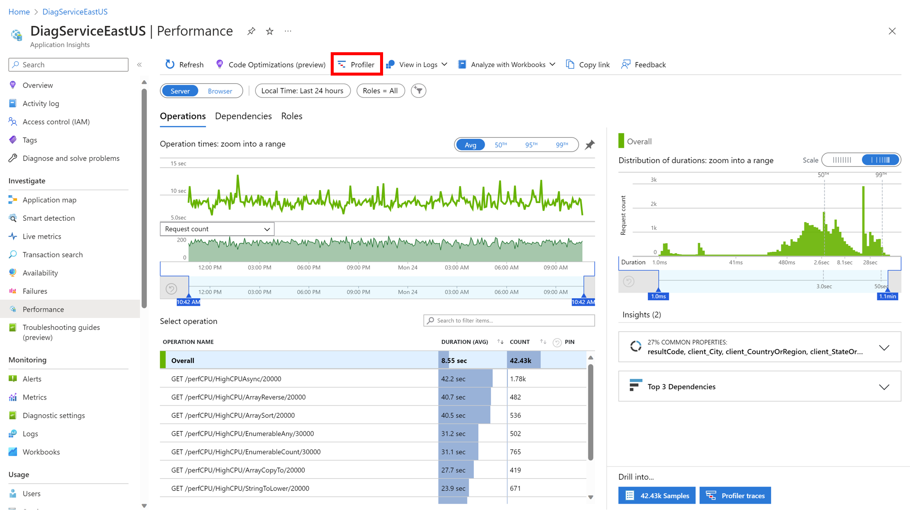

---
# Required metadata
		# For more information, see https://review.learn.microsoft.com/en-us/help/platform/learn-editor-add-metadata?branch=main
		# For valid values of ms.service, ms.prod, and ms.topic, see https://review.learn.microsoft.com/en-us/help/platform/metadata-taxonomies?branch=main

		title:      Troubleshoot Code Optimizations # Add a title for the browser tab
description: This article provides troubleshooting steps and information for using Azure Application Insights Code Optimizations # Add a meaningful description for search results
author:      rkahng # GitHub alias
ms.author:   ryankahng # Microsoft alias
ms.service:  # Add the ms.service or ms.prod value
# ms.prod:   # To use ms.prod, uncomment it and delete ms.service
ms.topic:    # Add the ms.topic value
ms.date:     04/21/2023
---

# Troubleshoot Code Optimizations

This article provides troubleshooting steps and information for using Azure Application Insights Code Optimizations.
## Make sure your app is connected to an Application Insights resource

[Create an Application Insights resource](/azure/azure-monitor/app/create-workspace-resource) and make sure it's connected to the right app.
## Make sure you have Application Insights Profiler enabled

[Enable Application Insights Profiler](/azure/azure-monitor/profiler/profiler-overview).
## Make sure Application Insights Profiler is collecting profiles

In addition to having Application Insights Profiler enabled, you should also make sure profiles are getting uploaded. Navigate to Application Insights Profiler from the Performance page in your Application Insights resource. If nothing shows up under "Recent profiling sessions", visit this page to troubleshoot: [Troubleshoot Application Insights Profiler](/troubleshoot/azure/azure-monitor/app-insights/profiler-troubleshooting).

## Keep checking back

If you met all the requirements listed above, keep checking back for insights. In the meantime, the service continues to analyze your profiles and provide insights as soon as it detects any issues in your code. After you enable the Application Insights Profiler, it may take a few hours for you to generate profiles and for the service to analyze them.
## Contact us for help

If you have questions or need help, [create a support request](https://ms.portal.azure.com/#blade/Microsoft_Azure_Support/HelpAndSupportBlade/overview?DMC=troubleshoot).
