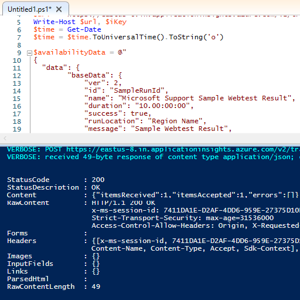

# Investigate missing telemetry in Azure Monitor Application Insights using PowerShell or curl client

This article provides information to help you isolate the step in the processing pipeline that causes telemetry to go missing.

## Every step telemetry passes in the processing pipeline

If telemetry is missing or you can't find specific telemetry records, it can be the result of failures across every step in the life of a telemetry record:


- The SDK or agent is misconfigured and not sending application telemetry to the ingestion endpoint.
- The SDK or agent is configured correctly but the network is blocking calls to the ingestion endpoint.
- The ingestion endpoint is dropping or throttling inbound telemetry.
- The ingestion pipeline is dropping or severely slowing down records as part of its processing due to [service health](https://azure.microsoft.com/get-started/azure-portal/service-health/#overview). (rare)
- Log Analytics is facing problems saving telemetry. (rare)
- The telemetry query API at api.applicationinsights.io has failures querying telemetry from Log Analytics.
- The Azure portal has issues pulling or rendering the records you're trying to view.

Problems can occur anywhere across the service, and may be tedious to properly diagnose. The goal is to eliminate these layers, so you can investigate the correct step within the processing pipeline that is causing the problem. One method that will assist with this isolation is sending a sample telemetry record using PowerShell.

## Troubleshooting with PowerShell

### On-premises or Azure VM

If you connect to the machine or VM where the web application is running, you can attempt to send a single telemetry record to the Applications Insights service instance using PowerShell. Doing so won't require any extra tools.

### Azure Web Apps

If the app that is having issues sending telemetry is [running on Kudu](/azure/app-service/resources-kudu), you can use the PowerShell script outlined here from Kudu's PowerShell debug command prompt feature in Azure Web Apps.

The are two caveats to running the operations from Kudu:

- Prior to executing the `Invoke-WebRequest` command, you have to issue the PowerShell command `$ProgressPreference = "SilentlyContinue"`
- You can't use `-Verbose` or `-Debug`. Instead, use `-UseBasicParsing`.

This is how the code would look:

```shell
$ProgressPreference = "SilentlyContinue"
Invoke-WebRequest -Uri $url -Method POST -Body $availabilityData -UseBasicParsing

```

After you send a sample telemetry record via PowerShell, you can check to see if it arrives using the Application Insights **Logs** tab in the Azure portal. If you see the sample record showing up, you've eliminated a large portion of the processing pipeline.

**A sample PowerShell record correctly saved and displayed suggests:**

- The machine or VM has DNS that resolves to the correct IP address.
- The network delivered the telemetry to the ingestion endpoint without blocking or dropping.
- The ingestion endpoint accepted the sample payload and processed it through the ingestion pipeline.
- Log Analytics correctly saved the sample telemetry record.
- The Azure portal **Logs** tab was able to query the draft API (api.applicationinsights.io) and render the record in the portal UI.

If the sample record does show up, it usually means you just need to troubleshoot the Application Insights SDK or codeless agent. You would typically move to collect SDK logs or PerfView traces, whichever is appropriate for the SDK/agent version.

There's still a small chance that ingestion or the backend pipeline is sampling records, or dropping specific telemetry types, which may explain why your test record arrives but the production telemetry doesn't. You should always start investigating the SDKs or agents if the below sample scripts correctly save and return telemetry records.

#### Availability test result telemetry records

Availability web test results are the best telemetry type to test with. The main reason is because the ingestion pipeline never samples out availability test records. If you instead send a request telemetry record using PowerShell, it could get sampled out with ingestion sampling, and not show up when you go to query for it. Start with a sample availability test records first, then try other telemetry types as needed.

### PowerShell script to send an availability test telemetry

This script builds a raw REST request to deliver a single availability test result record to the Application Insights component. You can supply the `$ConnectionString` or `$InstrumentationKey` parameters.

- Connection String only: Telemetry sent to regional endpoint in connection string
- Ikey only: Telemetry sent to global ingestion endpoint

If both connection string and ikey parameters are supplied, the script sends telemetry to the regional endpoint in the connection string.

It's easiest to run the script from the PowerShell ISE environment on an IaaS or virtual machine scale set (VMSS) instance. You can also copy and paste it into the App Services Kudu interface PowerShell debug console.

```shell
# Info: Provide either the connection string or ikey for your Application Insights resource
$ConnectionString = ""
$InstrumentationKey = ""

function ParseConnectionString {
param ([string]$ConnectionString)
  $Map = @{}

  foreach ($Part in $ConnectionString.Split(";")) {
     $KeyValue = $Part.Split("=")
     $Map.Add($KeyValue[0], $KeyValue[1])
  }
  return $Map
}

# If ikey is the only parameter supplied, we'll send telemetry to the global ingestion endpoint instead of regional endpoint found in connection strings
If (($InstrumentationKey) -and ("" -eq $ConnectionString)) {
$ConnectionString = "InstrumentationKey=$InstrumentationKey;IngestionEndpoint=https://dc.services.visualstudio.com/"
}

$map = ParseConnectionString($ConnectionString)
$url = $map["IngestionEndpoint"] + "v2/track"
$ikey = $map["InstrumentationKey"]
$lmUrl = $map["LiveEndpoint"]

$time = (Get-Date).ToUniversalTime().ToString("o")

$availabilityData = @"
{
  "data": {
        "baseData": {
            "ver": 2,
            "id": "SampleRunId",
            "name": "Microsoft Support Sample Webtest Result",
            "duration": "00.00:00:10",
            "success": true,
            "runLocation": "Region Name",
            "message": "Sample Webtest Result",
            "properties": {
                "Sample Property": "Sample Value"
                }
        },
        "baseType": "AvailabilityData"
  },
  "ver": 1,
  "name": "Microsoft.ApplicationInsights.Metric",
  "time": "$time",
  "sampleRate": 100,
  "ikey": "$ikey",
  "flags": 0
}
"@


# Uncomment one or more of the following lines to test client TLS/SSL protocols other than the machine default option
# [System.Net.ServicePointManager]::SecurityProtocol = [System.Net.SecurityProtocolType]::SSL3
# [System.Net.ServicePointManager]::SecurityProtocol = [System.Net.SecurityProtocolType]::TLS
# [System.Net.ServicePointManager]::SecurityProtocol = [System.Net.SecurityProtocolType]::TLS11
# [System.Net.ServicePointManager]::SecurityProtocol = [System.Net.SecurityProtocolType]::TLS12
# [System.Net.ServicePointManager]::SecurityProtocol = [System.Net.SecurityProtocolType]::TLS13

$ProgressPreference = "SilentlyContinue"
Invoke-WebRequest -Uri $url -Method POST -Body $availabilityData -UseBasicParsing

```

When the above script executes, you want to review the response details. We're looking for an HTTP 200 response, and as part of the response JSON payload we want to see the `itemsReceived` count **matches** the `itemsAccepted`. This means the ingestion endpoint is informing the client: you sent one record, I accepted one record.



### PowerShell script to send a request telemetry record

If you want to test sending a single request telemetry record, the below script will help you format it. This telemetry type is susceptible to server-side ingestion sampling configuration. Make sure ingestion sampling is turned off to help confirm if these records are getting saved correctly.

```shell
# Info: Provide either the connection string or ikey for your Application Insights resource
$ConnectionString = ""
$InstrumentationKey = ""

function ParseConnectionString {
param ([string]$ConnectionString)
  $Map = @{}

  foreach ($Part in $ConnectionString.Split(";")) {
     $KeyValue = $Part.Split("=")
     $Map.Add($KeyValue[0], $KeyValue[1])
  }
  return $Map
}

# If ikey is the only parameter supplied, we'll send telemetry to the global ingestion endpoint instead of regional endpoint found in connection strings
If (($InstrumentationKey) -and ("" -eq $ConnectionString)) {
$ConnectionString = "InstrumentationKey=$InstrumentationKey;IngestionEndpoint=https://dc.services.visualstudio.com/"
}

$map = ParseConnectionString($ConnectionString)
$url = $map["IngestionEndpoint"] + "v2/track"
$ikey = $map["InstrumentationKey"]
$lmUrl = $map["LiveEndpoint"]

$time = (Get-Date).ToUniversalTime().ToString("o")

$requestData = @"
{
   "data": {
      "baseType": "RequestData",
      "baseData": {
        "ver": 2,
        "id": "22093920382029384",
        "name": "GET /msftsupport/requestdata/",
        "starttime": "$time",
        "duration": "00:00:01.0000000",
        "success": true,
        "responseCode": "200",
        "url": http://localhost:8080/requestData/sampleurl,
        "httpMethod": "GET"
       }
   },
   "ver": 1,
   "ikey": "$ikey",
   "name": "Microsoft.ApplicationInsights.Request",
   "time": "$time",
   "sampleRate": 100,
   "flags": 0
}
"@


# Uncomment one or more of the following lines to test client TLS/SSL protocols other than the machine default option
# [System.Net.ServicePointManager]::SecurityProtocol = [System.Net.SecurityProtocolType]::SSL3
# [System.Net.ServicePointManager]::SecurityProtocol = [System.Net.SecurityProtocolType]::TLS
# [System.Net.ServicePointManager]::SecurityProtocol = [System.Net.SecurityProtocolType]::TLS11
# [System.Net.ServicePointManager]::SecurityProtocol = [System.Net.SecurityProtocolType]::TLS12
# [System.Net.ServicePointManager]::SecurityProtocol = [System.Net.SecurityProtocolType]::TLS13

$ProgressPreference = "SilentlyContinue"
Invoke-WebRequest -Uri $url -Method POST -Body $requestData -UseBasicParsing

```

### Curl client to send availability test telemetry record

If you're running Linux VMs, you could rely on the curl client to send a similar REST call instead of PowerShell. Below is a curl request to send a single availability web test result record. You'll need to adjust the ingestion endpoint host, the ikey value, and the timestamp values.

Curl command for **Linux/MaxOS**:

```
>curl -H "Content-Type: application/json" -X POST -d '{"data":{"baseData":{"ver":2,"id":"SampleRunId","name":"MicrosoftSupportSampleWebtestResultUsingCurl","duration":"00.00:00:10","success":true,"runLocation":"RegionName","message":"SampleWebtestResult","properties":{"SampleProperty":"SampleValue"}},"baseType":"AvailabilityData"},"ver":1,"name":"Microsoft.ApplicationInsights.Metric","time":"<span style="font-size:11.0pt;line-height:107%;font-family:&quot;Calibri&quot;,sans-serif;background:yellow">2021-10-05T22:00:00.0000000Z</span>","sampleRate":100,"ikey":"<span style="font-size:11.0pt;line-height:107%;font-family:&quot;Calibri&quot;,sans-serif;background:yellow">4c529c82-dee8-4723-b030-7b56bae7562a</span>","flags":0}' [https://%3cspan]https://<span style="font-size:11.0pt;line-height:107%;font-family:&quot;Calibri&quot;,sans-serif;background:yellow">dc.applicationinsights.azure.com</span>/v2.1/track

```

Curl command for **Windows** (adjust timestamp before running):

```shell
curl -H "Content-Type: application/json" -X POST -d {\"data\":{\"baseData\":{\"ver\":2,\"id\":\"SampleRunId\",\"name\":\"MicrosoftSupportSampleWebtestResultUsingCurl\",\"duration\":\"00.00:00:10\",\"success\":true,\"runLocation\":\"RegionName\",\"message\":\"SampleWebtestResult\",\"properties\":{\"SampleProperty\":\"SampleValue\"}},\"baseType\":\"AvailabilityData\"},\"ver\":1,\"name\":\"Microsoft.ApplicationInsights.Metric\",\"time\":\"2021-10-05T22:00:00.0000000Z\",\"sampleRate\":100,\"ikey\":\"4c529c82-dee8-4723-b030-7b56bae7562a\",\"flags\":0} https://dc.applicationinsights.azure.com/v2/track

```

### PowerShell script to send 100 trace messages

You can try to send a burst of telemetry records from the machine to the Application Insights component. For this approach, you'll want to find a version of Microsoft.ApplicationInsights.dll loaded on the machine. You can find it as part of NuGet package installation or Application Insights agent (SMv2) installation. The below script will load the dll, then call `TrackTrace` 100 times sending 100 telemetry records to the global ingestion endpoint at dc.services.visualstudio.com.

```shell
# One Parameter: Provide the instrumentation key
$ikey = "{replace-with-your-ikey}"

# Load Application Insights dll from local NuGet package if it exists
# Add-Type -Path "c:\users\{useralias}\.nuget\packages\microsoft.applicationinsights\2.17.0\lib\netstandard2.0\Microsoft.ApplicationInsights.dll";
# Load Application Insights dll from Application Insights agent installation directory

Add-Type -Path "C:\Program Files\WindowsPowerShell\Modules\Az.ApplicationMonitor\1.1.2\content\PowerShell\Microsoft.ApplicationInsights.dll";
$client = New-Object Microsoft.ApplicationInsights.TelemetryClient;

$client.InstrumentationKey=$ikey;
$i = 1;
while ($i -le 100) {
   $client.TrackTrace("Sample Trace Message # $i", $null);
   $i +=1;
}
$client.Flush();
read-host “Press ENTER to continue...”

```

## SSL/TLS troubleshooting

If you suspect the problem is between your machine or VM and the ingestion endpoint due to SSL/TLS configuration, you can adjust how PowerShell participates in the SSL/TLS protocol. Include these snippets if you need to diagnose secure channel as part of the connection between the client VM and the ingestion endpoints.

- Option 1: Control which SSL/TLS protocol is used by PowerShell to make a connection to the ingestion endpoint. Add any one of these lines to the top of your PowerShell script to control the protocol used in the test REST request:

  ```shell
  # Uncomment one or more of these lines to test TLS/SSL protocols other than the machine default option
  # [System.Net.ServicePointManager]::SecurityProtocol = [System.Net.SecurityProtocolType]::SSL3
  # [System.Net.ServicePointManager]::SecurityProtocol = [System.Net.SecurityProtocolType]::TLS
  # [System.Net.ServicePointManager]::SecurityProtocol = [System.Net.SecurityProtocolType]::TLS11
  # [System.Net.ServicePointManager]::SecurityProtocol = [System.Net.SecurityProtocolType]::TLS12
  # [System.Net.ServicePointManager]::SecurityProtocol = [System.Net.SecurityProtocolType]::TLS13

  ```

- Option 2: Ignore any SSL Certificate validation issues. If you have a firewall or proxy server that may be doing SSL certificate offloading, you can ignore any SSL cert issues by adding this snippet just before the `Invoke-WebRequest` call:

  ```shell
  # Ignore mismatched SSL certificate
  add-type @"
      using System.Net;
      using System.Security.Cryptography.X509Certificates;
      public class TrustAllCertsPolicy : ICertificatePolicy {
          public bool CheckValidationResult(
              ServicePoint srvPoint, X509Certificate certificate,
              WebRequest request, int certificateProblem) {
              return true;
          }
      }
  "@
  [System.Net.ServicePointManager]::CertificatePolicy = New-Object TrustAllCertsPolicy

  ```

If the application defaults to the system or machine default TLS settings, you can change those default settings within the registry on Windows machines using details found in [Transport Layer Security (TLS) registry settings](/windows-server/security/tls/tls-registry-settings#tls-dtls-and-ssl-protocol-version-settings).

Alternatively, if you need to change the default TLS/SSL protocol used by a .NET application, you can follow the official guidance in [Transport Layer Security (TLS) best practices with the .NET Framework](/dotnet/framework/network-programming/tls).

## Next steps

If sending telemetry via PowerShell from the impacted machine works, you will want to investigate the SDK or codeless configuration for further troubleshooting.

If sending telemetry via PowerShell also fails, continue to isolate where the problem could be: DNS investigations, TCP connection to ingestion endpoint, look for Dropped Metrics on the Ingestion tab within ASC, etc.
