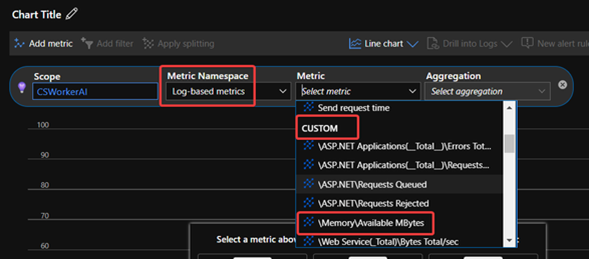

# Troubleshoot common Cloud Service Application issue with Application Insights

This article provides common scenarios about use Application Insights with Azure Cloud Services apps.

For basic knowledge of using Application Insights with Cloud Service, see [feature overview](link).

## Diagnostic setting and Application Insights

When Application Insights is enabled on the Cloud Service app, the Diagnostic setting must be enabled at same time. Some metrics data and log that are collected by Diagnostic service will be sent to Application Insights. For more information, see [view cloud service diagnostics data](https://docs.microsoft.com/visualstudio/azure/vs-azure-tools-diagnostics-for-cloud-services-and-virtual-machines?toc=%2Fazure%2Fcloud-services%2Ftoc.json&view=vs-2022#view-the-diagnostics-data).

When the Diagnostic setting is enabled, the **performance counters** setting works differently on Web Role and Worker Role:

### For Web Role

The following nine metrics data will be automatically collected even if the performance counters is not enabled in Diagnostic Setting. These nine metrics data will be saved in the **performanceCounter** table in Application Insights. If you enabled the performance counters, other metrics such as `\Process(w3wp)\% Processor Time`, will be saved into the **customMetrics** table.

```
\Process(??APP_WIN32_PROC??)\% Processor Time  

\Memory\Available Bytes  

.NET CLR Exceptions(??APP_CLR_PROC??)# # of Exceps Thrown / sec

\Process(??APP_WIN32_PROC??)\Private Bytes  

\Process(??APP_WIN32_PROC??)\IO Data Bytes/sec  

\Processor(_Total)%  Processor time  

\ASP.NET Applications(??APP_W3SVC_PROC??)\Requests/sec  

\ASP.NET Applications(??APP_W3SVC_PROC??)\Request Execution Time  

\SP.NET Applications(??APP_W3SVC_PROC??)\Requests In Application Queue  
```
### For Worker Role

If the performance counter is disabled in Diagnostic Setting, there will be no performance metrics data automatically collected and saved in Application Insights.

### For both Web Role and Worker Role

The **HeartBeatState** metric data will be always saved into Application Insights automatically. This metric is used to identify whether the instance is healthy at server level. It's triggered every 15 minutes and saved into the **customMetrics** table.

> [!IMPORTANT]
> If a Web Role never receives request, or a Worker Role does not read or write data from disk, or the amount of data IO is quite low, it’s possible that Application Insights won't capture any metric data.

The following list shows mapping between the Diagnostic logs and table names that store these logs in Application Insights:

| Table in Application insights | logs in Diagnostic setting |
| ----------- | ----------- |
| traces      | Application logs     |
| traces   | ETW logs       |
| traces   |  Infrastructure logs   |
| traces/custom events   |  Windows Event logs       |
| Custom metrics   |  performance counters        |

## Advanced way to use Application Insights with Cloud Service

There are several common advanced ways to use Application Insights with Cloud Service. For example, you can use Azure Application Insights SDK in Cloud Service project to generate or modify the data saved into Application Insights.

### Add custom log

To add a custom log into your application, follow these steps:

1. In the Visual Studio, right-click the Cloud Services project and select **Manage NuGet Packages...**.
1. Make sure that **Microsoft.ApplicationInsights** is installed.
 
1. Add the following code in the startup function of your role. The startup function of Web Role can normally be `Application_Start()` in Global.asax. For Worker Role, it can be `OnStart()` in Worker RoleName.cs.

    ```C#
    TelemetryConfiguration.Active.InstrumentationKey = RoleEnvironment.GetConfigurationSettingValue("APPINSIGHTS_INSTRUMENTATIONKEY"); 
    ```
4. Create a telemetry client and record the log context:

    ```C#
    using Microsoft.ApplicationInsights; 
    TelemetryClient ai = new TelemetryClient(); 
    ai.TrackTrace("The custom log context"); 
    ```

    Besides the trace log, we can also use the following method to record handled exceptions.

    ```c#
     ai.TrackException(exception);
    ```
### Record requests for Worker Role application

By design, requests that Cloud Services Web Role received are automatically marked with unique ID to identify the correlation. In Worker Role, there isn’t such logic. But it’s possible to simulate the result of the Worker Role application progress as a request and send this request to Application Insights for recording. It enable us to easily track the operation result of Worker Role application in Application Insights. The following is a Worker Role application example.

```C#
using Microsoft.WindowsAzure.ServiceRuntime;
using System;
using System.Diagnostics;
using Microsoft.ApplicationInsights; //Import the Application Insight SDK
using Microsoft.ApplicationInsights.Extensibility;
using Microsoft.ApplicationInsights.DataContracts;

namespace Worker Role1
{
    public class Worker Role : RoleEntryPoint
    {
        private TelemetryClient ai = new TelemetryClient(); //Define a private TelemetryClient
        private bool select = true;
        private int a = 0;
        private int b;
        private volatile bool onStopCalled = false;
        private volatile bool returnedFromRunMethod = false;
        private Stopwatch requestTimer;
        private bool requestResult;

        public override void Run()
        {
            ai.TrackTrace("Worker Role1 is running AI");

            var request = new RequestTelemetry(); // Generate a RequestTelemetry. Once it’s created, all the changes should be saved into this RequestTelemetry and SDK will save this RequestTelemetry into Application Insight.

            while (true)
            {
                request.Name = "A test request";  //the following three lines configure the Name, Id and StartTime property of the request.
                request.Id = Guid.NewGuid().ToString();
                request.StartTime = DateTimeOffset.UtcNow;

                ai.TrackTrace("New cycle. AI " + DateTimeOffset.UtcNow.ToString() + " " + request.Id);

                requestTimer = Stopwatch.StartNew();

                try
                {
                    if (onStopCalled == true)
                    {
                        ai.TrackTrace("Onstopcalled Worker Role AI");
                        returnedFromRunMethod = true;
                        return;
                    }

                    if (select == true)
                    {
                        select = false;
                        b = 100 / a;
                    }
                    else
                    {
                        select = true;
                        b = 100 / 10;
                    }
                    ai.TrackTrace("normal Worker Role AI " + DateTimeOffset.UtcNow.ToString() + " " + request.Id);
                    requestResult = true;
                }
                catch (Exception ex) // Pay attention to the way that saves the custom Trace log and Exception. The unique specific ID will be helpful for us to track the request workflow in Application Insight if your application is multi thread.
                {
                    ai.TrackTrace("Exception Worker Role AI " + DateTimeOffset.UtcNow.ToString() + " " + request.Id); 
                    ai.TrackException(ex, new Dictionary<string, string>() { { "id", request.Id } });
                    requestResult = false;
                }

                request.Success = requestResult; // the following codes set Success, Duration and ResponseCode property of the request, then save it into Application Insight.
                request.Duration = requestTimer.Elapsed;
                request.ResponseCode = requestResult ? "200" : "500";
                ai.TrackRequest(request);

                System.Threading.Thread.Sleep(30*1000);
            }
        }

        public override bool OnStart()
        {
            TelemetryConfiguration.Active.InstrumentationKey = RoleEnvironment.GetConfigurationSettingValue("APPINSIGHTS_INSTRUMENTATIONKEY");

            bool result = base.OnStart();

            return result;
        }

        public override void OnStop()
        {
            onStopCalled = true;

            while (returnedFromRunMethod == false)
            {
                System.Threading.Thread.Sleep(1000);
            }
        }
    }
}
```

In this example, the worker role will keep adding trace logs into Application Insights every 30 seconds. But log won't always be added successfully because there's one changing bool variable that selects to make the `Run` function return a handled exception in every two loops. The trace log recorded into Application Insights contain the timestamp, a fully random GUID as correlation ID to identify the relationship between request record and other records. Every loop is considered as a request, so it will generate a record of request with the start timestamp, the duration, the success status, the response code (200 for success and 500 for exception) and the correlation ID.

Only Duration and Success status are necessary for generating a request record. The reason why the other information is kept into the request record is:

- Start timestamp and response code can make it as a real request and different response code, for example 400 and 500 for failed requests, can help when user wants to identify different failure reasons.

- If the application uses multiple threads, there can be trace logs, exceptions and request records of different threads at same moment and this will cause user unable to track them by timestamp. A correlation ID used through all steps will be important. The ID of a request should be globally unique. To make sure the example works perfectly, we should add a function to verify if a newly generated random GUID is already used by any request records in same Application Insights(This part isn’t implemented in the example code).

> [!NOTE]
> You can also record the Work Role requests by using custom telemetry. For more information, see the [code sample](https://github.com/MohanGsk/ApplicationInsights-Home/tree/master/Samples/AzureEmailService/Worker RoleA).
 
### Check the failed request and related exception for Web Role

For failed requests in Web Role, the unhandled exception and the handled exception with ai.TrackException are automatically collected into exception table.

To find the exception records in the Application Insights instances, you can use one of the following methods:

#### View the Failures page in the Azure portal

1. Go to the Azure portal, select the Application insights instance, select **Failures**.
2. Locate the failed request in **Operations** tab by adjusting the time range and selecting corresponding operation.
3. Select the operation name, the failed requests with specific exception type or specific response code will be listed automatically. For more information, see [Part1]

#### Query Logs in the Azure portal

The second method is query logs from Application Insights. It allows you to use more custom filters to look for the specific types of exception. It also provides more details information that will not be displayed in the **Failures** page.
 
The request that the Web Role received is automatically marked with unique ID to identify the correlation. To query the exception with a request, follow these steps:

1. Go to the Azure portal, select the Application insights instance, select **Logs**.
1. Run the following query to locate the failed request in requests table and record its ID:
    ```
    requests
    | where resultCode == "500"
    ```
     
1.	Find the exception with same ID in exceptions table:

    ```
    exceptions
    | where operation_ParentId == "8d1adf11abf73c42"
    ```

The way of tracking exceptions based on a failed request will be helpful when you want to troubleshoot an intermittent failure issue since it will contain the complete CallStack of that request.
 
### Check the failed request and related exception for Worker Role

Since the unhandled exception of Worker Role may cause the whole application downtime, it is recommended to handle all the exceptions in Worker Role that means that it should be included by `try` function. As Web Role, to the handled exceptions, `ai.TrackException` is needed to record the exceptions into Application Insights.

Steps to check the exception in Worker Role is similar to the Web Role. The only difference is that there isn’t a built-in system to record the exceptions automatically, so some extra codes are needed for recording the requests and send them to Application insights. For more information, see [Record requests for Worker Role application](#record-requests-for-worker-role-application).

Here are multiple possible situations:

- Worker Role doesn’t has a logic to record requests. Then, use timestamp track the relationship between exception records and operations.
- Worker Role includes a logic to record custom requests with custom ID, but it’s not included in the exception record. Use timestamp track the relationship between exception records and operations.
- Worker Role includes a logic to record custom requests with custom ID, and it’s included in the exception record. Then you can check the **Failures** page or **Logs** page to find the related requests and exceptions. The query used in Logs page will be like:

    ```
    requests 
    | where success == False 
    ```
    ```
    exceptions 
    | where * contains "<request ID>" 
    ```

## Common scenarios and guidelines

In this part, there will be several common scenarios and the related guidelines about how to use Application Insights to meet the requirements.

### Monitor memory and request status for a Web Role

To monitor the Memory and Request status for the Web Role in Cloud Service, you just need to enable Application Insights on the role that you wants to collect metrics data from. Then It will automatically collect data for Memory usage and request status of the Web Role.

To see the collected data, it’s recommended to use the **Metrics** page of the Application Insights. For more information, see [System performance counters in Application Insights](https://docs.microsoft.com/azure/azure-monitor/app/performance-counters).

### Monitor the Memory and Request status for a Worker Role

Like Web Role, it’s also possible to monitor the memory and request status of the Worker Role but there will be some limitations:

1. For Worker Role, the memory metrics data won't be automatically collected by default. To monitor the memory status, you need to enable the `\Memory\Available MBytes` from Performance Counters of Diagnostic Setting. The collected data will be in the `custommetrics` table of Logs page.
1. To view the metrics chart of the collected memory data, go to the **Metrics** page in Application Insights, select **Log-based metrics** in Metric Namespace and **Available Memory** under **Performance** in Metric. The chart of the Available Memory of selected time range will be displayed.

    
### Troubleshoot performance issues such as slow response time

For example, when a Cloud Service Web Role receives a request, it needs to get some data from a remote server, such as SQL Database, then generate the data into a web page and return it to the user. Imagine that this progress is much slower than expected but still successful, it’s reasonable that user wants to clarify whether most of time spent is during the communication with SQL Database or during the progress inside the Cloud Service. For that, it will need user to add some extra custom log to record the timestamp of each step, such as start of the progress, start of the communication with SQL Database, end of the communication with SQL Database and end of generating the webpage etc.

The above is only one possible scenario as example. The design of the custom log system needs to be done by developers for different scenarios. In this part, there will only be a few tips about how to design a such kind of custom log:

1. For both Worker Role and Web Role, it's recommended to save trace log at every process start step. For example, in the above example codes, it’s possible to add trace log at following points when:

    - the Web Role receives the request
    - the Web Role starts to build communication with SQL server
    - the Web Role receives the data returned by SQL server and starts generating the webpage
    - the Web Role generates the webpage and returns it to user

2. If the main process is the application in Worker Role, record the functions of Worker Role application as request to add custom correlation ID into custom request record and exception record. 

Once the logic is implemented, you can check the requests in the **Performance** page of Application Insights and focus on the request durations by following:

1. Select a operation which you want to check.
1. Scale the duration distribution chart to the longest duration part
1. Select **Drill into samples**.
1. Select a request as example and get the built-in or custom ID of this request.

If the system isn't complicated, the time spent by different steps will be displayed in the End-to-end transaction chart. If the system is complicated or we’re using a custom ID which causes it unable to display the data in chart, use following query to get all related trace logs containing same correlation ID:

```
traces
| where * contains "xxxxxxxx-xxxx-xxxx-xxxx-xxxxxxxxxxxx" 
```

By this way, it’s possible for you to calculate the difference between every trace log to get the time spent by every step.

### Troubleshoot performance issues such as high CPU/Memory of Worker Role

Sometimes you will need to identify issues such as a Worker Role consuming very high CPU/Memory. The only thing which can be observed from outside of the Cloud Service is that the Worker Role is consuming much CPU/Memory but you has no idea what exactly is happening in the instance.

To troubleshoot such issues, there will be mainly two steps:

Add a custom log to track every step which the Worker Role application will do. This is very important because this step enables you to identify if the application is still running well and to compare the time spent in each step with the normal situation. This can help you to identify whether the application is affected by the high CPU/Memory issue. About how to add custom log system, please kindly refer to [add custom log](#add-custom-log).

Capture the dump file. Here are some tips:

You can RDP into the instance having high CPU/Memory issue and verify which process is consuming most of the CPU/Memory. If it’s WaWorkerHost, then it means that it’s the application itself consuming so much CPU/Memory.

If the instances are having high CPU/Memory and the application is just with low-performance but not crashed, then you can try to RDP into the instance and capture a dump file for this. For more details about how to capture the dump file, please kindly refer to this document. For example, you can use following command to capture a dump file when the CPU consumed by WaWorkerHost is higher than 85 for at least 3 seconds. Five dump files will be captured and saved into `c:\procdumps` directory.

```
 procdump.exe -accepteula -c 85 -s 3 -n 5 WaWorkerHost.exe c:\procdumps
```
In the diagnostic setting page of Cloud Service, you can also set the crash dump file auto-generation. For more details of this part, please refer to this document.