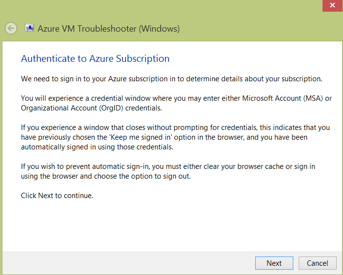

# [SDP3][29E28228-4A40-4205-BC9B-9886E51BA77D] Microsoft Azure Windows VM diagnostics package

_Original product version:_ &nbsp; Windows Virtual Machine
_Original KB number:_ &nbsp; 2976864

### Self-help

Click [here](https://home.diagnostics.support.microsoft.com/selfhelp?knowledgebasearticlefilter=2976864) to run the Microsoft Azure Windows VM troubleshooter from the self-help portal.

## Summary

This article describes how to troubleshoot issues on Microsoft Azure Windows-based virtual machines (VMs) by using the Guest Agent. This Microsoft Azure infrastructure as a service (IaaS) Support Diagnostics Platform (SDP) package can be configured to run the following operations:
- Correct common Remote Desktop Protocol (RDP) access issues such as resetting Windows Firewall and RDP registry values
- Reset a local administrator account password
- Remotely execute a custom customer-provided Windows PowerShell script against VMs
- Clean-boot VMs (disable all non-Microsoft services and then reboot)
- Ghosted network adapter removal
- Boot an Azure VM domain controller into Directory Services Restore Mode (DSRM)
- Identify Azure VM and Azure platform storage and disk configuration issues that can cause disk performance issues
- Remotely install the Azure VM Guest Agent
- Try to establish a remote PowerShell session to Azure VMs
- Perform system recovery operations by using a recovery VM when Azure VMs are in a no-boot or boot-looping state

### Information that is collected

This package collects no data from your local workstation. It also does not collect data from any of your Azure VMs without your consent. This package does request approval from you for Microsoft Support Engineering to pull data from your Azure VMs remotely.

### Package information

A supported package is now available from Microsoft Support.

To obtain this package, submit a request to Microsoft Online Customer Services. To do this, go to the following Microsoft website: [https://go.microsoft.com/?linkid=6294451](https://go.microsoft.com/?linkid=6294451) 
> [!NOTE]
> If additional issues occur or any troubleshooting is required, you might have to create a separate service request. The usual support costs will apply to additional support questions and issues that do not qualify for this specific package. To create a separate service request, go to the following Microsoft website: [https://support.microsoft.com/contactus/?ws=support](https://support.microsoft.com/contactus/?ws=support) 

## More information

To execute this package, follow these steps:
1. Consent to let the Microsoft Support engineer remotely collect diagnostic data on your behalf.

    

1. Click **Next**, and then provide your credentials to authenticate to the affected Azure subscription.

    

1. Select the Azure subscription name that contains the affected VMs.
1. Select the scenario that best fits the issue that you are experiencing.

    

1. Select the affected VMs form the list. Multiple VMs may be selected. If you don't see the affected VM, make sure that the VM is running and it has a Guest Agent installed.

## References

Learn about the [Microsoft Automated Troubleshooting Services and Support Diagnostics Platform](https://support.microsoft.com/help/2598970).
