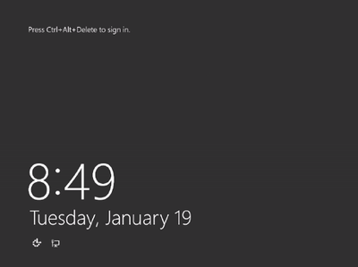

# Azure Virtual Machine - Netlogon service is not starting

## Symptoms

1. The virtual machine (VM) screenshot shows the operating system (OS) fully loaded and waiting for the credentials:

   

2. If you view the Guest OS Logs, you'll see that DNS Client service is either not starting, or is failing to start. This could be due to a hang, a crash of this service, or any required service to be run before it.

   ```cmd
      Log Name:      System
      Source:        Service Control Manager
      Date:          12/16/2015 11:19:36 AM
      Event ID:      7022
      Task Category: None
      Level:         Error
      Keywords:      Classic
      User:          N/A
      Computer:      myvm.contoso.net
      Description:
      The Netlogon service hung on starting.
   ```

   ```cmd
      Log Name:      System
      Source:        Service Control Manager
      Date:          2/25/2016 11:59:08 AM
      Event ID:      7001
      Task Category: None
      Level:         Error
      Keywords:      Classic
      User:          N/A
      Computer:      myvm.contoso.net
      Description:
      The Netlogon service depends on the Workstation service which failed to start because of the following error: 
    The service cannot be started, either because it is disabled or because it has no enabled devices associated with it.
   ```

   ```cmd
      Log Name:      System
      Source:        Service Control Manager
      Date:          12.08.2016 15:35:22
      Event ID:      7023
      Task Category: None
      Level:         Error
      Keywords:      Classic
      User:          N/A
      Computer:      myvm.contoso.net
      Description:
      The Netlogon service terminated with the following error: 
    %%14
   ```

### Connect to the VM using Serial console (Troubleshoot cause)

If you're unable to successfully RDP to the virtual machine (VM), use PowerShell and [Serial Console](https://docs.microsoft.com/azure/virtual-machines/troubleshooting/serial-console-windows) to check for the log entries.

1. On the command line, launch PowerShell by running `powershell.exe`.
2. In PowerShell, execute the following commands:

```ps
psCopy
```

```ps
remove-module psreadline
```

```ps
Get-WinEvent -FilterHashtable @{LogName='System'; StartTime=(Get-Date).AddDays(-1); ProviderName='Service Control Manager'}
```

## Cause

The Netlogon service is not running on the Virtual Machine. This issue happens in the following scenarios:

1. The Netlogon service was set to **disabled**.
2. The Netlogon is not responding, or is crashing.
3. Another required service is not running.

## Solution

Backup the VM OS disk using your preferred method.

One method that you can use is to [take a snapshot of the disk](https://docs.microsoft.com/azure/virtual-machines/windows/snapshot-copy-managed-disk).

### Connect to the VM using Serial console (Solution)

Connect to the VM using [Serial Console](https://docs.microsoft.com/azure/virtual-machines/troubleshooting/serial-console-windows) to attempt to get the Netlogon service started.

1. In the Serial Console, execute this command:

   `sc query Netlogon`

2. If the service is shown as:

   1. **Stopped** – Try to start the service:

      `sc start Netlogon`

      1. If the service starts without error and you can connect to the VM, then stop here.

   2. **Starting/Stopping** - Try stopping and starting the service again with these commands:

      `sc stop NETLOGON`

      `sc start NETLOGON`

3. If the Netlogon service is disabled:

   1. First set the service to automatic:

      `sc config NETLOGON start=auto`

   1. Start the Netlogon service:

      `sc start NETLOGON`

   1. Check if the Netlogon service is running:

      `sc query Netlogon`

4. IF the Netlogon service fails due to a dependency, you can try the above process on the dependency that was listed.
Once the Netlogon service is running you can try accessing the VM via RDP.

## Next steps

If you still cannot determine the cause of the issue and need more help, you can open a support ticket with Microsoft Customer Support.

If you need more help at any point in this article, you can contact the Azure experts on the [MSDN Azure and Stack Overflow forums](https://azure.microsoft.com/support/forums/). Alternatively, you can file an Azure support incident. Go to the [Azure support site](https://azure.microsoft.com/support/options/), and select **Get support**. For information about using Azure support, read the [Microsoft Azure support FAQ](https://azure.microsoft.com/support/faq/).
