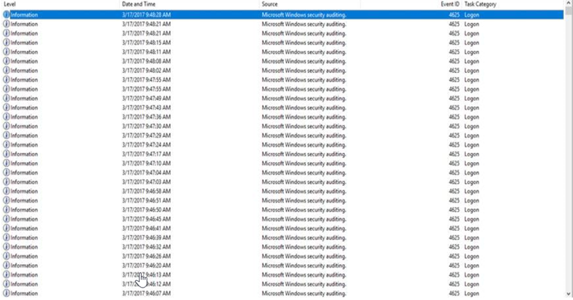
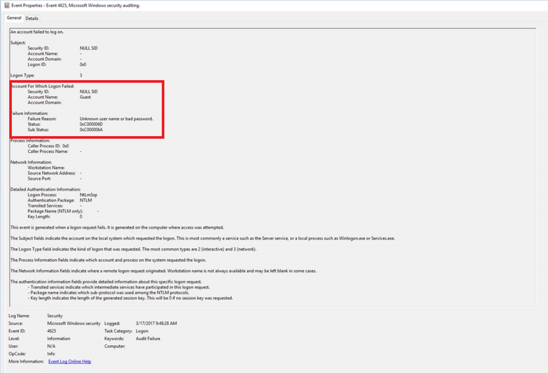
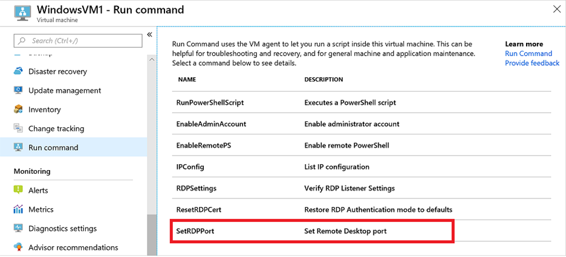

# Cannot RDP into Azure VM because of a brute force attack

Open ports on Internet-facing virtual machines are targets for brute force attacks. This article describes general errors you may experience when your Azure virtual machine (VM) is under attack and best practices for securing your VM.

## Symptoms

1. When you make a Remote Desktop Protocol (RDP) connection to a Window VM in Azure, you may receive the following general error messages:

    - An internal error has occurred.
    - Remote Desktop Services session has ended. Your network administrator might have ended the connection. Try connecting again, or contact technical support for assistance.

2. You're unable to RDP using the Public IP address, but you may be able to RDP using the Private IP address. This issue will depend on whether you have a performance spike because of the attack.

3. There are many failed logon attempts in the Security Event Logs:

   - Events 4625 from the logon is logged almost every second, with the failure reason **Bad Username Or Password**.

   

   

## Cause

The machine is likely experiencing a brute force attack, and the VM needs to be secured.

## Solution

In this scenario the RDP TCP Port 3389 is exposed to the internet, please use one or more of the methods listed below to increase security for the VM:

1. Use [Just-In-Time access](https://docs.microsoft.com/azure/security-center/just-in-time-explained) to secure the public facing ports of your VM.

2. Use [Azure Bastion](https://docs.microsoft.com/azure/bastion/) to connect securely via the Azure portal.

3. Edit your Network Security Group (NSG) to be more restrictive. Only allow specific internet protocols (IPs) or a range of IPs that belong to your organization in your inbound rule for RDP:

   For your inbound RDP (TCP Port 3389) rule, if the Source is set to "Any" or "*" then the rule is considered open. To improve the security of the rule, [restrict the RDP port to a specific user's IP address](https://docs.microsoft.com/azure/virtual-network/network-security-groups-overview#security-rules), and then test RDP access again.

4. Use [Run Command](https://docs.microsoft.com/azure/virtual-machines/windows/run-command) to change the default RDP port from 3389 to a less common port number. This is not suggested as a long-term fix, but may help to temporarily mitigate the attack and regain access to the VM, we suggest using [Just-In-Time access](https://docs.microsoft.com/azure/security-center/just-in-time-explained), or [Azure Bastion](https://docs.microsoft.com/azure/bastion/).

   

> [!NOTE]
> Use [Azure Security Centre](https://azure.microsoft.com/services/security-center/) to assess the security state of your cloud resources. Visualize your security state, and improve your security posture by using [Azure Secure Score](https://docs.microsoft.com/azure/security-center/secure-score-security-controls) recommendations.
