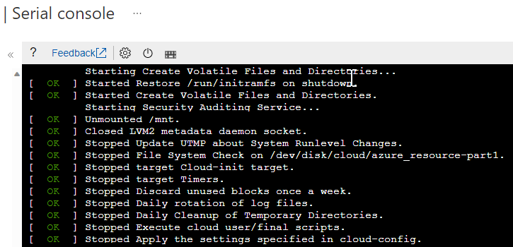
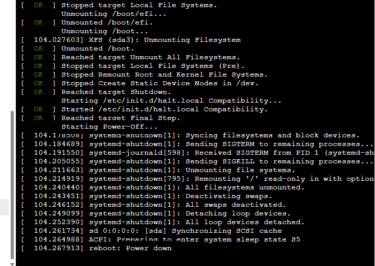

# Troubleshooting Linux boot issues due to full OS disk

When the OS disk or critical system partitions become full, the OS may have difficulties booting fully, and in some instances may shut down immediately.  In this document we will explore some causes for these situations, as well as some action plans which may be used in various different scenarios.

## Prerequisites

In order to complete the troubleshooting and system repairs discussed in this document, there are certain requirements which should be met.  Not all requirements apply to every set of instructions, but many of them will apply in the described circumstances.

- Permission to create a disk snapshot or operate other backup and restore tools.  In all procedures, data or disks will be altered, so having the ability to revert to a previous state is a critical component of safe system administration.
- [Boot diagnostics](/azure/virtual-machines/boot-diagnostics) should be enabled and properly configured.  Having this configuration in place will allow for storage of the console log for future review, as well as interacting with the serial console interface of the VM.
- Permissions to create a VM, in case a rescue VM is needed at any point.
- Permissions to create, detach and attach disks, should swapping disks be required for any reason.

## Symptom description

During normal system operations, disks can fill up.  Under certain circumstances and configurations, this may lead to a VM shutting down unexpectedly and/or will not boot successfully.  While not an exhaustive list of reasons this may happen, this article will illustrate a few causes, and some methods to clear the issues and return the system to a bootable state.

## Scenario 1: VM shuts down unexpectedly and will not boot

Many security hardening practices can lead to difficulties in maintaining systems.  One common configuration requires the system to shut down immediately if an error is encountered when writing to the audit log.  To check if this is the reason for a system shutting down, check for the following symptoms

- Using the [serial console](/azure/virtual-machines/boot-diagnostics) log, check for the system shutdown messages.  If the system is booted, the message "Starting Security Auditing Service…" is displayed but instead of indicating that the service is started, the VM transitions immediately to shutting down, finally indicating "power down."  If the system was running, and unexpectedly shut down, the serial console may show an orderly shutdown process ending in a 'power down" message.





- Using [az vm repair](/troubleshoot/azure/virtual-machines/repair-linux-vm-using-azure-virtual-machine-repair-commands) commands, a manual [recovery VM](/troubleshoot/azure/virtual-machines/troubleshoot-recovery-disks-portal-linux), or [single user mode](/troubleshoot/azure/virtual-machines/serial-console-grub-single-user-mode) to mount the OS disk, examine the disk utilization using `df` and see if the disk containing the `/var/log/audit` directory is nearing 100% utilization
- Using [az vm repair](/troubleshoot/azure/virtual-machines/repair-linux-vm-using-azure-virtual-machine-repair-commands) commands, a manual [recovery VM](/troubleshoot/azure/virtual-machines/troubleshoot-recovery-disks-portal-linux), or [single user mode](/troubleshoot/azure/virtual-machines/serial-console-grub-single-user-mode) to access the OS filesystem, verify if the /etc/audit/audit.conf file contains the following configurations:

```output
[root@linux /]# grep action /etc/audit/auditd.conf
admin_space_left_action = HALT
disk_full_action = HALT
disk_error_action = HALT
```

### Auditd Resolution Method 1: Temporarily disable halt conditions

If the auditd configuration is causing shutdown on audit log failure, temporarily disabling the "halt" configuration would allow the VM to boot to the full OS for remediation.  Once the sytem is booted the normal OS tools can be used to explore the filesystem utilization issue, or expand the disk if needed.  Care must be taken to return the configuration to the previous state as soon as possible once the issue has been cleared.

- Take a snapshot of the OS disk to provide a recovery state
- Use [az vm repair](/troubleshoot/azure/virtual-machines/repair-linux-vm-using-azure-virtual-machine-repair-commands) commands, a manual [recovery VM](/troubleshoot/azure/virtual-machines/troubleshoot-recovery-disks-portal-linux), or [single user mode](/troubleshoot/azure/virtual-machines/serial-console-grub-single-user-mode) to gain access to the configuration files.
- Take note of the current configuration, as there may not be space available to take a backup of the file in the VM.
- Alter the `/etc/auditd/audit.conf` by changing the above configurations from `halt` to any of the other valid answers except `single`.  Other choices for this scenario could be `ignore`, `suspend`, or any other value listed in the `man` page for `auditd.conf`, which will give the appropriate parameters for the versions of software in use on this VM.

```output
[root@linux /]# grep action /etc/audit/auditd.conf
admin_space_left_action = SUSPEND
disk_full_action = SUSPEND
disk_error_action = SUSPEND
```

- If utilizing a recovery VM, use the instructions in the [recovery document](/en-us/troubleshoot/azure/virtual-machines/troubleshoot-recovery-disks-portal-linux#unmount-and-detach-original-virtual-hard-disk) to swap the OS disk back to the broken VM, and attempt boot the VM normally.  If using single user mode, simply exit and the VM will reboot.
- Once booted fully, use tools such as `df` and `du` to browse the filesystem and free some space - around 10% of the filesystem containing /var/log/audit should be a good initial target.

> [!IMPORTANT]
> Be sure to return the contents of `/etc/audit/audit.conf` to the original values and reboot.

> [!NOTE]
> If this resolution path does not work or is not appropriate for your environment, follow the general methods at the end of this document.

## Scenario 2: VM disk was resized in Azure but the OS cannot resize, does not fully boot

After a full disk has been identified, and the VM has been shut down to resize the OS disk, a situation may occur where the VM does not start up successfully.  This scenario may be confusing on select distributions where the OS will attempt to automatically resize the root (`/`) filesystem on reboot.  The resize operation may fail if the disk was completely full, as the process requires a small amount of free space to expand the filesystem.  Having no free space can cause cloud-init to fail, and subsequently the VM will not finish booting.

To identify this issue, use the serial console to review the boot logs, to see if lines like the following are present

```output
[   15.384699] cloud-init[1142]: OSError: [Errno 28] No space left on device
[   15.384742] cloud-init[1142]: Original exception was:
[   15.384784] cloud-init[1142]: OSError: [Errno 28] No space left on device
```

Also look for other lines containing the text `[Errno 28] No space left on device` or similar 'no space' messages, as the specific cloud-init messages may not be the most visible messaging returned.

For more information, see the [General Resolutions](#general-resolution-method-1-clear-unneeded-data) around freeing disk space

## Scenario 3: VM boots but is inaccessible due to service failures

A VM which seems to boot completely may show service issues during the boot log, the Azure Agent may not show available, connections to the VM may fail or the VM may appear to be offline according to applications.  During the boot, there may be multiple messages such as `[Errno 28] No space left on device` or other formats of messages generally indicating that the root filesystem is full.

If a VM has been started but appears unavailable, check the serial log in boot diagnostics to view the boot messages, or use the [serial console](/azure/virtual-machines/boot-diagnostics) to attempt to interact with the VM.  If there are the indications of insufficient space, see the [General Resolutions](#general-resolution-methods) for options to free space or expand the disks.

If the console log contains many messages stating `ERROR ExtHandler /proc/net/route contains no routes`, a full OS disk may be the cause as well, as the networking services are unable to completely start.

## General resolution methods

The following resolutions are valid for any of the above scenarios

### General Resolution Method 1: Clear unneeded data

- Utilize [az vm repair](/troubleshoot/azure/virtual-machines/repair-linux-vm-using-azure-virtual-machine-repair-commands) commands, a manual [recovery VM](/troubleshoot/azure/virtual-machines/troubleshoot-recovery-disks-portal-linux), or [single user mode](/troubleshoot/azure/virtual-machines/serial-console-grub-single-user-mode) to gain access to OS disk and partitions, as the system will not boot normally.
- Use standard linux tools to identify large files and directories
    - `du -ks /* | sort -n` - Locate the most space-consuming files or directories in a location.  Repeat with the largest directory reported until some large data is uncovered
    - `ls -altSr /var/log` - List the contents of a directory, ordered by size, with the largest at the end
    - `find / -size +500M -exec ls -alFh {} \;` - Find large individual files.  Adjust the `500M` value here to a number of M(egabytes) or G(igabytes) as necessary to locate the most effective files to prune.
    - Remove any files which can be identified as unnecessary, such as old logs, forgotten backups, and similar files.
- Once a suitable amount of space is cleared, target around 10% free disk, reboot the system.

### General Resolution Method 2: Expand OS filesystem

If no data can be cleared from the OS filesystem(s), it may be advisable to expand the disk containing the critical OS volumes.  See the following document for the disk expansion procedure

[Expand Azure Disks](/azure/virtual-machines/linux/expand-disks)

## Next steps

In case the specific boot error isn't a Linux boot issue due to full OS disk, refer to the [Troubleshoot Azure Linux Virtual Machines boot errors](/troubleshoot/azure/virtual-machines/boot-error-troubleshoot-linux) for further troubleshooting options.

[!INCLUDE [Azure Help Support](../../includes/azure-help-support.md)]
